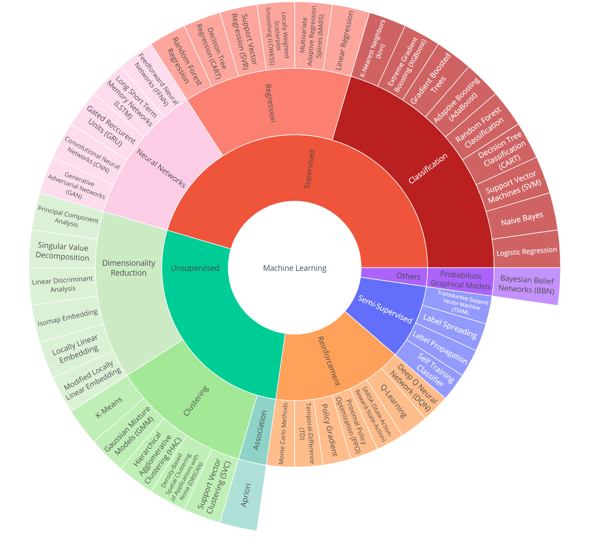

# INTRODUCTION

## TO DO

-   Feature encoding

-   iml

-   variance / covariance shift

-   Jak laczy sie optimizer i loss w pytorch: <https://stackoverflow.com/questions/53975717/pytorch-connection-between-loss-backward-and-optimizer-step>

-   <https://ichi.pro/pl/badanie-porownawcze-architektur-segmentacji-obrazu-z-wykorzystaniem-glebokiego-uczenia-60763173541384>

-   Zdecydować gdzie mają być materiały o deep learningu.

-   ICA i blind source separation (dobry artykuł: "Independent Component Analysis: Algorithm and Application" by Aapo Hyvarien and Erkki Oja). ICA ma 2 bardzo ważne założenia. Ukryte koponenty muszą być ortogonalne i muszą mieć rozkład Niegaussowski. Liczba obserwacji nie musi być większa niż liczba wymiarów.

-   Johnson-Lindenstrauss lemma (o tym że macierz wielowymiarową można aproksymować macierzą o niższej ilośc wymiarów zachowując odległości między obserwacjami poprzez przemnożenie jest przez macierz losową). Jest wykorzystywany przez technikę (dostępną w sklearn) o nazwie RAndom Projection służącą do redukcji wymiarowości.

-   ensembled models

-   conformal prediction

-   calibration of probability

-   isitonic regression

-   possion model

-   correlation between imbalanced variables

-   survuval analysis

-   miary do modeli klasyfikacyjnych

-   feature importance

-   isolated forest

-   GLM - gdzie sa reszty?

-   Standaryzacja do analizy klasrowania a wymóg dużej zmienności (min. 10%). Przecież po standaryzacji każda zmienna będzie miała do samo odchylenie. Jak rozpoznać zmienną zestandaryzowaną która pierwotnie miała małą zmienność. Chyba trzeba to zbadać przed standaryacja.

-   blad w implementacji xg boosta w sklearn - w kolejnych krokach obserwacje się z prob nakladaja. notat.

-   ARIMA

-   skalowanie platta : svm i score w kalibracji prawdopodobienstwa.

-   optymalizacja byesowska w grid searchu

-   mutual information , entrophy, cross entrophy,

-   kąty do szukania outliers

-   wezly czyli metoda MARS

-   kalibracja w ryzyku kredytowym - dodawanie zewnetrznych informacji git

-   random forest w szeregach czasowych - nie lapie trendow.

-   Uniform Manifold Approximation and Projection (UMAP)

-   autokorelacja i autokorelacja czastkowa

-   colaborative filtering

-   C4.5, GAN

-   uczenie przyrostowe dla gradientów. Czy ma sens?

-   Niezbalansowanie próby a różne analizy (korelacja , PCA, miary)

-   Dobry model a jego predykcje w przyszłości. Załóżmy że mam super model odrzucający złych kredytobiorców. Z czasem pojawi się problem że w próbie nie będzie złych kredytów. Jak reestymować model

-   liczba dunbara

-   jak zrobić dobry minitoring modeli. Jak wyznaczyć przedziały ufności dla predykcji

-   Jak wykrywać podpopulacje? Jedna silna zmienna. Niestabilność relacji w podpopulacjach.

-   Kalibrowanie prawdopodobieństwo.

-   covariate shift

-   conformal prediction [link](https://github.com/isidroc/conformal)

-   Czy w clusteringu jest sens podziału na train i test set. Jak mierzyć over/under fitting?

-   Pamięć w rozkładach prawdopodobieństwa

-   image segmentatnion to nie to samo co **semantic segmentation** : [link](https://learnopencv.com/deep-learning-based-object-detection-and-instance-segmentation-using-mask-rcnn-in-opencv-python-c/)

-   Pamięć w macierzach markowa (First-order Markov model, Second-order Markov model).

-   Hidden Markov model. Fajny przykład z psem i pogodą: [link](http://www.biostat.jhsph.edu/bstcourse/bio638/notes/HMM1.pdf)

-   Co to są sieci syjamskie

-   zerknąć na notatki które mam w telefonie bo tam też jest zanotowanych wiele ciekawych problemów statystycznych

lini o PCA i eigenvalues:

<https://wiki.pathmind.com/eigenvector>

<https://medium.com/analytics-vidhya/eigenvectors-and-eigenvalues-and-there-use-in-principal-component-analysis-machine-learning-1f97fdbdb303>

## draft

## Introduction

## AI problems and algorithms classification

## Meta issues

### Knowledge representation

### Types of learning

#### Ensemble (zespołowe)

Dowód matematyczny skuteczności podejścia wielomodelowego: [@Gatnar2008] s 84

Intuicyjne wyjaśnienie skuteczności działania podejścia *Ensemble:* [@Geron2018]

*Ensemble* jest traktowany jako metoda dedykowana pod uczenie nadzorowane. Dla klastrowania istnieje odpowiednik nazywany "Consensus clustering".

Zakładamy że:

-   Mamy że w danych mamy dosyć skomplikowane zależności przy których nie poradzimy sobie z użyciem prostego modelu
-   Zakładamy że możemy zbudować n prostych modeli (weak learners) z których każdy będzie miał znacząco różniącą się wiedzę od pozostałych modeli. Ale każdy model jest jednak na tyle dobry, że nie jest modelem dającym czysto losowe rezultaty.

Wtedy *ensemble* może być sensowną alternatywą dla robienia jednego dużego i skomplikowanego modelu. Utworzenie dużego modelu naraża na komplikacje w jego specyfikacji oraz na problemy z overfittingiem. Ważne jednak jest aby modele były różne pod kątem wiedzy. Uzyskujemy to poprzez:

-   budowanie każdego modelu innym algorytmem

-   stosowanie algorytmów które mają dużą wariancję (niewielka zmiana w danych może istotnie wpłynąć na predykcje). Dlatego najpopularniejszym algorytmem jest drzewo.

-   budowanie modeli na innych podpróbkach

-   budowanie modeli na innym zestawie zmiennych objaśniających

##### Bagging and Pasting

W *bagging* tworzymy kolejne podpróbki poprzez losowanie boostrapowe. W *pasting* tworzymy kolejne próbki poprzez losowanie ze zwracaniem.

**Pros**

-   Many weak learners aggregated typically outperform a single learner over the entire set, and has less overfit

-   Removes variance in high-variance [low-bias](https://www.wikiwand.com/en/Bias_(statistics) "Bias (statistics)") data sets^[[7]](https://www.wikiwand.com/en/Bootstrap_aggregating#citenote37)^

-   Can be performed in [parallel](https://www.wikiwand.com/en/Parallel_Computing), as each separate bootstrap can be processed on its own before combination^[[8]](https://www.wikiwand.com/en/Bootstrap_aggregating#citenote8)^

**Cons**

-   In a data set with high bias, bagging will also carry high bias into its aggregate^[[7]](https://www.wikiwand.com/en/Bootstrap_aggregating#citenote37)^

-   Loss of interpretability of a model.

-   Can be computationally expensive depending on the data set

##### Boosting

##### Stacking

### Model complexity

### Overfittng / underfitting

### Bias / Variance trade off

### Curse of dimentionality

### Sparious phenomenon

## Rozne podzialy algorytmow

