# AUXILIARY FIELDS

## Introduction

## Philosophy

## Logic

## Psychology

## Linguistics

## Cybernetics (control theory)

## Math_1 -- Probability

### Basics

### Univariate distributions

### Multivariate distributions

### Stochastic processes

## Math_2 -- Statistics

### Descriptive statistics

#### Univariate

#### Multivariate

##### Correlation

Rozbudowane omówienie właściwości korelacji: [link](https://www.probabilitycourse.com/chapter5/5_3_1_covariance_correlation.php)

Kowariancja sumy zmiennych losowych:

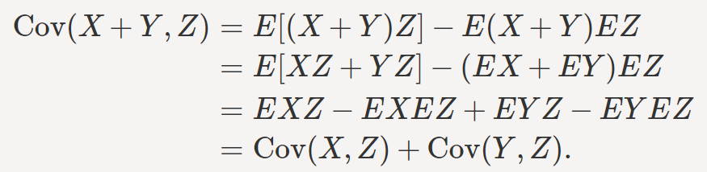

Wariancja sumy zmiennych losowych:

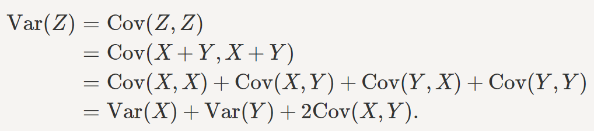

Różne właściwości korelacji (np. przechodniość): [link](https://www.analyticsvidhya.com/blog/2015/06/correlation-common-questions/)

Geometryczna interpretacja korelacji wielorakiej:

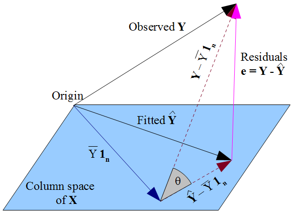**Semipartial correlation**

The semipartial (or part) correlation statistic is similar to the partial correlation statistic. Both measure variance after certain factors are controlled for, but to calculate the semipartial correlation one holds the third variable constant for \*\*either X or Y\*\*, whereas for partial correlations one holds the third variable constant for \*\*both\*\*.[6] The semipartial correlation measures unique and joint variance while the partial correlation measures unique variance[clarification needed]. The semipartial (or part) correlation can be viewed as more practically relevant "because it is scaled to (i.e., relative to) the total variability in the dependent (response) variable." [7] Conversely, it is less theoretically useful because it is less precise about the unique contribution of the independent variable. Although it may seem paradoxical, the semipartial correlation of X with Y is always less than or equal to the partial correlation of X with Y

##### Autocerrelation

[link:towardsdatascience](https://towardsdatascience.com/understanding-partial-auto-correlation-fa39271146ac)

### Statistical and ecometrical inference

#### Basics

#### Pameters estimation algorithms

##### General moments methods

##### Maxium likehood

##### Nonparametric techniques

#### Sampling techniques

##### Holdout

##### Boostrap

[link](https://online.stat.psu.edu/stat555/node/119/)

W bootstrapie z probki n-elementowej losujemy k raz podpróbki n-elementowe ALE ze zwracaniem. Losowanie próbek z podpróbek powinno symulować losowanie próbek z populacji (The population is to the sample as the sample is to the bootstrap samples). Bootstrap dzielimy na:

-   **parametryczny**: losowanie jest wykonywane z zadanego rozkładu a nie z samej próbki (czyli zakładamy że znamy klasę rozkładu, np. jest to rozkład normalny)

-   **semi-parametryczny** : The semiparametric bootstrap assumes that the population includes **other items that are similar to the observed sample by sampling from a smoothed version of the sample histogram**. It turns out that this can be done very simply by first taking a sample with replacement from the observed sample (just like the nonparametric bootstrap) and then adding noise.

-   **nieparametryczny**. Elementy są losowanie z konkretnych elementów z samej próbki.

**Boostrap dla regresji**

[@Biecek2008] s 13. (link)[<https://stats.stackexchange.com/questions/64813/two-ways-of-using-bootstrap-to-estimate-the-confidence-interval-of-coefficients>]

1.  Sample paired response-predictor: Randomly resample pairs of $y_i−x_i$, and apply linear regression to each run. After m runs, we obtain a collection of estimated coefficients $\hat{β_j},j=1,…,m$.. Finally, compute the quantile of $\hat{β_j}$.
2.  Sample error: First apply linear regression on the original observed data, from this model we obtain $\hat{β_o}$ and the error $ϵ_i$. Afterwards, randomly resample the error $ϵ_i$ and compute the new data with $\hat{β_o}$ and $y_i=\hat{β_o}x_i+ϵ_i$. Apply once again linear regression. After m runs, we obtain a collection of estimated coefficeints $\hat{β_j},j=1,…,m$. Finally, compute the quantile of $\hat{β_j}$.

##### Jacknife

##### Permutation

[@Biecek2008] s 13

##### Cross validation

##### Monte Carlo

Hasting algorithm.

Bardzo dobry filmik [link](https://www.youtube.com/watch?v=yCv2N7wGDCw) :

##### Stratified sampling

### Other issues

#### Similarity and dissimilarity meassures for observations

#### Similarity and dissimilarity meassures for distributions

#### Measures of disorder/randomness

#### Conformal prediction

##### Przykład knn dla random forest (klasyfikacja i regresja)

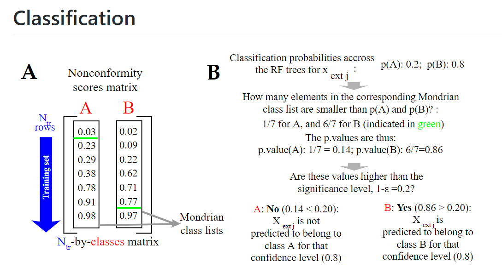

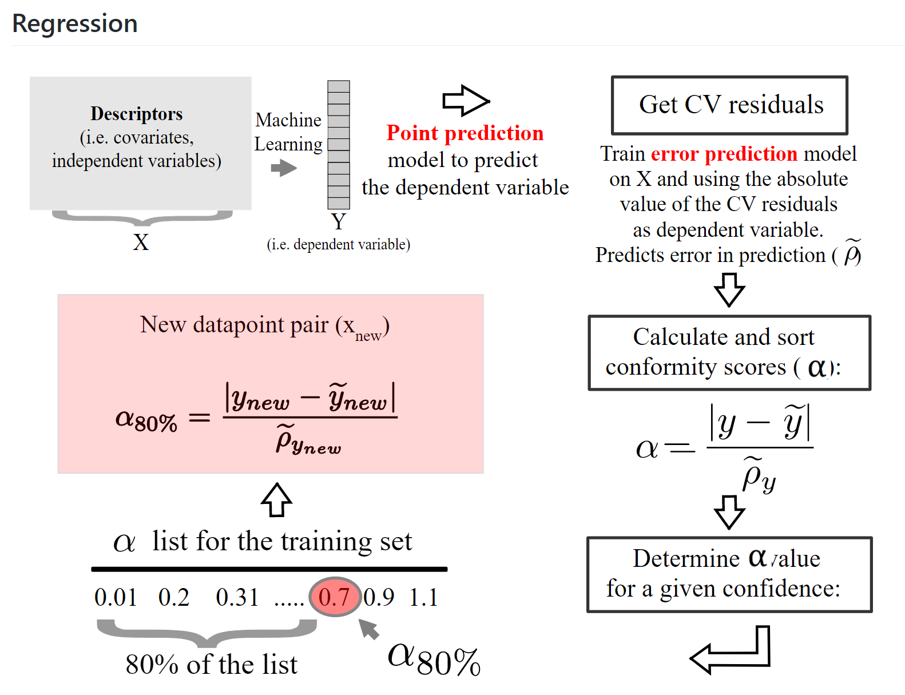

##### Przykład dla knn dla klasyfikacji ([link](https://medium.com/analytics-vidhya/a-guideline-to-conformal-prediction-7a392fc29bc1))

Let's do an exercise.

***Training set:***\
1. Positive samples: (0, 3), (2, 2), (3, 3)\
2. Negative samples: (-1, 1), (-1, -1), (0, 1)\
***Test sample:*** (0, 0)\
Let us calculate the euclidean distance from the new sample to each training sample.

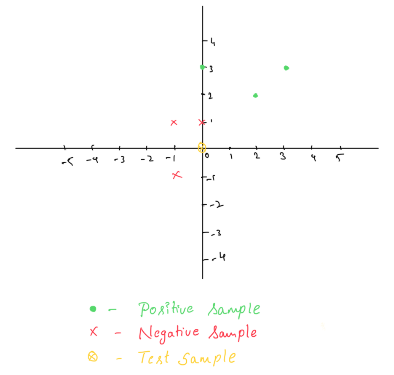

As conformity measure, use the distance to the nearest sample of a different class divided by the distance to the nearest sample of the same class.

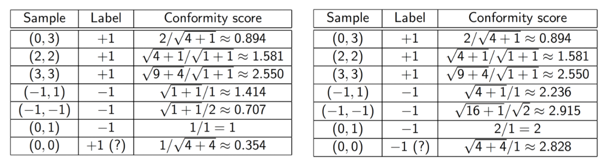

> 1\. Assume the label of (0, 0) is +1. The test sample is the strangest, so the p-value is 1/7 = 0.143.
>
> 2\. Assume the label of (0, 0) is -1. The test sample is the second most conforming; its rank is 6, so the p-value is 6/7 = 0.857.

The *p-values* are 0.143 (for +1) and 0.857 (for -1). We can predict -1, but our prediction does not achieve statistical significance of 5% for that we should at least have 20 training observations.

#### Paradoxes

3 paradoxes from kdnugget: [link](https://www.kdnuggets.com/2021/04/top-3-statistical-paradoxes-data-science.html)

## Math_3 - Deep Learning

Dobry zestaw materiałów dm.in do Deep LEarningu z Pytorch : [link](https://github.com/aladdinpersson/Machine-Learning-Collection)

Wyprowadzenie CNN i z sieci FC (fully connected): [link](https://www.kdnuggets.com/2018/04/derivation-convolutional-neural-network-fully-connected-step-by-step.html)

### Różne uwagi

#### Ogólnie o sieciach

Jeżeli mamy w sieci kilka outputów i dla każdego z nich inną funkcję straty, to wtedy w celu umożliwianie wstecznej propagacji tworzymy jedną funkcję straty które jest np. ważoną funkcją wszystkich poszczególnych funkcji straty.

Kolejność elementów po warstwie trenowanej:

The correct order is: Conv \> Normalization \> Activation \> Dropout \> Pooling

#### Funkcje aktywacyjne

<https://machinelearningmastery.com/choose-an-activation-function-for-deep-learning/>

Wybór funkcji aktywacyjnej do warstw ukrytych (hidden):

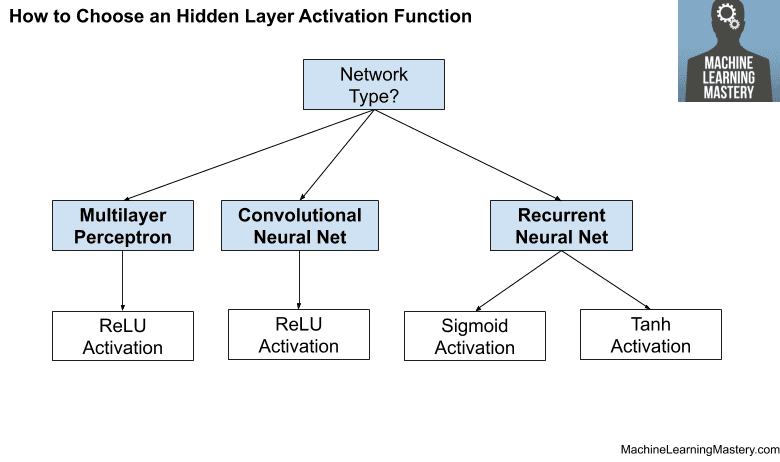

Wybór funkcji aktywacyjnych do warstwy wyjściowe (output)

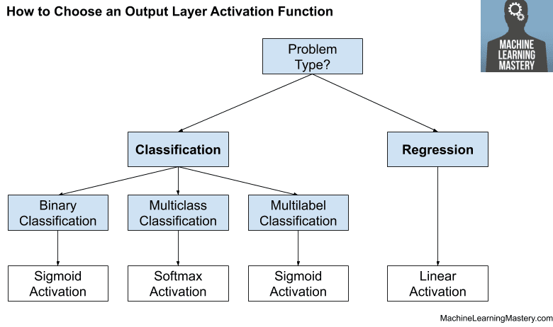

**Dropout**:

Na czym on polega? Wydaje mi się że wyłączenie nauronu to po prostu nałożenie na niego funkcji aktywacyjnej które niezależnie wejścia zwraca zero. Funkcja taka ma zerowy gradient, więc jeżeli robimy wsteczną propagację to nie będziemy modyfikowali wag "wyłączonego" nauronu.

Dodatkowo należy pamiętać o przeskalowaniu. Jeżeli w danej warstwie wyłączam *p* procent neuronów to output z pozostałych skaluje przez 1/(1+p).

#### RNN

[link](https://datascience-enthusiast.com/DL/Building_a_Recurrent_Neural_Network-Step_by_Step_v1.html) [link](https://chowdera.com/2021/01/20210111201949567G.html)

propagacja (Backpropagation Through Time (BPTT) wsteczna recznie rozpisana: [link](https://towardsdatascience.com/back-to-basics-deriving-back-propagation-on-simple-rnn-lstm-feat-aidan-gomez-c7f286ba973d) [link](https://willwolf.io/2016/10/18/recurrent-neural-network-gradients-and-lessons-learned-therein/)

Poniżej warto pamiętać że Wx i Wh są we wszystkich miejscach te same. To zakłada oczywiście stałość rozmiaru xt i ht w kolejnych warstwach.

LSTM:

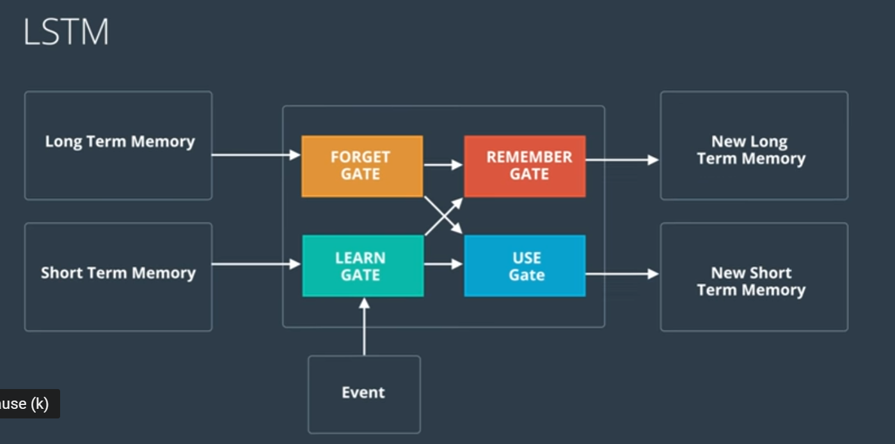

Parametry w funkcjach:

-   input_dim = rozmiar wektora dla konkretnego t

-   n_layers - ilość warstw

-   hidden_dim - rozmiar output = rozmiar stanu ukrytwgo h (pamiec krotkowerminowa) = rozmiar stanu ukrytego c (pamiec dlugoterminowa).

Embeding plus LSTM: [link](https://towardsdatascience.com/taming-lstms-variable-sized-mini-batches-and-why-pytorch-is-good-for-your-health-61d35642972e)

Zmienny rozmiar inputu z LSTM (batch = 1): [link](https://stackoverflow.com/questions/49832739/variable-size-input-for-lstm-in-pytorch)

#### CNN dwuwymiarowe:

Filtry konwolucyjne są wielowymiarowe natomiast warstwy pooling są płaskie. Po przepuszczeniu przez nie obrazu zmieniają się tylko wymiary dot. szerokości i wysokości.

##### R-CNN (Region-CNN)

podstawowe : [link](https://towardsdatascience.com/deep-learning-method-for-object-detection-r-cnn-explained-ecdadd751d22)

Architektura sieci:

1.  Zdjęcie jest przepuszczane przez algorytm który daje propozycje regionów gdzie mogą być obiekty (ROI).
2.  Każdy proponowany ROI jest przepuszczany przez sieć CNN. Ostatnia warstwa pooling w sieci CNN daje nam parametry do regresji która koryguje współrzędne bounding boxa. Dane są przepuszczane dalej do sieci FC (fully connected) która przekazuje wektor do modelu SVM który dokonuje klasyfikacji.

Trenowanie sieci:

1.  Przygotowuje sobie jakiś algorytm do tworzenia ROI (region of interest), np. Selective Search. Czyli algorytm ten zwróci nam propozycje bounding boxów gdzie mogą być jakieś elementy. Ewentualne trenowania/dostrajanie tego algorytmu jest dodatkowym zagadnieniem które nas tutaj nie interesuje. Zakładamy że mamy po prostu gotowy działający algorytm.

2.  Mam zbiór ze zdjęciami gdzie na każdym jest jeden obiekt danej klasy. Na tym zbiorze wstępnie trenuje sieć (np. VGG-16).

3.  Teraz zakładam że mam już zbiór ze zdjęciami gdzie każde z nich może zawierać wiele elementów rożnych klas. Dodatkowo są na nich zaznaczona poprawne (ground truth) bounding boxy. Z wstępnie wytrenowanej sieci usuwam ostatnią warstwę (output layer mogącą prognozować k klas ) i zastępują ją warstwą która ma możliwość prognozowania k+1 klas. Ta dodatkowa klasa jest po to aby umożliwić dotrenowanie sieci tak aby umożliwić wykrywanie dodatkowej klasy jaką jest tło (background). Zatem: Przepuszczam zdjęcie przez algorytm ROI. Zaproponowany przez ROI (proposed) region przekazuje do sieci. Następnie sieć klasyfikuje obiekt (wcześniej musimy zrobić resize, bo każdy obraz trafiający do sieci musi być tego samego rozmiaru). Jeżeli proponowany region pokrywa się z którym z prawdziwych regionów w przynajmniej 50% (pokrycie nazywa się: IoU - Intersection over Union) to sieć robi predykcje do jakiej klasy należy obiekt znajdujący się w tym regionie. Jeżeli pokrycie jest poniżej 50% to klasyfikujemy region jako tło (tła nie mają żadnych bounding boxów w groud truh).

4.  W kolejnym etapie, znowu usuwam ostatnią klasyfikacyjną warstwę (output layer). Na bazie wyników z nowej ostatniej warstwy (jest to wektor wynikowy z warstwy FC (fully connected)), trenujemy modele binarne SVM w rozpoznawaniu obiektów. Jeżeli mamy k klas to modeli SVM będzie k. Tutaj znowu zdjęcie przechodzi przez algorytm ROI i potem przez sieć. Jeżeli dla konkretnego i-tego modelu SVM (roznającego i-tą klasę) IoU \< threshold to automatycznie mamy wynik negtywny, w przeciwnym razie SVM klasyfikuje region binarnie. Dodatkowo równolegle trenujemy mechanizm do korekty rozmiaru i pozycji bounding boxa, tak żeby był jak najlepiej dopasowany do obiektu. Są to 4 modele regresyjne ( (1) modyfikacja szerokości (2) modyfikacja wysokości (3) przesunięcie w pionie (4) przesunięcie w poziomie). Tak więc poprzez regresje wytrenowaną na zależności między *proposed region* i *ground truth* region dostaniemy mechanizm do korekty. Wartości tych korekt będą oczywiście dynamiczne w zależności od zdjęcia. Aby tą dynamiczność uzyskać wartościami które są parametrami regresji stają się features from the last pooling layer of the CNN.

##### Fast R-CNN

[link](https://towardsdatascience.com/fast-r-cnn-for-object-detection-a-technical-summary-a0ff94faa022)

##### Fast-er R-CNN

[link](https://medium.com/alegion/deep-learning-for-object-detection-and-localization-using-fast-r-cnn-85d52e3928a1); [link](https://medium.com/@smallfishbigsea/faster-r-cnn-explained-864d4fb7e3f8)

Jest to ulepszenie R-CNN i Fast R-CNN. Tutaj do tworzenia RoI nie potrzebujemy dodatkowego algorytmu. RoI będą powstawały w ramach naszej sieci i będzie to tzw RPN (*Region proposal network*). Dodatkowo co CNN trafia cały obraz a nie RoI to przyśpiesza trenowanie sieci. RoI są dopiero wykorzystywane na featurach zwracanych przez CNN.

Architektura:

Na zdjęciu ustalam tzw. anchors/boxes. Są to okna o różnych rozmiarach i proporcjach. Ilość tych okien i ich rozmiar jest hiperparametrem który możemy ustawiać. Każdy anchor jest przeliczany dla każdego pixela (czyli slidujemy po każdym pixelu).

Zdjęcia przepuszczamy przez sieć CNN. Wyniki z CNN oraz anchors trafiają następnie do sieci RPN ([link](https://blog.deepsense.ai/region-of-interest-pooling-explained/)), odpowiadającą za tworzenie RoI. Sieć zwraca dla każdego anchors prawdopodobieństwa że zawierają obiekt. Musimy wyselekcjonować najlepsze anchors. Robimy to poprzez NMS czyli Non-maximum suppression ([link](https://medium.com/alegion/faster-r-cnn-using-region-proposal-network-for-object-detection-c113b6dd00a)):

1.  Select the box that has the highest score.

2.  Compute its overlap with all other boxes, and remove boxes that overlap it more than the IOU threshold

3.  Go back to step 1 and iterate until there's no more boxes with a lower score than the current selected box.

Otrzymane najlepsze anchors są dodatkowo korygowane pod względem rozmiaru i pozycji modelem regresyjnym i dzięki temu otrzymujemy finalne RoI. Te RoI następnie służą do wycinania elementów z wyników CNN (czyli wycinamy na featurach, a nie na oryginalnym zdjęciu). Następnie przepuszczam te wyniki przez warstwę RoiI pooling która standaryzuje mi rozmiar outputu. Warstwa ta ma dynamiczny rozmiar w zależności od rozmiaru zdjęcia. Dynamiczny wymiar umożliwia właśnie stały rozmiar outputu przy zmiennym rozmiarze inputu (wycinki mogą mieć różny rozmiar i proporcje). Standaryzacja zdjęcia jest potrzebna aby można było je potem przepuścić do warstw FC (które w przeciwieństwie do warstw konwolucyjnych muszą mieć określone rozmiary).

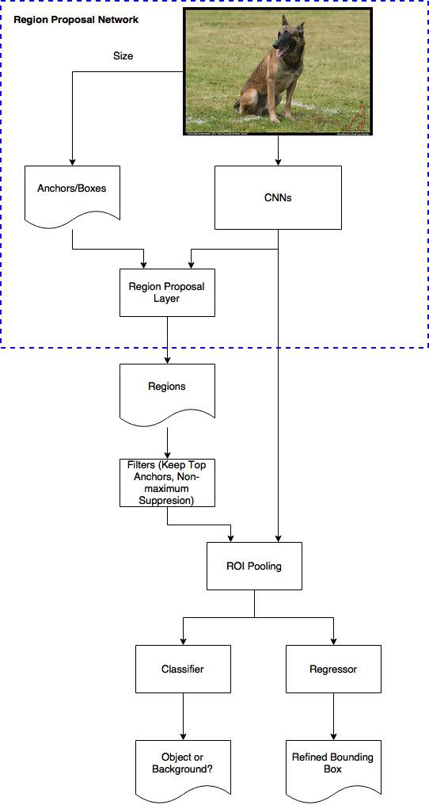

Dalej wyniki przepuszczam przez kolejne warstwy (tutaj nie wiem czy są to po prostu od razu FC (fully connected), czy jakaś większa architektura. Ale raczej od razu powinno być FC. Tak czy inaczej na końcu zawsze jest jakieś FC i standaryzacja przez RoI pooling ma sens). Po czym mamy rozgałęzienie aby otrzymać dwie predykcje:

-   klasę obiektu (konkretna klasa a nie tylko binarne rozróżnienie tło/obiekt).

-   korektę (drugą - bo pierwsza była liczona w algorytmie RNP) na współrzędne bounding box.

O tym jak robić to rozgałęzienie trzeba poczytać w materiałach o podstawowym R-CNN.

Trenowanie sieci:

1.  RPN - Siec ma rozpoznawać 2 rzeczy: po pierwsze dla każdej pozycji każdego anchora ma binarnie określać czy mamy do czynienia z obiektem czy z tłem. Po drugie musimy mieć współrzędne i wymiary bounding boxów które mają największe prawdopodobieństwo że znajduje się w nich obiekty.

    Zatem aby wytrenować RPN pod kątem rozpoznawania tło/obiekt zakładamy, że mamy zbiór danych z gronud truch bounding boxes. Dla każdego anchor muszę określić jakie jest prawdopodobieństwo, że zawiera obiekt. Zakładam że stopień w jakim anchor pokrywa się z ground truth bounding box określa prawdopodobieństwo, że ten anchor rzeczywiście zawiera obiekt a nie tło. Zatem możemy zbudować sieć o następującym inpucie: Let's say the 600x800 image shinks 16 times to a 39x51 feature map after applying CNNs. Every position (dla każego pixela) in the feature map has 9 anchors, and every anchor has two possible labels (background, foreground). If we make the depth of the feature map as 18 (9 anchors x 2 labels), we will make every anchor have a vector with two values (normal called logit) representing foreground and background.

    Na outpucie siecie dajemy softmax/logistic regression activation function i trenujemy model który nam zwróci prawdopodobieństwo.

    Następnie trenujemy też regresję do korekty proponowanych anchores. Tutaj pamiętamy, że tło (backgroud) nie ma gorund truth boxes. Ma ją je tylko obiekty. Kontynując założenia z przykładu do trenowania labeli mamy: The depth of feature map is 32 (9 anchors x 4 positions (4 bo : wysokość, szerokość, przesunięcie w pionie, przesunięcie w poziomie)).

    The overall loss of the RPN is a combination of the classification loss and the regression loss.

2.  Jeżeli chodzi o trenowanie pozostałych elementów sieci to tutaj trzeba chyba poczytać o zwykłym RCNN. Bo de facto w porównaniu do zwykłego R-CNN zmienił nam się sposób budowy i lokalizacji algorytmu RoI, ale reszta elementów powinna działać podobnie. Pytanie czy RoI można trenować równolegle z pozostałymi elementami sieci.

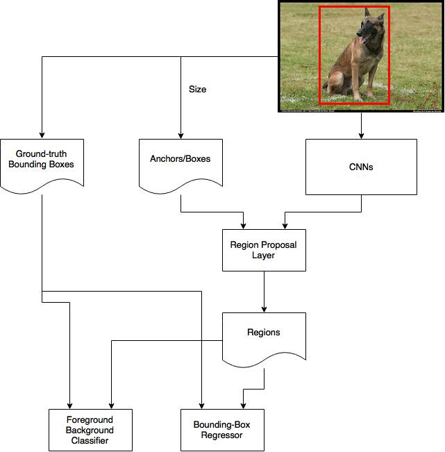

##### Yolo

Architektura:

Przepuszczam obaz przez sieć po czym dostaję predykcję bounding boxów i class elementów w bounding boxach.

Następnie stosuje algorytm NMS. Ma 2 thresholdy. Jeden usuwa boxy któRe mają małe prawdopodobieństwa wystąpienia obiektu w boxie (niskie pc). Drui odpowiada za IoU. Jeżeli IoU wynosi *n* to elementy z tej samej klasy dla których bounding boxy pokrywają się w takim stopniu że IoU jest większy nić \*n\* to usuwamy je (z wyjątkiem tego o największym Pc).

Wady sieci. W jednej komórce może wykryć tylko jeden obiekt danej klasy.

Trenowanie:

Przygotowujemy zbiory obrazow dla których mamy podział na grid i dla każdego grida określone elementy wektora:

pc1

c1

...

cn

x1

y1

w1

h1

pc2

c1

...

cn

x2

y2

w2

h2

### Embedding

Impelementacja word2vec w pytorch:

<https://gist.github.com/GavinXing/9954ea846072e115bb07d9758892382c>

Logika dzialania embedding w przypadku pytorch-a dla tekstu (według moich domysłów!) jezeli chcialbym to zaimplementowac zwykla warstwa Linear:

Dostaje obserwacja postawi calego zdanie. Zdanie to dekomponuje na macierz o wymiarach vxd. v - o slownik (wszystkie mozliwe unikalne wyrazy we wszystkich probkach) a d to ilosc slow. Nastepnie slowo po slowie laduje do sieci i dostaje kolejne wyniki o wymiarach e (e to wymiar embeddingu).

## Math_4 -- Game theory

## Math_5 -- Optimisation

### Functions optimum

### Functions optimum -- constrained

#### Lagrange Multipliers

#### Linear programming

#### Nonlinear programming

#### Regularization

### Functional optimum

#### Dynamic programming

#### Calculus of variations

### Cost functions

### Back propagation

### Heuristic algorithms

#### Swarm algorithm

#### Ants algorithm

#### Genetics algorithms

## Math_5 -- Other issues

### Functions usefull in Data Science

### Useful tricks

### Linear algebra

### Combinatorics

### Numerical methods

### Equations

#### x as number

#### X as derivative: differential and difference equations

#### Choas

##### logistic map

[link: varitasium channel](https://www.youtube.com/watch?v=ovJcsL7vyrk&t=356s)

### Fuzzy logic

### Graphs
