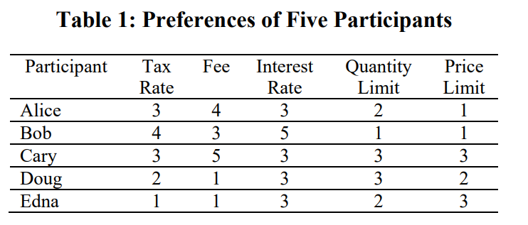
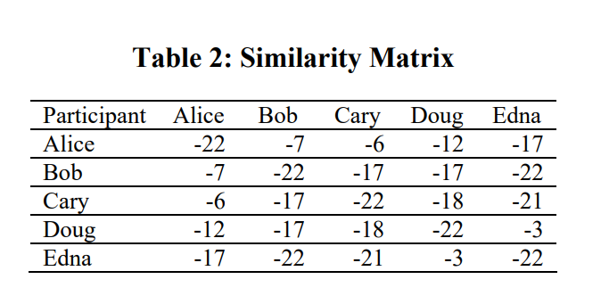
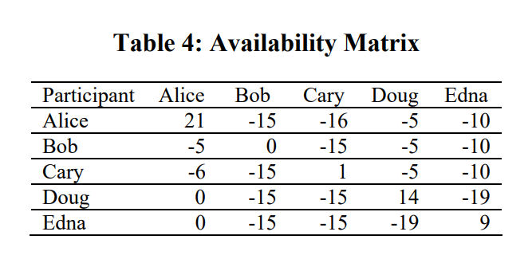
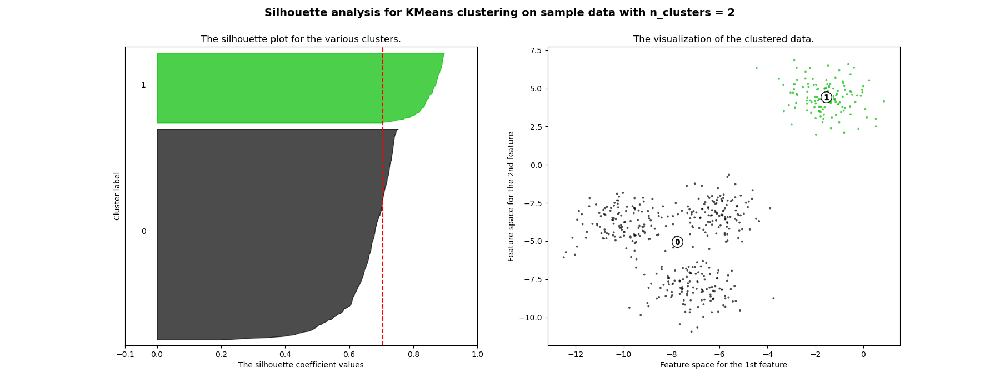

# LEARNING: PATTERNS DISCOVERING

## Introduction

## Clustering

17 algorytmów clusteringowych: [link](https://towardsdatascience.com/17-clustering-algorithms-used-in-data-science-mining-49dbfa5bf69a?gi=6587e8b747e3).

Rodzaje klastrowania (strona cse): [link](https://www.cse.iitb.ac.in/infolab/Data/Courses/CS632/1999/clustering/node2.html).

Ogólne uwagi:

-   Nie ma jednej precyzyjnie przyjętej definicji klastra. W ogólności zakłada się że elementy wewnątrz klastra powinny być podobne ze względu na interesujące na kryterium, a obiekty z różnych klastrów powinny się istotnie różnic.

-   Klastrowanie nie jest całkowicie nienadzorowanym procesem. Kiedy dokonujemy klastrowania to musimy wiedzieć jaką informacje mają nam dać klastry. Przykładowo kraje świata możemy poklastrować przy pomocy setek zmiennych. Tylko jaką informację dadzą nam klastry które są zrobione w oparciu o bardzo różne tematycznie nie związane ze sobą zmienne? W klastrowaniu musimy sobie wyznaczyć, że chcemy poklastrować kraje ze względu np. na poziom życia. Albo ze względu na warunki geograficzne. Ten ogólny cel podpowie nam jakie zmienne dobrać i ułatwi nam interpretowalonść klastrów.

-   Warto pamiętaś o przemyśleniu standaryzacji zmiennych i ewentyalnie nadaniu im wag.

-   Zmienne do modelu powinny też cechować się w miarę dużą wariancją (min.10%)

-   Jest problem ze zmiennymi jakościowymi. Większość algorytmów ich nie obsługuje. Pytanie czy zwykłe przekodowanie na *dummies* będzie wystarczające.

-   Nie bardzo wiadomo jak podejść do redukcji wymiarowości . Może grozić duża utrata informacji. Tu jest dobry przykład kiedy PCA spowoduje utratę informacji:

    

    Generalnie zalecane jest żeby spróbować i zobaczyć czy dane się lepiej klastrują po redukcji wymiarowości.

-   Nie bardzo wiadomo jak zdefiniować over/under fitting. Coś na temat rozwiązania tego problemu napisane jest w rozdziale o *consensu clustering*.

-   W algorytmach jest problem z klątwą wymiarowości. Dlatego przy dużej ilości wymiarów potrzebne są bardzo duże próby.

    \

### 

### Introduction

### Hierarchical (Connectivity-based)

#### Agglomerative/Divisive

Przykładowy algorytm aglomeracyjny:

1.  Na początku każdy element stanowi oddzielny klaster.
2.  Liczymy odległości pomiędzy wszystkimi klastrami (tworzę macierz odległości). W pierwszej iteracji każdy element jest klastrem. Wzory na liczenie odległości między klastrami są różne (patrz np @Gatner2009 str. 414).
3.  Z macierzy wybieram 2 najbliższe klastry i łączę je.
4.  Procedurę powtarzam aż uzyskam jeden klaster obejmujący wszystkie obserwacje.

Przykładowy algorytm deglomeracyjny (książka Gatnara):

1.  Dla każdego klastra wyznacz najbardziej odległe obserwacje (na początku w pierwszej iteracji mamy tylko jeden klaster). Ten klaster dla którego ta odległość jest największa wybierz do podziału.

2.  Dla wybranego klastra dla każdej obserwacji oblicz średnią odległość od pozostałych obiektów. Obiekt dla którego uzyskano średnią największą odległość stanowi zalążek nowego klastra A. Pozostałe obiekty stają się tymczasowym klastrem B.

3.  Dla każdej obserwacji w klastrze tymczasowym B obliczam średnią odległość od pozostałych obiektów z B oraz oddzielnie średnią odległość od obiektów z A (na początek mamy jeden element w A). Elementy z B które mają średnią odległość bliższą do A są przerzucane do A. Przerzucanie kontynuujemy aż nie będzie się dało już przerzucić żadnego następnego elementu.

4.  Cały proces znajdowania nowych klastrów kontynuujemy do momentu, aż każdy obserwacja stanie się pojedynczym klastrem.

#### CHAMELEON

#### BIRCH

Klaster jest reprezentowany w syntetyczny sposób w postaci 3 informacji (tzw. CF):

-   liczebności klastra

-   sumy wartości zmiennych po wszystkich obserwacjach, ale niezależnie po każdym wymiarze.

-   duma kwadratów wartości zmiennych (tutaj chyba jest jedna liczba bo robimy to na raz po wszystkich zmiennych)

Pseudoalgorytm (mój intuicyjny):

-   Mam zbiór obserwacji. Wybieram pierwszą z nich i alokuje ją do pierwszego klastra wyliczając CF.

-   Wybieram kolejną obserwację. Sprawdzam czy po przypisaniu jej do pierwszego klastra spełniony jest warunek że średnia klastra nie może być większa nić założona wartość *d*. Jeżeli warunek nie jest spełniony to tworzę nowy klaster.

-   Wybieram kolejną obserwację. Sprawdzam do którego klastra ma najbliżej i znowu sprawdzam warunek średnicy klastrów. Jeżeli nie da się obserwacji umieścić w żadnym klastrze to tworzę nowy klaster.

-   Jeżeli liczba klastrów jest za duża, to muszę je zagregować. Agreguje się klastry które są blisko siebie.

-   Proces kolejnych agregacji można przedstawić w postaci drzewa CF (CF tree), co powoduje, że algorytm jest algorytmem hierarchicznym.

-   Na wynikach drzewa (wartościach syntetycznych CF), można przepuścić standardowe algorytmy klastrujące.

Pros:

-   Scales linearly: finds a good clustering with a single scan and improves the quality with a few additional scans

-   It has back-tracking capability.

-   It is also an incremental method that does not require the whole data set in advance.

Cons:

-   It cannot handle non-numeric data.

#### HDBSCAN

#### ROCK

#### Echidna

#### Diana

#### Agnes

### Partititonal

#### k-methods

##### k-means

Pseudoalgorytm (mój intuicyjny):

1.  ustalam ilość centroidów *k*
2.  Zazwyczaj dobrze jest znormalizować dane. Dane powinni być numeryczne.
3.  Wybieram losowo pozycję k centroidów.
4.  Obliczam dla każdego elementów odległość do poszczególnych centroidów. Każdy element przypisuje do tego centroidu do którego ma najbliżej
5.  Liczę nowe współrzędne każdego centroidu poprzez uśrednienie współrzędnych elementów które są przypisane do danego centroidu.
6.  Ponieważ mamy nowe współrzędne cetroidów wracam do puntu 4 i robimy nowe przeliczenia. Obliczenia kończymy jeżeli przekroczymy zadaną liczbę iteracji lub centroidy z kolejnych iteracjach nie zmieniają położenia w istotny sposób.

Pros:

1.  Simple to understand

2.  Fast to cluster

3.  Widely available (there are several packages that implement K-means)

4.  Easy to implement

5.  Always yields a result (also a con, as it may be deceiving)

Cons:

1.  We need to choose the number of clusters (*remedy: elbow method*)

2.  it is sensitive to initialization (*remedy: kmeans++*)

3.  Sensitive to outliers (*remedy: remove outliers*)

4.  Standardization

##### k-means ++

Tutaj jest modyfikacja w stosunku do standardowego k-means polegająca na modyfikacji wyboru początkowego położenia centroidów:

1.  Choose one center uniformly at random among the data points.

2.  For each data point x not chosen yet, compute D(x), the distance between x and the nearest center that has already been chosen.

3.  Choose one new data point at random as a new center, using a weighted probability distribution where a point x is chosen with probability proportional to D(x)^2^.

4.  Repeat Steps 2 and 3 until k centers have been chosen.

5.  Now that the initial centers have been chosen, proceed using standard [*k*-means clustering](https://www.wikiwand.com/en/K-means_clustering).

##### k-means ++ scalable

Dokładny przykład numeryczny: [link](https://stats.stackexchange.com/questions/135656/k-means-a-k-a-scalable-k-means)

Podobnie ja w k_means++ tutaj mamy modyfikację sposobu wyboru początkowego położenia centroidów.

Pseudoalgorym (mój intuicyjny):

1.  Ustalamy ilość docelową centroidów *k*.
2.  Wybieram losowo punkt który będzie pierwszym centroidem.
3.  Liczymy odległość wszystkich punktów do tego centroidu. Każdemu punktowi przypisujemy odległość do centroidu i w jego oparciu przypisujemy mu prawdopodobieństwo $p_x = l\cdot d^2(x,\mathcal{C})/\phi_X(\mathcal{C})$ (prawdopodobieństwa dla wszystkich punktów nie muszą się sumować do 1. Wystarczy że prawdopodobieństwo dla każdego punktu będzie z przedziału [0,1]. Mianownik tego wzoru to suma wszystkich odległości.
4.  Dla każdego punktu niezależnie losujmy wartość z przedziału [0,1]. Wszystkie punkty których prawdopodobieństwo będzie większe od wylosowanych dla nich wartości traktujemy jako centroidy.
5.  Punkt 3 i 4 powtarzamy kilka razy otrzymując dużą ilość centroidów. W punkcie 3 oczywiście zakładamy w obliczeniach że tym razem mamy więcej niż jeden centroid.
6.  Liczmy wagi dla każdego centroidu. Dużą wagę ma centroid który ma dużo punktów dla których jest on najbliżej.
7.  Z listy centoridów losujemy kolejno k centroidów uwaględniając wagi. Po wylosowaniu kolejno każdego centroidu usuwamy go ze zbioru, liczymy nowe wagi i dokonujemy kolejnego losowania.
8.  W tym momencie mamy listę centroidów i możemy wykonywać normalną analizę k-means.

**Ogólny algorytm:**

**Przykład** (używając oznaczeń z powyższego algorytmu):

Mamy zbiór danych:

data points: (7,1),(3,4),(1,5),(5,8),(1,3),(7,8),(8,2),(5,9),(8,0)

l = 2 // oversampling factor

k = 3 // no. of desired clusters

**Step 1:**

Suppose the first centroid is $\mathcal{C}$ is $\{c1\} = \{(8,0)\}$

X={x1,x2,x3,x4,x5,x6,x7,x8}={(7,1),(3,4),(1,5),(5,8),(1,3),(7,8),(8,2),(5,9)}

$\phi_X(\mathcal{C})$ is the sum of all smallest 2-norm distances (euclidean distance) from all points from the set X to all points from $\mathcal{C}$. In other words, for each point in X find the distance to the closest point in $\mathcal{C}$, in the end compute the sum of all those minimal distances, one for each point in X.

Denote with $d^2_{\mathcal{C}}(x_i)$ as the distance from $x_i$ to the closest point in $\mathcal{C}$. We then have $\psi = \sum_{i=1}^{n}d^2_{\mathcal{C}}(x_i)$

At step 2, $\mathcal{C}$ contains a single element (see step 1), and X is the set of all elements. Thus in this step the $d^2_{\mathcal{C}}(x_i)$ is simply the distance between the point in $\mathcal{C}$ and $x_i$. Thus $\phi = \sum_{i=1}^{n}{||x_i-c||^2}$.

log(\\psi) = log(52.128) = 3.95 = 4 (rounded)

> $\psi = \sum_{i=1}^nd^2(x_i,c_1) = 1.41+6.4+8.6+8.54+7.61+8.06+2+9.4 = 52.128$
>
> $log(\psi) = log(52.128) = 3.95 = 4 (rounded)$.

Note however that in step 3, the general formula is applied since $\mathcal{C}$ will contain more than one point.

**Step 3:**

The *for* loop is executed for $log(\psi)$ previously computed.

The drawings are not like you understood. The drawings are independent, which means you will execute a draw for each point in X. So, for each point in X, denoted as $x_i$, compute a probability from $p_x = l d^2(x,\mathcal{C})/\phi_X(\mathcal{C})$ . Here you have ll a factor given as parameter, $d^2(x,\mathcal{C})$ is the distance to the closest center, and $\phi_X(\mathcal{C})$ is explained at step 2.

The algorithm is simply:

-   iterate in X to find all $x_i$

-   for each $x_i$ compute $p_{x_i}$

-   generate an uniform number in [0,1], if is smaller than $p_{x_i}$ select it to form $\mathcal{C'}$

-   after you done all draws include selected points from $\mathcal{C'}$ into $\mathcal{C}$

Note that at each step 3 executed in iteration (line 3 of the original algorithm) you expect to select ll points from XX (this is easily shown writing directly the formula for expectation).

    for(int i=0; i<4; i++) {

      // compute d2 for each x_i
      int[] psi = new int[X.size()];
      for(int i=0; i<X.size(); i++) {
        double min = Double.POSITIVE_INFINITY;
        for(int j=0; j<C.size(); j++) {
          if(min>d2(x[i],c[j])) min = norm2(x[i],c[j]);
        }
        psi[i]=min;
      }

      // compute psi
      double phi_c = 0;
      for(int i=0; i<X.size(); i++) phi_c += psi[i];

      // do the drawings
      for(int i=0; i<X.size(); i++) {
        double p_x = l*psi[i]/phi;
        if(p_x >= Random.nextDouble()) {
          C.add(x[i]);
          X.remove(x[i]);
        }
      }
    }
    // in the end we have C with all centroid candidates
    return C;

**Step 4:**

A simple algorithm for that is to create a vector ww of size equals to the number of elements in $\mathcal{C}$, and initialize all its values with 0. Now iterate in X (elements not selected in as centroids), and for each $x_i \in X$, find the index j of the closest centroid (element from $\mathcal{C}$) and increment w[j] with 1. In the end you will have the vector $w$ computed properly.

    double[] w = new double[C.size()]; // by default all are zero
    for(int i=0; i<X.size(); i++) {
      double min = norm2(X[i], C[0]);
      double index = 0;
      for(int j=1; j<C.size(); j++) {
        if(min>norm2(X[i],C[j])) {
          min = norm2(X[i],C[j]);
          index = j;
        }
      }
      // we found the minimum index, so we increment corresp. weight
      w[index]++;
    }

**Step 5:**

Considering the weights $w$ computed at the previous step, you follow kmeans++ algorithm to select only $k$ points as starting centroids. Thus, you will execute $k$ for loops, at each loop selecting a single element, drawn randomly with probability for each element being $p(i) = w(i)/\sum_{j=1}^m{w_j}$. At each step you select one element, and remove it from candidates, also removing its corresponding weight.

    for(int k=0; k<K; k++) {
      // select one centroid from candidates, randomly, 
      // weighted by w
      // see kmeans++ and you first idea (which is wrong for step 3)
      ... 
    }  

All the previous steps continues, as in the case of kmeans++, with the normal flow of the clustering algorithm

I hope is clearer now.

I found also a presentation made by authors, where you can not clearly that at each iteration multiple points might be selected. The presentation is [here](http://web.stanford.edu/group/mmds/slides2012/s-bahmani.pdf).

It is obvious that $log(\psi)$ depends on data and the issue you raised would be a real problem if the algorithm would be executed on a single host/machine/computer. However you have to note that this variant of kmeans clustering is dedicated to large problems, and for running on distributed systems. Even more, the authors, in the following paragraphs above the algorithm description state the following:

> Notice that the size of $\mathcal{C}$ is significantly smaller than the input size; the reclustering can therefore be done quickly. For instance, in MapReduce, since the number of centers is small they can all be assigned to a single machine and any provable approximation algorithm (such as k-means++) can be used to cluster the points to obtain k centers. A MapReduce implementation of Algorithm 2 is discussed in Section 3.5. While our algorithm is very simple and lends itself to a natural parallel implementation (in $log(\psi)$ rounds ), the challenging part is to show that it has provable guarantees.

Another thing to note is the following note on the same page which states:

> In practice, our experimental results in Section 5 show that only a few rounds are enough to reach a good solution.

Which means you could run the algorithm not for $log(\psi$)\$ times, but for a given constant time.

##### c-fuzzy means

Szczegółowy opis: [link](https://matteucci.faculty.polimi.it/Clustering/tutorial_html/cmeans.html)

Przykłąd numeryczny: [link](https://www.geeksforgeeks.org/ml-fuzzy-clustering/)

Pseudoalgorym (mój intuicyjny):

1.  Ustalam ilość klastrów *k*.

2.  Inicjalizuje *partitioning matrix*. Określa on stopień przynależności każdej obserwacji do każdej klasy. Ma więc ilość kolumn i wierszy proporcjonalną do ilości klastrów i obserwacji. Zainicjowana macierz jest wypełniona zerami i jedynkami.

3.  Obliczam współrzędne centroidów uśredniając zmienne po wszystkich obserwacjach i ważąc wagami którymi są elementy *partition matrix*:

    $C_j = \frac{\sum\limits_{x \in C_j} u_{ij}^m x}{\sum\limits_{x \in C_j} u_{ij}^m}$

4.  Mając wyliczone centroidy mogę policzyć odległości i w oparciu nowe wagi (stopnie przynależności) i tym samym zaktualizować wartości *partition matrix*:ameila

    $u_{ij}^m = \frac{1}{\sum\limits_{l=1}^k \left( \frac{| x_i - c_j |}{| x_i - c_k |}\right)^{\frac{2}{m-1}}}$

    -   $c_j$ is the centroid of the cluster j

    -   $u_{ij}$ is the degree to which an observation $x_i$ belongs to a cluster $c_j$

5.  Wracam do punktu 3. Wykonuję iteracje aż zmiany w *partition matrix* nie będą istotne.

Algorytym minimalizuje wyrażenie:

$\sum\limits_{j=1}^k \sum\limits_{x_i \in C_j} u_{ij}^m (x_i - \mu_j)^2$

Where,

-   \$u\_{ij} is the degree to which an observation xixi belongs to a cluster cjcj

-   $\mu_j$ is the center of the cluster j

-   $u_{ij}$ is the degree to which an observation xixi belongs to a cluster \$c_j\$

-   m is the fuzzifier.

##### k-medoids

Przkład numeryczny: [link](https://www.geeksforgeeks.org/ml-k-medoids-clustering-with-example/)

**Medoids** are representative objects of a [data set](https://www.wikiwand.com/en/Data_set) or a [cluster](https://www.wikiwand.com/en/Cluster_analysis "Cluster analysis") within a data set whose average dissimilarity to all the objects in the cluster is minimal.^[[1]](https://www.wikiwand.com/en/Medoid#citenoteStruyf19971)^ Medoids are similar in concept to [means](https://www.wikiwand.com/en/Mean "Mean") or [centroids](https://www.wikiwand.com/en/Centroids "Centroids"), but medoids are always restricted to be members of the data set

Pseudoalgorytm (mój intuicyjny dla Partitioning Around Medoids (PAM) czyli najpopularniejszej implementacji tej metody):

1.  Wybieram ilość klastrów *k*.
2.  Losuje k punktów jako medoid.
3.  Przypisuje każdy punkt do medoidu do którego ma najbliżej i otrzymuje klastry.
4.  Obliczam funkcję kosztu. Dla każdego medoidu liczymy sumą odległości obserwacji od medoidu następnie wyniki z wszystkich medoidów sumujemy.
5.  Następnie dla każdego medoida losuje po kolei różne obserwacje i sprawdzam jaka jest nowa wartość kosztu. Jeżeli koszt spada to obserwacja zastąpi analizowany medoidu.
6.  Punkt 4 (zamiany medoidów w innymi obserwacjami) do momentu aż nie da się nic uzyskać.

Przykład liczenia kosztu:

Poniżej mam 10 obserwacji z dwoma zmiennymi (x,y). Obserwacje na czerwono to dwa medoidy. W dwóch ostatnich kolumnach mamy odległości obserwacji od medoidów. Punkty `1, 2, 5` idą do medoidu `C1` a `0, 3, 6, 7, 8` do medoidu `C2`. Koszt w tym wypadku wynosi:

koszt=(3 + 4 + 4) + (3 + 1 + 1 + 2 + 2) = 20

1.  Select k of the n data points as the medoids to minimize the cost

2.  Associate each data point to the closest medoid.

3.  (SWAP) While the cost of the configuration decreases:

    1.  For **each** medoid m, and for **each** non-medoid data point o:

        1.  Consider the swap of m and o, and compute the cost change

        2.  If the cost change is the current best, remember this *m* and *o* combination

    2.  Perform the best swap of $m_{best}$ and $o_{best}$ , if it decreases the cost function. Otherwise, the algorithm terminates.

**Pros:**

1.  It is simple to understand and easy to implement.

2.  PAM is less sensitive to outliers than other partitioning algorithms.

3.  It works efficiently for small data sets.

**Cons:**

1.  The main disadvantage of K-Medoid algorithms is that it is not suitable for clustering non-spherical (arbitrary shaped) groups of objects. This is because it relies on minimizing the distances between the non-medoid objects and the medoid (the cluster centre) -- briefly, it uses compactness as clustering criteria instead of connectivity.

2.  It may obtain different results for different runs on the same dataset because the first k medoids are chosen randomly.

3.  It does not scale well for large data sets.

4.  Its processing is more expensive than k-means method

##### k-medians

Jest to algorytm k-means ale przy obliczania współrzędnych centroidów używamy mediany a nie średniej. Dodatkowo jako metryka odległości jest używany metryka miejska a nie euklidesowa.

##### k-modes

Jest to k-means dla danych jakościowych. Do liczenia centroidów stosuje się tutaj dominanty, a do pomiaru odległości między obserwacjami są inne miary (doczytać jakie. W jednym artykule wymieniono np. cosinus, ale tutaj poniżej jest przykład bardzo prostej miary).

Przykład numeryczny: [link](https://www.youtube.com/watch?v=b39_vipRkUo)

Obliczanie odległości miedzy obserwacjami.

Obliczanie centroidu poprzez dominanty:

Input: Data objects X, Number of clusters K.

Step 1: Randomly select the K initial modes from the data objects such that Cj, j = 1,2,...,K Step 2: Find the matching dissimilarity between the each K initial cluster modes and each data objects.

Step 3: Evaluate the fitness using the Eq.(1)

Step 4: Find the minimum mode values in each data object i.e. finding the objects nearest to the initial cluster modes.

Step 5: Assign the data objects to the nearest cluster centroid modes.

Step 6: Update the modes by apply the frequency-based method on newly formed clusters. Step 7: Recalculate the similarity between the data objects and the updated modes.

Step 8: Repeat the step 4 and step 5 until no changes in the cluster ship of data objects. Output: Clustered data objects

##### k-prototypes

Przykład z Youtuba jak używ w Pythonie: [AIEngineering](https://www.youtube.com/watch?v=8eATPLDJ0NQ)

Jest to mix metody k-means i k-modes. Można ją zatem stosować do zmiennych na mieszanych skalach (ilościowe i jakościowe). Oddzielnie Liczy się odległość ze względu na zmienne ilościowe (metryka euklidesa) i oddzielnie ze względu na jakościowe. Następnie obie odległości się agreguje.

Przykład obliczania odległości (mamy trzy centroidy i punkt x ):

Example 1. We assume that k = 3. Each current cluster center is as follows: C1=(A, A, A, 5), C2=(B, B, B, 7), and C3=(B, B, B, 8). As shown by Figure, we have to compute the distance between Xi=(B, B,B,4) and each of cluster centers (C1, C2, and C3) for assigning Xi to the cluster of the closest center. Firstly, we compute the distance of numerical attributes, dr(Xi,Cj) is 1, 9, and 16, respectively. Xi is the closest to C1 only with numerical attributes. In this example, objects consisted of three categorical attributes; the minimum value of possible distance is 0, and the maximum value is 3. The difference of numerical distance between dr(Xi,C1) and dr(Xi,C2) is 8. Thus, Xi continues to be the closest to C1, even if dc(Xi,C1) is calculated by 3 as the computable max difference value.

Wzór na centroidy:

**D(x,p) = E(x,p) +**λ **C(x,p)**

Where,\
x = Any datapoint,\
y = Prototype of a cluster,\
D(x,p) = Dissimilarity measure between x and y,\
E(x,p) = Euclidean distance between **continuous attributes** of x and y,\
C(x,p) = number of mismatched **categorical attributes** between x and y,\
λ= weightage for categorical variable value.

##### k-means SGD (stochastic gradient descent)

Tutaj aktualizacja pozycji centroidów opiera się o gradient minimalizowanej funkcji.

##### k-mini-batches

Tutaj za każdym razem kiedy zaktualizujemy pozycję centroidów kolejne przeliczenia odległości robimy na kolejno losowanej podpróbce.

#### CLARANAS

#### CLARA

Klasa to metoda k-medoidów z dodanym próbkowaniem:

1.  Create randomly, from the original dataset, multiple subsets with fixed size (sampsize)

2.  Compute PAM algorithm on each subset and choose the corresponding k representative objects (medoids). Assign each observation of the entire data set to the closest medoid.

3.  Calculate the mean (or the sum) of the dissimilarities of the observations to their closest medoid. This is used as a measure of the goodness of the clustering.

4.  Retain the sub-dataset for which the mean (or sum) is minimal. A further analysis is carried out on the final partition.

#### FCM

#### FCMdC

#### Fanny

### Density /Latent distibutions

Algorytm ten występuje też w wersji dla danych jakościowych i w wersji półnadzorowanej. Jest oparty o mieszanki gaussowskie ((gaussian mixtures)) ([link](https://towardsdatascience.com/gaussian-mixture-models-explained-6986aaf5a95))

Expectation Maximisation algorithm:

Mamy jednowymiarową próbkę danych:

Zakładamy że są tutaj ukryte 2 rozkłady normalne. Losowy wybieramy 2 miejsca na osi i traktujemy je jako wartość oczekiwaną rozkładów. Wariancja rozkładów jest ustalona losowo. (czasem dla inicjalizacji stosuje się najpierw klastrowanie metodą k-means. Na otrzymanych klasach liczy się początkowe parametry rozkładów)

Dla każdej obserwacji wyliczam jakie jest prawdopodobieństwo jej wylosowania z każdego z rozkładów (x\|b). Dodatkowo wyliczam prawdopodobieństwo warunkowe określające jakie jest prawdopodobieństwo (b\|x) że obserwacja pochodzi z określonego rozkładu.

Następnie wyliczam nową średnią i wariancję dla każdego z rozkładów. Ale tutaj obserwacje są ważone wagami. Wagi to dla każdej obserwacji prawdopodobieństwo że pochodzi z danego rozkładu (według udacity jest chyba dadatkowo zakładane, że dla każdego rozkładu biorę tylko obserwacje które powinny być zaklasyfikowane do tego rozkładu , czyli maja największe prawdopodobienstwo przynalezenia do danego rozkladu).

Mam teraz nowy rozkład. Poprzednie kroki powtarzam do momentu aż nie będziemy zauważali większych zmian w kolejnych iteracjach pod kątem parametrów rozkładu (u i sigma).

Przykłady praktycznego użycia:

<http://citeseerx.ist.psu.edu/viewdoc/download?doi=10.1.1.681.3152&rep=rep1&type=pdf>

<https://arxiv.org/abs/1205.6221>

<http://citeseerx.ist.psu.edu/viewdoc/download?doi=10.1.1.117.338&rep=rep1&type=pdf>

<http://www.ai.mit.edu/projects/vsam/Publications/stauffer_cvpr98_track.pdf>

<https://www.youtube.com/watch?v=lLt9H6RFO6A>

#### DBSCAN

W algorytmie tym nie ustalamy z góry ilości klastrów.

Pseudoalgorytm (mój intuicyjny):

1.  Ustalam parametry:

    -   $\epsilon$ określający odległość od punktów jaka będzie analizowana (specifies how close points should be to each other to be considered a part of a cluster. It means that if the distance between two points is lower or equal to this value (eps), these points are considered neighbors).

    -   ***minPoints** (*the minimum number of points to form a dense region. For example, if we set the minPoints parameter as 5, then we need at least 5 points to form a dense region*).*

2.  Wybieram JEDEN losowy punkt. Sprawdzam czy w otoczeniu o szerokości $\epsilon$ jest wystarczające ilość innych obserwacji (minPoints). Jeżeli tak to punkt ten traktuje jako *core point*. Dla mojego *core point* dla punktów które są w jego otoczeniu sprawdzam warunek bycia *core point*. I idę tak iteracyjnie aż skończy się możliwość rozszerzania mojej bazy *core points* . Jeżeli jakiś punkt znajdzie się w otoczeniu jakiegoś *core point* a sam nie nie jest to jest to punkt brzegowy. Po wyczerpaniu przeszukiwania nasze wszystkie połaczone *core points* i punkty brzegowe traktujemy jako odwiedzone. Nie będę one bały udziały w dalszej analizie.

3.  Teraz losujemy kolejny punkt spośród punktów nieodwiedzonych i potarzamy całą procedurę. Robimy to do wyczerpania wszystkich punktów.

W trakcie analizy niektóre obserwacje nie załapią się ani jako brzegowa ani jako *core points*. Będą one zaklasyfikowane jako szum. Na rusunku poniżej niebieska obserwacja N to noise (szum), żółte to punkty brzegowe, a czerwone to punkty corowe.

**Pros:** a) It can handle noise efficiently. b) It can handle clusters of different shapes and sizes. c) It is faster. d) There is no need to define number of clusters in advance. **Cons:** a) Varying densities b) It is not suitable for High-dimensional data c) It has some difficulties in distinguishing separated clusters if they are located too close to

#### OPTICS

Optics to rozwinięcie DBSCAN. Umożliwia radzenie sobie z sytuację, kiedy różne obszary danych mają różną gęstość. Wtedy ustalony na sztywno parmetr $\epsilon$ nie jest dobrym rozwiązaniem. Ustalamy maxEpsilon i tak jak w poprzednim algorytmie ***minPoints.*** Następnie dla obserwacji badamy jaki jest najmniejszy $\epsilon$ który jest obejmuje ilość punktów określonych przez *minPoints*. Jeżeli jest on mniejszy od maxEpsilon to punkt traktujemy jako corowy. Dzięki temu że nasz $\epsilon$ może się zmieniać możemy pracować z różnymi gęstościami punktów. Kiedy mamy nasz corowy punkt to badamy pod tym względem kolejne punkty znajdujące się z jego otoczeniu $\epsilon$. Ale badany punkty w kolejności od najbliższego do najdalszego (nie bardzo rozumiem dlaczego to ma znaczenie, ale to jest chyba tylko kwestia optymalizacji w punktu widzenia uwagi którą dalej piszę ).

Uwaga: Dodatkowo chyba jest tak że żeby dwa *core points* były połączone bezpośrednio to muszą się znajdować nawzajem w swoich $\epsilon$. Ponieważ tutaj w przeciwieństwie do DBSCAN te wartości mogą się dla dwóch punktów różnić nie jest to trywialna rzecz.

#### PreDeCon

#### SUBCLU

#### DENCLUE

#### DBCLASD

#### Graph based clustering

##### Spectral clustering

Dostyć matematyczny opis : [link](https://snap-stanford.github.io/cs224w-notes/network-methods/spectral-clustering)

Filmik: [Spectral Partitioning, Part 1 The Graph Laplacian](https://www.youtube.com/watch?v=rVnOANM0oJE)

Filmik - pierwszy z serii ze Stanfordu : [Lecture 29](https://www.youtube.com/watch?v=zLuVrqlYKyg)

Najpierw ze zbioru danych tworzę nieskierowany graf powiązania obserwacji (similarity graph). Tutaj są popularne 3 podejścia:

1.  $\epsilon$ neighborhood graph: łączymy punktu które są w odległości mniejszej niż zadany $\epsilon$.
2.  k-nn graph: łącze dany punkt z innym jeżeli jest wśród jego k najbliższych sąsiadów. Uwaga: nie ma tutaj zawsze przechodniości. A może należeć do k najbliższych sąsiadów B, ale niekoniecznie musi tak być odwrotnie. Wtedy chyba wystarczy że jest połączenie w jedną stronę żeby uznać punkty za połączone.
3.  fully connected graph : podobieństwo między punktami łączymy przez GAussowską funkcję podobieńśtwa z ustalanym parametrm $\sigma$ .

Następnie w oparciu o graf tworzymy 3 macierze:

Adjacency matrix (A). Elementy macierzy określają czy dwa punty są ze sobą połączone. Jeżeli mamy graf nieważony to jest to określenie binarne (jak w przykładzie poniżej). W grafie ważonym mamy wagi określające odległości między punktami.

Degree matrix (D): Jest to macierz diagonalna gdzie dla każdego punktu zlicza się ile ma połączeń z innymi punktami.

Laplacia matrix (L) : L = D-A

Z Lapacian matrix wyliczamy wartości własne i wektory własne służące do analizy spektralnej. Ustalam ilość klastrów poprzez maksypalizację eigengap. Eigengap to różnica pomiędzy kolejnymi sąsiadującymi eigenvalues (są posortowane rosnąco). Tam gdzie różnica jest największa mamy największą eigengap. Jeżeli maksymalny eigengap jest miedzy 3 i 4 eigenvalue to ilość klastrów k = 3

Tworzę macierz dla wektorów własnych odpowiadających k najmniejszym niezerowym wartością własny. Wiersze tej macierzy grupuję algorytmem (np. k-means).

Z Laplacian matrix są związane następujące pojęcia:

-   The collection of the eigenvalues of matrix L is called the spectrum of L.

<!-- -->

-   ***Spectral Gap***: The first non-zero eigenvalue is called the Spectral Gap. The Spectral Gap gives us some notion of the density of the graph.

-   ***Fiedler Value***: The second eigenvalue is called the Fiedler Value, and the corresponding vector is the Fiedler vector. Each value in the Fiedler vector gives us information as to which side of the decision boundary a particular node belongs to.

Intuicja działania algorytmu.

Jeżeli weźmiemy drugą wartość własną to się okazuje że jej wyliczenie jest związane z wyliczeniem wektora własnego w taki sposób że minimalizuje on pewne wyrażenie.

Jeżeli założymy że Laplacian jest binarny (graf nieważony), to pomnożenie Laplacian-u przez werktor własny tak naprawdę sumuje iloczyny swoich wartości i 0 oraz jedynek (gdzie jedynka oznacza że 2 punkty są połączone). Wartości wektora własnego możemy traktować jako swego rodzaju lebele przypisane obserwacją.

Zagadnienie minimalizacji jest związane żeby zminimalizować sumę różnic pomiędzy wartościami wektorów własnych, ale dla przypadków gdzie elementy są połączone. Dodatkowo suma elementów wektora własnego musi wynosić 0. Okazuje się że jeżeli przypiszę elementom grupie elementów połączonych podobne wartości to w wyniku sumowanie różnic wszystko mi się kasuje i minimalizuje wartość wyrażenia. Elementy są powiązane więc jest dużo odejmowań i odejmuje podobne wartości więc to się kasuje. Jeżeli słabo powiązanym obserwacją przepiszę podobne wartości to to się nie będzie kasowało. Bedę miał mało odejmować dla elementów o podobnych wartościach a dużo dla elementów o różnych wartościach (gdzie różnice nie będę już zerowe) Tak więc grypy mocno powiązanych wartości będę miały labele podobnej wartości. W tej sposób wektor własny (będący tymi labelami) wskaże nam klastrowanie elementów.

**Pros:**

-   Elegant, and well-founded mathematically

-   Works quite well when relations are approximately transitive (like similarity)

-   Excellent quality under many different data forms

**Cons:**

-   Very noisy datasets cause problems

    -   "Informative" eigenvectors need not be in top few

    -   Performance can drop suddenly from good to terrible

-   Expensive for very large datasets

    -   Computing eigenvectors is the bottleneck

    -   Much slower than KMeans

**Warning:**

Transforming distance to well-behaved similarities

Note that if the values of your similarity matrix are not well distributed, e.g. with negative values or with a distance matrix rather than a similarity, the spectral problem will be singular and the problem not solvable. In which case it is advised to apply a transformation to the entries of the matrix. For instance, in the case of a signed distance matrix, is common to apply a heat kernel:

    similarity = np.exp(-beta * distance / distance.std())

#### Mean Shift

W tej metodzie nie jest z góry określone ile dostaniemy klastrów. Ilość klastrów jest pośrednio zależna od średnicy tzw. okna którym będziemy się poruszać po obserwacjach. Poniżej mamy przykład. Na początku zdefiniowaliśmy losowo punkt startowy (niebieski krzyżyk) i analizowany obszar (niebieskie kółko). Dla obserwacji które znajdują się w tym obszarze liczymy *center of mass* (punkt ciężkości zbioru). Następnie cały obszar przesuwamy tak aby ten punkt był nowym środkiem obszaru. Powtarzamy to iteracyjnie, aż pozycja *center of mass* się ustabilizuje.

Takich punktów startowych i obszarów wybieramy losowo kilka. Jeżeli będą zaczynały działać w różnych pozycjach to większość z nich powinno znaleźć swoje stabilne *center of mass* w różnych miejscach. Jeżeli różne obszary zbiegły się do podobnych miejsc (czyli dostaniemy swego rodzaju duplikaty), to algorytm jest usunie. Po usunięciu duplikatów te obszary są miejscami poszczególnych klastrów. Szerokość obszarów wpłynie na ilość klas. Duże obszary to mniej klas. Małe to więcej klas. Chyba może wystąpić też taka możliwość że obszary nie pokryją jakichś obserwacji. Nie wiem czy algorytm rozwiązuje jakoś ten problem (może alokacja to najbliższego klastra? ). Nie wiem też co w sytuacji kiedy obszary będą się częściowo pokrywały (może też zasada że przypisanie jest do bliższego centrum klastra).

Pros:

-   Mean shift cleverly exploits the density of the points in an attempt to generate a reasonable number of clusters

Cons:

-   The most glaring disadvantage is its slowness. More specifically, it is an N squared algorithm.

#### Substractive Methods

### Grids

#### STING

Przestrzeń dzieli się hierarchicznie na coraz mniejsze jednostki:

Dla najmniejszych jednostek na dole wyliczam różne miary (średnia, mediana, odchylenie itp.). Potem je "agreguje" w górę. Dzięki temu mam w hierarchiczny sposób uporządkowane informacje o zbiorach na różnych poziomach mojego hierarchicznego grida.

Te informacje pozwalają mi selekcjonować "units" grid-u ze względu na klastry. Niestety nie wiem jak to dokładnie działa. Wiem tylko że poruszamy się z góry w dół do coraz mniejszych gidów.

**Pros:** a) Query-independent, easy to parallelize, incremental update O(K), where K is the number of grid cells at the lowest level . b) It facilitates parallel processing and incremental updating. c) It is efficient. **Cons:** a) The quality of STING clustering depends on the granularity of the lowest level of the grid structure. b) It results into unaccurate clusters despite the fast processing time of the technique

#### CLIQUE

Najpierw tworzymy wielowymiarową siatkę w której każdy hiperścian to *unit*. Potem dla każdego wymiaru z osobna badamy rozkład obserwacji (na powyższym rysunku wykresy gęstości na obrzeżach). Następnie w przestrzeni 2 D badamy paramy miary i wykrywamy obszary gdzie jest duża gęstość na obu wymiarach (kolorowe kwadraty). Potem kontynuujemy w wyższych wymiarach (z 2D przechodzimy do 3D). Kiedy mamy wytypowane obszary i dużej gęstości sprawdzamy które z nich sąsiadują ze sobą. Takie sąsiadujące skupiska będę kandydatami na klastry. Minimalne ilość przylegających do siebie *units* o dużej gęstości to będą klastry.

**Pros:** a) CLIQUE automatically finds subspaces of the highest dimensionality such that high-density clusters exist in those subspaces. b) It is insensitive to the order of input. c) It is scalable. **Cons:** a) Need to tune grid size and density threshold b) May fail if clusters are of widely differing densities, since the threshold is fixed c) Can still have high mining cost d) Same density threshold for low and high dimensionality

#### WaveCluster

Jest oparte o falkową tranformację danych. Różne transformacje pozwalają na różne zmniejszanie "rozdzielność". Przestrzeń dla tak przekształconych danych się griduje i szuka "unitis" o większej gęstości. Przylegające "units" o dużej gęstości są klastrami.

**Pros:** a) It finds clusters for very large spatial databases. b) It provides unsupervised clustering. c) Wavelet transformation can automatically result in the removal of outliers. d) It can help detect clusters at varying levels of accuracy. e) Wavelet-based clustering is very fast. f) High-quality clusters g) The ability to work well in relatively high-dimensional spatial data

**Cons:**

#### OptiGrid

### Model Based

#### CLASSIT

#### SOMs

#### COBWEB

#### Neural Networks

### Other

#### Affinity propagation

Metoda jest dostępna w pakiecie sklearn.

Numeryczny przykład: [link](https://towardsdatascience.com/unsupervised-machine-learning-affinity-propagation-algorithm-explained-d1fef85f22c8)

Ciekawy opis (affinity propagation jest tutaj opisany jako drugi po k-means algorytm) : [link](https://www.toptal.com/machine-learning/clustering-algorithms)

W tej metodzie szukamy tak jak przy metodzie medodiów ze zbioru danych najlepszego reprezentanta dla klastrów. Robi się to poprzez "passing messages" pomiędzy obserwacjami.

Tutaj warto zwrócić uwagę na 2 rodzaje wartości:

1.  Calculating responsibilities (odpowiada im macierz *responsibility matrix)*: Responsibility r(i, k) reflects the accumulated evidence for how well-suited point k is to serve as the exemplar for point i, taking into account other potential exemplars for point i. Responsibility is sent from data point i to candidate exemplar point k.

2.  Calculating availabilities (odpowiada im macierz *availibility matrix*): Availability a(i, k) reflects the accumulated evidence for how appropriate it would be for point i to choose point k as its exemplar, taking into account the support from other points that point k should be an exemplar. Availability is sent from candidate exemplar point k to point i.

Mamy poniższy zbiór danych.

Tworzę *similarity matrix*. Są to sumy kwadratów różnic wartości kolejnych zmiennych dla dwóch wybranych obserwacji. Wartość ta jest mnożona przez -1.

Przykładowo odległość dla pary Bob i Edna:

$-1*((4-1)^2 + (3-1)^2 + (5-3)^2 + (1-2)^2 + (1-3)^1) = -22$

Następnie w oparciu o *similarity matrix* wyliczam *responsibility matrix*.

Przykład:

Wybieram parę obserwacji Dough i Cary. Dla wiersza Cary wybieram wartość maksymalną (-6. W liczeniu max nie uwzględnia kolumny Dough = -18). Następnie ją odejmuje od wartości w kolumnie odpowiadającej Dough.

-18-(-6) =-12

Tutaj sprawdzam na ile Doug jest dobrym kandydatem żeby być dla Cary *exemplar-em* . Najbliższym punktem jest Alice (-6), więc Doug jest o -12 gorszy od niej.

Poniżej w pełni przeliczona *responsibility matrix*.

Teraz obliczam availibility matrix.

Najpierw przeliczam elementy przekątne. Sumuje po kolei elementy kolumny które są większe niż 0 (ujemne zastępuje zerem). Nie biorę w przeliczaniach pod uwagi elementu na przekątnej (-16)

Przykład przeliczenia elementu przekątnego dla Cary:

1+0+0+0 = 1

Następnie przeliczam elementy poza przekątną.

Przykład dla pary Bob i Dough.

Biorę kolumnę Bob. Do elementu przekątnego (-15) dodaje kolejne dodatnie elementy (ujemne zastępuje zerem) kolumny pomijając wiesza dla Dough (-14). Jeżeli otrzymana wartość jest dodatnia to zastępuje ją zerem.

Przeliczona *availability matrix*.

Obliczam *criterion matrix* jaku sumę macierz availability i responsibility.

Uwaga: Mamy tuta iteracyjność. Wydaje mi się że *responsobility matrix* jest przeliczana do momentu, aż liczona po niej *availibility matrix* nie ustabilizuje się.

Z powyższej macierzy wybieram wartości maksymalne dla każdego wiersza. Zróżnicowanie tych wartości jest podstawą do klastrowania. Powyżej uformowały się nam naturalnie 2 klastry dla wartości 5 i -5 (wyboldowane w tabeli powyżej). Alice i Dough będziemy traktowali jako reprezentantów klastrów.

#### Random Foreset

In unsupervised learning the data consist of a set of x -vectors of the same dimension with no class labels or response variables. There is no figure of merit to optimize, leaving the field open to ambiguous conclusions. The usual goal is to cluster the data - to see if it falls into different piles, each of which can be assigned some meaning.

1.  **Utworzenie syntetycznego zbioru danych.**

    The approach in random forests is to consider the original data as class 1 and to create a synthetic second class of the same size that will be labeled as class 2. The synthetic second class is created by sampling at random from the univariate distributions of the original data. Here is how a single member of class two is created - the first coordinate is sampled from the N values {x(1,n)}. The second coordinate is sampled independently from the N values {x(2,n)}, and so forth.

    Thus, class two has the distribution of independent random variables, each one having the same univariate distribution as the corresponding variable in the original data. Class 2 thus destroys the dependency structure in the original data. But now, there are two classes and this artificial two-class problem can be run through random forests. This allows all of the random forests options to be applied to the original unlabeled data set.

    If the oob misclassification rate in the two-class problem is, say, 40% or more, it implies that the x -variables look too much like independent variables to random forests. The dependencies do not have a large role and not much discrimination is taking place. If the misclassification rate is lower, then the dependencies are playing an important role.

    Formulating it as a two class problem has a number of payoffs. Missing values can be replaced effectively. Outliers can be found. Variable importance can be measured. Scaling can be performed (in this case, if the original data had labels, the unsupervised scaling often retains the structure of the original scaling). But the most important payoff is the possibility of clustering.

2.  **Budowa modelu.**

    Model klasyfikuj czy obserwacja jest ze zbioru pierwotnego czy syntetycznego.

3.  **Proximity matrix**.

    The key output we want is the proximity (or similarity/dissimilarity) matrix. This is an n \\times n matrix where each value is the proportion of times observation i and j where in the same terminal node. For example, if 100 trees were fit and the ij\^{th} entry is 0.9, it means 90 times out of 100 observation i and j where in the same terminal node.

4.  **Użycie innych algorytmow klastrujacych bazujących na poximity matrix.**

    With this matrix we can then perform a normal clustering procedure such as kmeans or PAM (number of cool things could be done once the proximity matrix is created)

### Consensus

Jest wiele podejść do tego problemu.

#### Monti Consensus

Tutaj jest algorytm który ma po części rozwiązać problem overfittingu:

1.  Losuje *k* podpróbek ze zbioru.
2.  Na każdej podpróbce buduje algorytm (Tutaj chyba musimy zakładać że dla każdej próbki algorytm zwróci taką samą ilość klastrów. Dodatkowo zakładam że dla każdej próbki jest ten sam rodzaj algorytmu)
3.  Buduję macierz M(i,j) gdzie element o współrzędnych *i,j* pokazuje w ilu procentach *k* sytuacji było tak, że obserwacja *i* i obserwacja *j* były w tej samej kasie.
4.  Powyższa macierz informuje mnie o stabilności klastrowania
5.  Jeżeli klastrowanie jest dosyć stabilne, to macierz mogę zamienić na macierz odległości (D (i,j) = 1- M(i,j) ) i zrobić na niej klastrowanie metodą opartą o macierze odległości (np. klastrowanie hierarchiczne).

Powyższa metoda może być pomocna w ustalaniu ilości klastrów. Wybieramy taką ilość klastrów dla której macierz pokazuje największą stabilność. Problem jest w tym że przy dużej ilości obserwacji macierze są duże i ciężko określi na oko co jest lepsze. Wtedy chyba najlepiej wziąć wszystko powyżej przekątnej (macierz jest symetryczna) i wrzucić wszystkie wartości na wykres gęstości. Wtedy porównując różne wykresy gęstości zobaczymy gdzie jest stabilniej (jest dużo wartości bliskich 0 i 1).

Drobna uwaga to powyższego. Jak sprawdzić które klastry są "tymi samymi" z dwóch różnych próbek. Mozna to chyba zrobić poprzez maximum jaccard similarity ( given two vectors, the jaccard similarity is the intersect / union).

Sa też inne podobne algorytmy.

Możemy np. boostrapować próbkę (w r pakiet ). Dla każdej próbki robię klastrowanie. Miarą jaccard szukam najbliższych klastrów pomiędzy kolejnymi próbkami. Potem sprawdzam jak stabilnie zachowują się odległości pomiędzy tymi najbliższymi klastrami.

#### Rand Index

Jest to indeks pokazujący czy dwa oddzielnie wykonane na tym samym zbiorze klastrowania (np. różnymi algorytmami) są do siebie podobne.

Mamy dwa klastrowania (P i Q) i N elementów. Budujemy w oparciu o nie 4 zbiory. • A: pairs that are together in P, Q • B: together in P, not in Q • C: together in Q, not in P • D: not together in P, not together in Q • Rand index: r=(A+D)/(A+B+C+D), 0 ≤ r ≤ 1 A + D można określić jako sytuacje gdzie algorytmy są zgodne. B + D to sytuacje gdzie algorytmy się wykluczają.

Rand index występuje też w wersji skorygowanej.

### By problems

#### Numerical and categorical

#### Text data

##### Latent Dirichlet allocation

Linki:

Jest to algorytm klastrujący do danych tekstowych. Załóżmy że mamy teksty o różnej tematyce. Zakładamy że można je podzielić na k klas. Algorytm za pomocą rozkładu słów postara się tam poklastrować teksty na te k klas. Algorytm zwraca prawdopodobieństwa przynależności do klasy więc jest to *miękka* separacja.

**Ogólna idea:**

Załóżmy że memy 2 rozkłady Dirichleta.

Pierwszy dotyczy rozkładu dokumentów względem tematów.

Każdemu punktowi dokumentowi (reprezentowanego przez pomarańczowy punkt) jest przypisany rozkład wielomianowy, który wynika ze współrzędnych tego punktu (tabelki po prawej). Sam rozkład prawdopodobieństwa znalezienie się dokumentu w określonym miejscu trójkąta modeluje rozkład Dirichleta:

Drugi rozkład dotyczy rozkładu słów względem tematów.:

Znowu każdemu punktowi (tym razem tematowi) jest przypisany rozkład wielomianowy słów znowu wynikający ze współrzędnych tych punktów (tabelki po lewej stronie), ale sam rozkład punktów jest opisany znowu przez rozkład Dirichleta.

Mamy zatem 2 rozkłady.

Chcielibyśmy aby te rozkłady były dobrze dopasowane do rozkładów słów/tematów w próbce dokumentów którą badamy. Wtedy na podstawie słów dokumentu moglibyśmy osiągnąć nasz cel czyli, określić temat dokumentu.

Jednak po pierwsze nie znamy ilości tematów. To jest parametr który musimy ustalić apriori. Po drugie jak określić co w takiej sytuacji oznacza dobrze dopasowanie rozkładów skoro to nie jest uczenie nadzorowane. Nie znamy rozkładów wielomianowych w tabelkach z rysunków powyżej. Pomysł jest aby stworzyć generator dokumentów w oparciu o rozkłady. Rozkłady będziemy stroić tak żeby maszynka generowała dokumenty jak najbliższe oryginalnym dokumentom z próbki. Porównujemy tutaj po prostu częstotliwość słów (nie badamy tematów bo nie mamy przez etykiet z jakim dokumentem jest powiązane słowo lub dokument).

Przepis na maszynkę w 4 etapach:

etap 1 etap 2 etap 3 etap 4

1.  Najpierw z pierwszego rozkładu losujemy punkt w rozkładzie dokumentów. Dla wylosowanego żółtego punktu (dokumentu) mamy przypisany rozkład tematów.
2.  Następnie z drugiego rozkładu losujemy tematy i przypisane im rozkłady słów.
3.  Teraz z wylosowanego w pierwszym punkcie rozkładu tematów który jest przypisany dokumentowi, dokonujemy losowania tematów.
4.  Potem dla każdego wylosowanego tematu losujemy słowa. Jeżeli temat jest niebieski (science) to losujemy z puli słów przypisanych do tego tematu itd. Ostateczna lista słów to jest nasz wygenerowany dokument. Ilość wylosowanych słów jest modelowana przez rozkład Poissona (zakładamy że dokumenty różnią się ilością słów).

Teraz mamy maszynkę do generowania słów i możemy sprawdzić czy jest ona dobrze skalibrowana ( co się sprowadza do tego czy rozkłady Dirichleta są dobrze wyestymowane. Rozkłady wielomianowe są tylko współrzędnymi punktów i nie ma tu nic do estymowania) poprzez porównanie dokumentów wygenerowanych i tych z próbki.

**Jak wyestymować rozkłady Dirichleta**? Używa się do tego próbkowania Gibbsa:

Losowo przypisuje słowa do tematów (tematy mają kolory więc losowo przypisuje kolory). Chcemy je przekolorowywać słowa tak aby zbiory słów i dokumenty stały się jak najbardziej monochromatyczne, czyli np. uzyskać końcowo coś takiego:

Załóżmy zatem że mamy losowe kolorowanie (rysunek poniżej). W celu rozpoczęcia przekolorowywania losujemy słowo. Niech to będzie pierwsze słowo z pierwszego dokumentu ('ball'). Chcemy je przekolorować. Przeprowadźmy analizę. Na rysunku poniżej dokumentów mamy 2 wiersze : (1) "How much is Topic t in Doc 1" i (2) "How much is 'ball'' in Topic t". Odpowiada to dwóm estymowanym rozkładom **Dirichleta** których potrzebujemy.

Pierwszy wiersz podpowiada nam, że na pewno nie powinniśmy kolorować 'ball' na zielono, bo w dokumencie nie ma tam takiego koloru (0). Jest remi między niebieskimi i czerwonym (2 do 2).

Zatem zobaczmy po cały dokumencie jak są pokolorowane tylko słowa 'ball'. Mamy 3 czerwone, 1 zielony i 0 niebieskich. Teraz zróbmy iloczyny wartości w pierwszego i drugiego wiersza:

2\*0=0 (niebieskie)

0+1=1 (zielone)

2\*3 =6 (czerwone)

Wygrywa czerwone. Jednak żeby spowolnić tempo zbieżności algorytmu wprowadzamy warunki łagodzące. Po pierwsze dodajemy parametry alfa i beta (Parametry rozkładu Dirichleta), dzięki czemu dla wszystkich kolorów dostaniemy zawsze wartość większą nić 0. Ostatecznie losowanie koloru do przypisania jest losowane z rozkładów gdzie prawdopodobieństwo wylosowania koloru jest proporcjonalne do liczb otrzymanych liczeniu kolorów i proporcjonalnie do parametrów alfa i beta:

Parametry alfa i beta też trzeba dobrać.

#### Sound

#### Vision

Dostępność metod typu **external** (zakładają że mimo ze robimy klastrowanie to dane miały labels) w Sklearn:

Dostępność metod typu **internal** (zakładają że dane nie było olabelowane) w Sklearn:

### Results diagnostics

Poniżej są różne miary jakości klastrowania (zakładają że nie znamy ground truth):

#### BIC/AIC

Jeżeli metoda której używamy jest oparta o określone rozkłady statystyczne (np. mieszanki rozkładów) to możemy obliczyć funkcję wiarygodności. A to umożliwia nam policzenie kryteriów BIC i AIC. Pokażą one jakość łącznego dopasowania rozkładów do danych, jednocześnie karając za komplikacje modelu (duża ilość klastrów) .

#### Metoda łokcia (elbow).

Stosowana jest dla różnych miast. Najczęściej dla SSE i tutaj podamy taki przykład. Obliczamy SSE (sum of squared error). Jednak ponieważ nie mamy tutaj uczenia nadzorowanego to "error" przyjmuje tutaj inne znaczenie. SSE is defined as the sum of the squared distance between centroid and each member of the cluster. Im więcej klastrów tym SSE będzie oczywiście spadało. Najmniejszą wartość będzie miało kiedy każda obserwacja jest oddzielnym klastrem.

Sztuką jest wybrać małą ilość klastrów gdzie jest stosunkowe małe SSE. Na poniższym przykładzie wybieram 6 klastrów. Zwiększanie ilości klastrów powyżej 6, nie daje mi dużego uzysku na zmniejszeniu SSE. 

Lista miar ze szczegółowym opisem dostepnych w sklearn [link](https://scikit-learn.org/stable/modules/clustering.html#clustering-performance-evaluation)

#### silhouette: [link](https://medium.com/@cmukesh8688/silhouette-analysis-in-k-means-clustering-cefa9a7ad111)

Miara ta przyjmuje wartości z przedziału [-1.1].

Miara ta mierzy jak punkt z danego klastra jest oddalony od innego sąsiedniego klastra. Im dalej tym lepiej.

Poniżej mamy 2 klastry (po prawej stronie jest poklastrowany zbiór danych).

Dla każdej obserwacji w ramach jej klastra jest wyliczana miara silhouette:

Obserwacje w klastrach sortuje rosnąco. Potem nakładam na obrócony o 90 stoni wykres słupowy (wykres po lewej). Dodatkowo wyliczam średnią wartość silhouette dla wszystkich obserwacji i nanoszę ją jako czerwoną przerywaną linię. Taką wartość uśrednioną można policzyć dla różnych klastrowań i w oparciu o nią wybrać najlepsze klastrowanie.

-   **Advantages**

1.  The score is bounded between -1 for incorrect clustering and +1 for highly dense clustering. Scores around zero indicate overlapping clusters.

2.  The score is higher when clusters are dense and well separated, which relates to a standard concept of a cluster.

-   **Drawbacks**

1.  The Silhouette Coefficient is generally higher for convex clusters than other concepts of clusters, such as density based clusters like those obtained through DBSCAN.

2.  **High computational complexity: O(n²)**

#### Celinski Harabasz indeks

Określa jakość klastrowania w oparciu o odległości związane z centroidami:

W liczniku mamy miarę określającą średnią odległość kwadratów centroidów klastrów od globalnego centroidu (chcemy maksymalizować)

W mianowniku mamy miarę uśredniającą średnie odległości punktów od swoich centroidów (chcemy minimalizować)

Im większa wartość indeksu tym lepiej.

-   **Advantages**

1.  The score is higher when clusters are dense and well separated, which relates to a standard concept of a cluster.

2.  The score is fast to compute.

-   **Drawbacks**

1.  The Calinski-Harabasz index is generally higher for convex clusters than other concepts of clusters, such as density based clusters like those obtained through DBSCAN.

#### **Davies-Bouldin Index**

This index signifies the average 'similarity' between clusters, where the similarity is a measure that compares the distance between clusters with the size of the clusters themselves. A lower Davies-Bouldin index relates to a model with better separation between the clusters.

-   **Advantages**

1.  The computation of Davies-Bouldin is simpler than that of Silhouette scores.

2.  The index is computed only quantities and features inherent to the dataset.

-   **Drawbacks**

1.  The usage of centroid distance limits the distance metric to **Euclidean space**.

2.  The Davies-Boulding index is generally higher for convex clusters than other concepts of clusters, such as density based clusters like those obtained from DBSCAN.

### Elements selection

### IML

### By problems

## Association

### Apriori

### Euclat

### FP-growth

### ASSOC

### OPUS

### Neural Networks

### Results diagnostics

### Elements selection

### IML

### By problems

## Dimentionality reduction

Porównanie różnych algorytmów : [link](https://towardsdatascience.com/why-you-should-not-rely-on-t-sne-umap-or-trimap-f8f5dc333e59)

### Unsupervised

#### PCA

##### Basic PCA

PCA może być wyliczone na 2 sposoby:

-   bezpośrednio z macierzy danych poprzez SVD (korzysta z tego sklearn)

-   poprzez policzenie wartości własnych i wektorów własnych na macierzy korelacji

W przypadku PCA często stosuje się rekonstukcję. Jest to przekształcanie danych z powrotem do pierwotnej przestrzeni. Ale tutaj można wykorzystać tylko k-największych wartości własnych (i odpowiadających im wektorów własnych) , co można potraktować jako odszumienie lub skompresowanie danych. Można policzyć błąd rekonstrukcji pokazujący jak bardzo dane skompresowane różnią się od pierwotnych.

Ilość k-najwyższych wartości własnych wybieramy metodą łokcia.

##### Incremental PCA

##### Randomized PCA

##### kernel PCA

Ta wersja PCA stosuje znany z metody wektorów nośnych pomysł na zrzutowanie odpowiednim funkcją (kernelem) danych do przestrzeni o wyższej liczbie wymiarów. Tutaj w celu usprawnienia obliczeń również stosuje się *kernel trick*.

**Uwaga:** Jest tutaj problem z rekonstrukcją danych. PCA jest wykonywana w przestrzeni o wyższej liczbie wymiarów. Rekonstrukcja wykonana wzorami adekwatnymi dla zwykłej PCA zrekonstruuje nam dane ale w przestrzeni o wyższej liczbie wymiarów. Dlatego dane trzeba dodatkowo przekształcić (w celu otrzymania tzw. przeciwobrazu (ang. pre-image) ). Dopiero wtedy dostajemy pełną rekonstrukcję.

#### t-SNE

t-SNE to skrót od t-distributed stochastic neighbor embedding.

Pseudoalgorytm (mój intuicyjny) :

1.  dla każdej obserwacji tworzę niezależnie wielowymiarowy rozkład normalny. Jego wartości oczekiwane są w miejscu obserwacji. Natomiast jago wariancje/korelacje są zależne od pozostałych punktów w przestrzeni zmiennych. Rozkład jest po prostu dopasowywany do tych punktów. Z własności rozkładu normalnego będziemy mieli małe wartości prawdopodobieństwa dla odległych obserwacji i wysokie dla pobliskich. Więc mamy tu wartości w oparciu o które możemy budować jakąś miarę odległości.

2.  Następnie rozkłady są standaryzowane. To powoduje że wartości prawdopodobieństwa przypisane punktom znajdującym się w pobliżu analizowanego punktu są podobne, niezależnie od tego czy punktu te są upakowane gęsto czy rzadziej (rzadziej czyli że są średnio rzecz biorą nieco bardziej oddalone).

3.  Zestandaryzowane prawdopodobieństwa traktujemy jako miary odległości między punktami.

4.  Odległość z A do B nie musi być równa odległości z B do A przy liczeniu ich powyższym sposobem. Dlatego symetryzuje uśredniając je.

5.  W ten sposób dostajemy macierz odległości pomiędzy punktami. W macierzy punkty sortujemy mniej więcej tak, żeby punkty bliskie było obok siebie.

6.  Teraz dane rzutujemy losowo na przestrzeń o niższej ilości wymiarów.

7.  Dla nowej przestrzeni znowu liczymy odległości między punktami, ale tym razem używając rozkładu t-studenta. Wynika to z tego że rozkład ten ma cięższe ogony, co spowoduje że obserwacje które były pierwotnie daleko będzie łatwiej wypchnąć na większą odległość i dzięki temu dane nie będę miały tendencji do skupiania się na małym obszarze.

8.  Dostajemy nową macierz odległości. Zachowujemy sortowanie punktów z poprzedniej macierzy. Ponieważ punkty zostały losowo zrzutowane to nie będzie zachowana reguła, że punkty znajdujące się obok siebie w macierzy będą blisko siebie pod kątem odległości liczonej rozkładem t-studenta.

9.  Dokonujemy iteracyjne przesunięć kolejnych obserwacji w taki sposób aby macierz nowa zaczęła się upodobniać do starej. Robi się to poprzez to, że punkty będące blisko na pierwotnej macierzy mocniej przyciągają a znajdujące się daleko odpychają analizowany punkt (bardziej technicznie: Jest tutaj używany *gradient descent,* względem odpowiednio zdefiniowanej funkcji straty. Funkcja straty przy pomocy miary Kullback-Lieblera mierzy różnicę w odległościach między pierwotnym przestrzenią a nową. Chcemy te różnice minimalizować) . W czasie liczenia iteracji bardzo ważnym jest dobrze ustawić hiperparametr *perplexity*. Steruję on siłą przyciągania przez bliskie punkty. Duże przyciąganie przez bliskie punkty sprzyja zachowaniu lokalnych struktur danych z pierwotnej przestrzeni. Niskie przyciąganie zachowuje bardziej globalne struktury.

#### Local Linear Embedding (LLE)

Pseudoalgorytm (mój intuicyjny)

1.  Ustalamy parametr *k* określających ilość najbliższych sąsiadów obserwacji branych do analizy.
2.  Dla każdego punktu tworzymy "regresję" w oparciu o k najbliższych sąsiadów. Wagi *w* dobieramy tak żeby suma ważonych sąsiadów dawała wartość jak najbardziej zbliżoną do wartości analizowanej obserwacji.
3.  Następnie wchodzimy do przestrzeni o niższej liczbie wymiarów. Tutaj wagi *w* z regresji policzonej w wyżej liczbie wymiarów traktujemy jako ustalone. Tym razem dopasowujemy wartości *z* współrzędnych obserwacji tak aby regresja dla każdego punktów względem sąsiadów była jak najlepsza (*w* jest ustalone!!!).

#### Isomap

To jest algorytm w którym przeprowadza się klasyczna skalowania wielowymiarowe (MDS), ale na specjalnie przygotowanej macierzy odległości.

Isomap jest jednym z algorytów zakładających że dane są zlokalizowane na rozmaitości. W takie sytuacji na poniższym rysunku odległość między punktami *x1* i *x2* chcemy policzyć po czerwonej krzywej a nie po niebieskiej linii.

Opis algorytmu (mój intuicyjny):

-   Musze utworzyć macierz odległości.

    -   Dla każdego punktu ustalam punktu w najbliższym sąsiedztwie. Robię to albo:

        -   wybierając k najbliższych sąsiadów

        -   albo poprzez utworzenie kuli o zadanym promieniu

    -   Jeżeli punkty są w swoim sąsiedztwie to będę połączone na grafie. Graf będzie ważony odległościami.

    -   Liczę odległości pomiędzy wszystkimi punktami używając algorytmu [Dijkstra](https://www.wikiwand.com/en/Dijkstra%27s_algorithm) lub [Floyd--Warshall](https://www.wikiwand.com/en/Floyd%E2%80%93Warshall_algorithm). Tutaj podamy przykład dla tego drugiego algorytmu.

        Poniżej zaczynamy od częściowo połączonego grafu (tutaj akurat jest graf skierowany, ale w ISOMAP chyba jest nieskierowany) który znajduje się po lewej stronie. Następnie wykonujemy kolejne iteracje (k)

        

        W iteracji k=0 po prostu wypisujemy wszystkie połączenia.

        W k=1 wykryliśmy że ścieżkę 2-\>3 (długość = 3) można zastąpić krótszą ścieżką 2-\>1-\>3 (długość = 4-2=2).

        W k = 2 mając wiedzę o nowej optymalnej ścieżce ustalonej w k = 1, odkrywamy że można zrobić ścieżkę 4-\>2-\>1-\>3. Tutaj np. wykluczamy możliwość ścieżki 4-\>2-\>3 bo w nowej ścieżce 2-\>1-\>3. jest krótsze niż 2-\>3.

        Ostatecznie dla k = 4 znaleziono wszystkie ścieżki przechodzące tak, że poruszając się po nich mamy zapewnione najkrótsze przejścia między punktami. Widzimy że ścieżki zawierają w sobie podścieżki i nie ma potrzeby żeby wypisywać niezależnie kombinacje ścieżek dla wszystkich kombinacji punktów.

-   Na macierzy odległości przeprowadzam klasyczne skalowanie wielowymiarowe (właściwie to jest PCA zrobione na macierzy odległości).

#### LDA as dimentional reduction

Jak robić w Pythonie: [link](https://machinelearningmastery.com/linear-discriminant-analysis-for-dimensionality-reduction-in-python/#:~:text=Dimensionality%20reduction%20involves%20reducing%20the,to%20automatically%20perform%20dimensionality%20reduction.)

#### Partial Least Squares

#### Multidimentional Scaling

Idea skalowania polega na tym że transformując zbiór do przestrzeni o niższej liczbie wymiarów staramy się zachować proporcje odległości miedzy obsrwacjami

#### Correspondence Analysis

#### Kohonen Networks

Odnośnie powyższego rysunku zakładam że:

1.  mamy P elementów zbioru danych.
2.  Każdy element jest n wymiarowy
3.  Mamy N neuronów.
4.  Każdy neuron ma n wag ( tyle ile wymiarów danych) oznaczonych przez mi.

Opis algorytmu (mój intuicyjny)

1.  Na początku wartości mi (wagi) są ustalone losowo.

2.  Bierzemy obserwacje $x_i$ i sprawdzamy metryką do wag którego neuronu jest jej najbliżej (np. ze względu na metrykę euklidesową).

    $c = \underset{i}{argmin}||x-m_i||$

    Gdzie c to szukamy neuron (Best maching unit - **BMU**).

3.  Aktualizujemy wagi $m_i$ ale tylko w sąsiedztwie neuronu c. Są różne metody szukania najbliższych neuronów. Najprostszy topologiczny sposób jest podany poniżej. Neurony sąsiednie dla naszego zielonego neuronu c to neurony niebieskie.

    

Aktualizacja wag przebiega tak, że wagi aktualizujemy aby były bliższe (np. ze względu na metrykę euklidesową) do $x_i$. Dla BMU aktualizacja jest silniejsza. Dla neuronów sąsiednich jest słabsza.

Interpretacja wyników.:

Na koniec dostajemy gotowe neurony. Każdy neuron ma w przestrzeni pierwotnej swój odpowiednik. To jest punkt od którego odległość wynosi 0. (czerwony mały punkcik na wykresie po lewej). Zazwyczaj nie ma tam żadnej obserwacji. Ale są elementy które są najbliżej tego punktu (czerwone box-y obok czerwonego punktu). I te elementy są "podpięte" pod nasz neuron. (Wartość w neuronach (np. 9 dla tego z czerwoną obwódką) to waga - akurat tutaj jest jedna waga chociaż powinny być 3 bo pierwotna przestrzeń miała 3 wymiary).

Ilość obserwacji podpiętych pod neuron możemy zobrazować przez *counts plot (im bardziej niebiesko tym więcej obserwacji)*:

Możemy też zrobić U_matrix. Tutaj patrzymy czy sąsiadujące neurony są sobie bliskie. Poniżej naurowny czerwona są blisko swoich sąsiadów.Neuron biały (na dole po prawej) jest daleko od sąsiadów. Dorze jest żeby neurony bliskie tworzyły skupiska. Takie odseparowane skupiska, oznaczają uchwycenie przez naszą mapę jakichś struktur danych.

Ważne są też heat mapy. Robimy je ze względu na konkretny wymiar z przestrzeni wyjściowej obserwacji. Poniżej mamy dwie takie mapy. Ten po lewej, pokazuje jaki jest średni poziom bezrobocie dla obserwacji podpiętych pod każdy neuron. Ten poprawej jest dla zmiennej poziom edukacji.

#### Neural Networks (other than Kohonen)

#### Factor Analysis

Interpretacja geometryczna

Geometric interpretation of Factor Analysis parameters for 3 respondents to question "a". The "answer" is represented by the unit vector , which is projected onto a plane defined by two orthonormal vectors and . The projection vector is and the error is perpendicular to the plane, so that . The projection vector may be represented in terms of the factor vectors as . The square of the length of the projection vector is the communality: . If another data vector were plotted, the cosine of the angle between and would be  : the -entry in the correlation matrix. (Adapted from Harman Fig. 4.3)^[[2]](https://www.wikiwand.com/en/Factor_analysis#citenoteHarman2)^

#### Latent semantic analysis

#### Autoencoders

#### Analiza glownych skladowych (PCA) [Principal Component Analysis]

#### Analiza glownych wspolrzednych (PCoA) [Principal Coordinates Analysis]

#### Analiza korespondencji (CA) [Correspondenca Analysis]

#### Asymetryczna analiza korespondencji (ACA) [Non-symmetric correspondence analysis]

#### Kanoniczna analiza korespondencji (CCA) [Canonical correspondence analysis]

#### Laczna analiza korespondencji (JCA) [Joint Correspondence Analysis]

#### Odwrocona analiza korespondencji (InvCA) [Inverse correspondence analysis]

#### Taksowkowa analiza korespondencji (TCA) [Taxicab Correspondence Analysis]

#### Rozmyta analiza korespondencji (FCA) [Fuzzy correspondence analysis]

#### Wieloraka analiza korespondencji (MCA) [Multiple correspondence analysis]

#### Regularyzowana wieloraka analiza korespondencji (RMCA) [Regularized Multiple Correspondence Analysis]

#### Analiza czynnikowa (FA) [Factor analysis]

#### Wieloraka analiza czynnikowa (MFA) [Multiple Factor Analysis]

#### Analiza skladowych niezaleznych (ICA) [Independent component analysis ]

#### (DCA) [Detreded Correspondence Analysis]

#### Nieliniowa Analiza Korespondencji (NPCA) [Nonlinear Principal Components Analysis]

#### (MDS) [Non-Metric Multidimensional Scaling]

#### UMAP

**Linki:**

pakiet w pythonie: [link](https://umap-learn.readthedocs.io/en/latest/)

artykuł porównujący z t-SNE: [link](https://towardsdatascience.com/how-exactly-umap-works-13e3040e1668)

dobry artykuł : [link](https://www.programmersought.com/article/78774869630/#5_UMAP__167)

UMAP from scrach: [link](https://towardsdatascience.com/how-to-program-umap-from-scratch-e6eff67f55fe)

UMAP vs t-SNE: [link](https://towardsdatascience.com/how-exactly-umap-works-13e3040e1668)

**Moje bardzo ogóle intuicyjne zrozumienie problemu:**

Jest to metoda oparta o graf. Czyli chcemy połączyć obserwacje grafem w taki sposób żeby obserwacje położone bliżej były mocniej powiązane a położone dalej słabiej powiązane. Graf jest dodatkowo ważony (krawędzią przypisujemy liczny które też nam coś mówią o odległości).

Problem jest to jak że trzeba określić regułę tego które elementy ze sobą łączyć. Można to zrobić np. wyznaczając wokół każdego punktu promień. I jeżeli dla dwóch punktów ich promienie się zazębiają to je łączymy krawędzią. Problemem jest to jak szeroki promień dobrać. Jeżeli ustalimy jeden promień na sztywno dl wszystkich wyniki mogą nie być satysfakcjonujące. Poniżej punktu w środku (niebiesko-zielone) nie będą z niczym połączona, ale wyrażanie układają się pewien wzorzec i powinny być jakoś połączone.

Alternatywnie zamiast ustalać z góry ustalać promień można ustalić k najbliższych sąsiadów. Ale wtedy będziemy z kolej czasami mieć za dużo niepotrzebnych połączeń.

Tutaj z pomocą przychodzi nam geometria Rimmana. Możemy stworzyć przestrzeń z taką metryką że nasz zbiór po przekształceniu będzie rozłożony równomiernie jak poniżej:

W tej nowej przestrzeni ustalany średnicę promieni tak aby każdy punkt miał mniej więcej k najbliższych sąsiadów.

Następnie wracany do przestrzeni z normalną metryką. Gemetria Rimmana powoduje że dla każdego punktu jest lokalnie określona inna metryka. Przez to po powrocie do wyjściowej przestrzeni otrzymamy promienie o różnej średnicy dla każdego punktu:

Teraz możemy zbudować graf:

Problemem jest jeszcze to że odległości między punktami nie są symetryczne ( stąd krawędzie grafu są zaokrąglone). Trzeba ja odpowiedni zsymetryzować. Symetryzację robi się inaczej niż w t-SNE. Dodatkowo odległości się nie standaryzuje.

W tym momencie mamy graf i możemy zbudować macierz odległości. Dalsza część algorytmu jest podobna do t-SNE. Chcemy znaleźć w przestrzeni o niższej liczbie wymiarów punktu rozlokowane tak aby struktura odległości między punktami była jak najlepiej zachowana. Tutaj tak jak w t-SNE mamy funkcję straty i stosujemy *gradient descent*. Jednak nie używamy tutaj odległości KL ale entropie krzyżową aby porównać różnice w odległościach między przestrzenią pierwotną i nową o mniejszej liczbie wymiarów.

#### **TriMAP**

opis algorytmu w PDF: [link](https://arxiv.org/pdf/2012.04456.pdf)

Intuitively, the algorithm tries to find an embedding (reprezentacje w przestrzeni o mniejszej liczbie wymiarów) that preserves the ordering ofdistances within a subset of **triplets** that mostly consist of a k-nearest neighbor and a further observation with respect to a focal observation, and a few additional randomized triplets which consist of two non-neighbors. As can be seen in the description above, the algorithm contains many design choices which work empirically, but it is not evident which of these choices are essential to creating good visualizations.

#### PaCMAP

### Supervised

#### LDA

#### Partial Least Squares

### Results diagnostics

### Elements selection

### IML

### By problems

## Casuality analysis

### SEM

Modele SEM służą do analizowanie przyczynowości/korelacji miedzy zmiennymi. Badacz tworzy określone założenia co do struktury przyczynowości/korelacji między zmiennymi i potem to weryfikuje. W podejściu takim możemy również stawiać hipotezy na temat zmiennych ukrytych *latent variables*.

Filmik gdzie mam pokazane co jest estymowane w podejściu ze zmiennymi ukrytymi: (link)[<https://www.youtube.com/watch?v=nR94_juMpX0>]

[typy analiz SEM](https://www.theanalysisfactor.com/four-types-sem/)

[typy path analysis i inne rzeczy o SEM](https://basicmedicalkey.com/path-analysis-and-structural-equation-modeling/)

#### Confirmatory factor analysis

#### Confirmatory composite analysis

#### Path analysis

W tym podejściu zakładamy że wszystkie zmiennej są jawna (nie ma zmiennych ukrytych). W katalogu 'material' jest przykład numeryczny.

#### Partial least squares path modeling

#### Latent growth modeling

## Dimentions decomoposition

### Results diagnostics

### Elements selection

### IML

### By problems

## Generative models

### Results diagnostics

### Elements selection

### IML

### By problems
