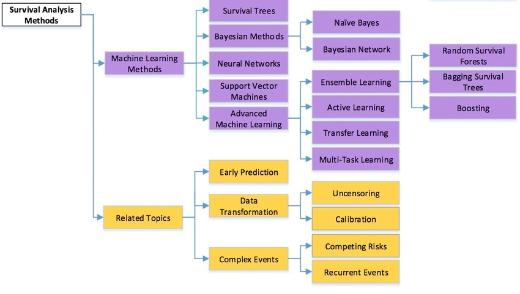

# LEARNING: WITH TARGET

## Introduction

### Classification

### Regression

## Econometrical regression

### Basic regression

### Basic dynamic model

### Generalisations and constrains

#### GLM

Szczegółowo o założeniach i problemach:
[link](https://towardsdatascience.com/generalized-linear-models-9ec4dfe3dc3f)

Interpretacja parametrów w modelach GLM:
[link](http://environmentalcomputing.net/interpreting-coefficients-in-glms/)

Założenia różnych modeli (źrodło:
[link](https://www.casact.org/sites/default/files/presentation/rpm_2009_handouts_havlicek.pdf))

Rodzaje reszt w modelach GLM:
[link](https://www.datascienceblog.net/post/machine-learning/interpreting_generalized_linear_models/)

Podstawowe cechy modeli regresyjnych:

-   Traditional Linear Model

    -   response variable: a continuous variable

    -   error distribution: normal

    -   link function: identity

-   Logistic Regression

    -   response variable: a proportion

    -   error distribution: binomial

    -   link function: logit

-   Poisson Regression in Log Linear Model

    -   response variable: a count

    -   error distribution: Poisson

    -   link function: log

-   Gamma Model with Log Link

    -   response variable: a positive, continuous variable

    -   error distribution: gamma

    -   link function: log

W modelach GLM nie zapisuje się składnika losowego bo:

model modeluje nie wartość y ale parametr (np. p jako prawdopodobieństwo
w rozkładzie Bernulliego). Reszty możemy sobie dodatkowo doliczyć.

##### logisti regression

W przypadku regresji logistycznej parametry mają chyba rozkład normalny.

Czym są reszty w regresji logistycznej:
[link](https://stats.stackexchange.com/questions/1432/what-do-the-residuals-in-a-logistic-regression-mean)

Dlaczego nie ma *error term*:
[link](https://stats.stackexchange.com/questions/124818/logistic-regression-error-term-and-its-distribution),
[link](https://www.theanalysisfactor.com/link-functions-and-errors-in-logistic-regression/)

### Bayesian inference

### Multivariate models

### Models with effects

Załóżmy, że mamy model regresji liniowej ze zmiennymi przełącznikowymi
(zmienne zero-jeden). Te zmienne "przełączają" wartość wyrazu wolnego
pomiędzy różnymi podzbiorami obserwacji. Podobne przełączniki możemy
mieć na parametrach kierunkowych. Jeżeli założymy że te zróżnicowane
efekty nie są losowe, to mamy model efektami stałymi. Zazwyczaj można je
estymować MKN. Jeżeli założymy że te przełączniki są losowane z jakiegoś
rozkładu to mamy efekty losowe. Wtedy używamy innych technik estymacji.
Są też modele gdzie mamy efekty mieszane, czyli zarówno losowe jak i
nielosowe. Warto dodać że efekty można też zagnieżdżać.

To czy efekty są losowe czy nielosowe można próbować zweryfikować
**testem** **Hausman-a**.

**Modele panelowe**

Modele panelowe są szczególnym przypadkiem modelu z efektami. Mamy tutaj
dane przekrojowa w czasie. Dla badanych obiektów (np. przedsiębiorstw),
mamy szeregi czasowe. Więc mamy wiele obserwacji na obiekt. Przełączniki
działając miedzy obiektami. Na każdy przełącznik mamy kilka obserwacji
więc jesteśmy w stanie je wyestymować.

Modele panelowe występują w wersji dynamicznej (zmiennymi objaśniającymi
jest opóźniona zmienna objaśniana) oraz w wersji wielorównaniowej).

### Nonparametric regression

#### MARS Splines

Mars jest techniką jednowymiarową (ma jedenowymiarowy output). Jego
uogólnieniem wulowymiarowym (wielowymiarowy output) jest Polymars.
Załóżmy że mamy jedną zmienną predykcyjną. MARS polega na tym aby
zmienną x podzielić na segmenty i następnie w ramach segmentów poprzez
np. Metodą Najmniejszych Kwadradów dopasować wielomian. W najprostszym
przypadku może to być stała (wtedy dostaniemy schodki). Punkty
rodzielające segmenty to węzły (knots). W przypadki wielomianów wyższych
stopni chcemy żeby krzywe co najmniej się łączyły (regresje liniowe) w
węzłąch $f_k(x_k)=f_{k+1}(x_k)$, albo jeżeli to możliwe żeby w węzłach
była zachowana ciągłość. Ogólniej mówiąc na wielomian stopnia M nakłada
się warunek ciągłości w węzłach stopnia M-1 (czyli pochodne do stopnia
M-1 muszą być równe w węźle dla sąsiadujących segmentów). Aby to
osiągnąć na algorytm dopasowujący wielomiany (np. MKN) trzeba nałożyć
dodatkowe warunki ograniczające.

W modelu musimy zatem z góry ustalić:

-   ilość węzłów i ich położenie

-   stopień wielomianu

### Pros

-   Works well with a large number of predictor variables

-   Automatically detects interactions between variables

-   It is an efficient and fast algorithm, despite its complexity

-   Robust to outliers\
    \

### Cons

-   Susceptible to overfitting

-   More difficult to understand and interpret than other methods

-   Not good with missing data

#### Isotonic

Linki:

Przykład numeryczny z algorytmem PAVA: [Online isotonic regression
Wojciech
Kotłowski](http://idss.cs.put.poznan.pl/site/fileadmin/seminaria/2016/2017-idss.pdf)

Opis algorytmu:
[analyticsvidhya](https://www.analyticsvidhya.com/blog/2021/02/isotonic-regression-and-the-pava-algorithm/)

Staramy się zminimalizować:

$$
\text{argmin}_x |y - x |^2 \\\text{subject to } x_0 \leq x_1 \leq \cdots \leq x_n
$$

Najczęściej osiąga się to dzięki algorytmowi PAVA (Pool Adjacent
Violators Algorithm).

Wizualizacja działania algorytmu PAVA:

### Other regression models

#### Canonical analysis

#### ANOVA MANOVA ANCOVA

## LDA & QDA

## Bayesian models

## Trees

Drzewo jest przykładem algorytmu zachłannego (greedy)

**Dlaczego w praktyce używa się tylko drzew binarnych:**

[(link:
stack_change)](https://stats.stackexchange.com/questions/12187/are-decision-trees-almost-always-binary-trees)

The number of possible splits goes up exponentially. If you are
splitting on a continuous variable that has 1000 distinct values, there
are 999 binary splits, but 999\*998 trinary splits. There are:

$\binom{1000-1}{3-1} = 999*998/2$

splits, actually.

### pros

-   Nie trzeba preprocesować danych. Nie trzeba normalizować zmiennych
    ciągłych. Zmiennych jakościowych nie trzeba rekodować.

-   możliwość pracy z danymi jakościowymi i ilościowymi

-   są nieparametryczne. Nie mają założeń o rozkładach

-   nie ma problemu z brakami danych. Przy analizie zmiennej na splicie
    braki są prostu pomijane.

-   łatwa interpretacja

-   szybkie wyliczenie predykcji przez niską złożoność obliczeniową
    O(log(m)).

-   Tak naprawdę same przeprowadzają selekcje cech (feature selection).

### cons

-   Łatwo model przetrenować. Są niestabilne. Małe zmiany w danych
    generują mocno różniące się drzewa. Przez te problemy występuje duża
    wariancja modelu i słabe uogólnianie.

-   są algorytmem zachłannym więc nie dają gwarancji znalezienia optimum
    globalnego.

-   dosyć długo czas estymacji modelu

-   wrażliwość na rotacje danych [@Geron2018] s. 184.

[dhirajkumarblog.medium](https://dhirajkumarblog.medium.com/top-5-advantages-and-disadvantages-of-decision-tree-algorithm-428ebd199d9a)

### Classification

### Regression

## SVM

### Classification

**Linki**:

Fajny opis na "kapitał ludzki": [czesc
1](https://brain.fuw.edu.pl/edu/index.php/Uczenie_maszynowe_i_sztuczne_sieci_neuronowe/Wyk%C5%82ad_8)
[czesc
2](https://brain.fuw.edu.pl/edu/index.php/Uczenie_maszynowe_i_sztuczne_sieci_neuronowe/Wyk%C5%82ad_9#:~:text=O(m).-,Twierdzenie%20Mercera,miar%C4%85%20podobie%C5%84stwa%20pomi%C4%99dzy%20wektorami%20cech.&text=Id%C4%85c%20tym%20tropem%20mo%C5%BCemy%20zapostulowa%C4%87,stanowi%C4%87%20miar%C4%99%20podobie%C5%84stwa%20mi%C4%99dzy%20wektorami.)

Załóżmy że mamy 2-wymiarowe dane, które dodatkowo mają 2 klasy 1 i -1.
Dokładamy 3 wymiar na którym możemy odłożyć wartości przypisane klasom
[@Geron2018] s 166. Mając 3 wymiary tworzymy hiperpłaszczyznę. Jej
równanie to :

$y=\textbf{w}^T\cdot \textbf{x} + b$

Przejdźmy z powrotem do 2 wymiarów. Hiperpłaszczyzna w pewnym miejscy
przecina nasze 2 wyjściowe wymiary danych (y=0, czarna linie poniżej).
Dodatkowo na te 2 wymiary zrzutujemy 2 linie dla których wartości
hiperpłaszczyzny wynoszą 1 i -1 (linie niebieska i różowa):

Obszar między liniami niebieską i różową stanową margines. Chcemy
stworzyć tak żeby:

1.  był jak najszerszy.
2.  był umieszczony w takim miejscu żeby jak najlepiej separował
    obserwacje.

Szerokość marginesu jest pochodną nachylenia hiperpłaszczyzny, zatem
jest funkcją parametrów tej hiperpłaszczyzny i jest równa długości
długości wektora tych parametrów: \|\|w\|\|. To jest wartość którą
maksymalizujemy. Ze względu na uproszenie związane z liczeniem
pochodnych maksymalizujemy:

$\frac{1}{2}||\textbf{w}||^2$ Aby spełnić drugi warunek (separowanie
obserwacji) na powyższą funkcję celu musimy dodać warunki ograniczające:

\$t^{(i)}(^\textbf{w}T \cdot \textbf{x}\^{(i)}+b )\geq 1 \$

$t^{(i)}$ równa się -1 dla obserwacji przypisanych do klasy -1 o równa
się 1 do obserwacji przypisanych do klasy 1 (1 \* 1 = 1 oraz -1 \* -1 =
1). Pozyżej mamy ten problem że mamy tu doczynienia z twardym
merginesami.

Z powyższym jest taki problem że mamy tutaj twarde marginesy, a zatem
staramy się zrobić idealną separację. Problem optymalizacyjny jest tak
sfomułowany że nie dopuszcza błędnych klasyfikacji. Żeby załagodzić temu
możemy wprowadzić *slack variables*. Jeżeli do wartości y przypisanej
obserwacji na hiperpłaszczyźnie dodamy w warunku zmienną $\zeta$, to ta
zmienna spowoduje że nawet jeżeli wartość y będzie nieodpowiednia to po
dodaniu zmiennej $\zeta$ warunek jednak będzie spełniony. To właśnie nam
luzuje ograniczenie.

Zatem nowa funkcja celu:

$\frac{1}{2}||\textbf{w}||^2 + C\sum_{i=1}^{m}{\zeta^{(i)}}$

\$t^{(i)}(^\textbf{w}T \cdot \textbf{x}\^{(i)}+b )\geq 1 , \zeta \geq 0
, , dla , , i = 1, 2, ...m \$

W pierwszym równaniu drugi element sumy jest stały. Jeżeli zwiększamy C
to suma slack variables się zmniejsza i na odwrót. Zatem mały C to duże
slack variables i duża tolerancja na błędy klasyfikacji, czyli szeroki
margines.

Powyższe zagadnienie optymalizacyjne to zadanie programowania
kwadratowego. Zadanie to jest sprowadzone z tzw. problemu pierwotnego do
problemu dualnego. Warto zauważyć że w celu przechodzenia pomiędzy
wynikami rozwiązania problemu dualnego i pierwotnego nasze problem
powinien spełniać warunki Karush-Kuhn-Tucker'a (KKT). Ostateczne
rozwiązanie związane jest z przeliczeniem iloczynów skalarnych
obserwacji, co jest ważną uwagą dla rozważań o maszynach
kernelizowanych.

**Maszyny kernelizowane**

Żeby obserwacje ze względu na klasy było łatwiej separować, lepiej
przenieść je do przestrzeni o większej liczbie wymiarów przy pomocy
odpowiedniej funkcji. Do tego celu jest wykorzystywanych kilka
najbardziej popularnych przekształceń. Jak wspomniano wcześniej,
rozwiązania zadania optymalizacyjnego dla SVM opiera się o iloczyny
skalarne obserwacji. Przekształcanie obserwacji do przestrzeni o większe
ilości wymiarów i obliczanie iloczynów skalarnych z nowej przestrzeni
jest obliczeniochłonne. Dlatego możemy zastosować *kernel trick*. Jeżeli
nasze funkcja przekształcająca $\Phi$ spełnia warunki Mercera to możemy
zastosować twierdzenie Mercera i stworzyć tzw. funkcje jądrową. Funkcja
ta umożliwia uzyskanie wyników iloczynu skalarnego obserwacji (wektorów)
w przestrzeni o wyższej liczbie wymiarów bez konieczności
przekształcania wektorów do tej przestrzeni (funkcja pracuje na
pierwotnych wektorach). Zatem iloczyn skalarny liczmy nie przez
$<\Phi(a),\Phi(b)>$ (gdzie musimy na wektorach pierwotnych a i b
zastosować przekształcenie $\Phi$, żeby uzyskać nowe wektory w
przestrzeni o większej ilości wymiarów), ale mamy prostszą funkcję
jądrową K(a,b) działającą bezpośredni na wektorach a i b.

### Regression

## K-NN

### Classification

**Jak wyliczane jest prawdopodobieństwo w *sklearn*** :

[link](https://datascience.stackexchange.com/questions/27444/how-does-sklearn-kneighborsclassifier-compute-class-probabilites)

The class probabilities are the normalized weighted average of
indicators for the k-nearest classes, weighted by the inverse distance.

For example: Say we have 6 classes, and the 5 nearest examples to our
test input have class labels 'F', 'B', 'D', 'A', and 'B', with distances
2, 3, 4, 5, and 6, respectively.

Then the unnormalized class probabilities can by computed by:

    (1/2) * [0, 0, 0, 0, 0, 1] + (1/3) * [0, 1, 0, 0, 0, 0] + 
    (1/4) * [0, 0, 0, 1, 0, 0] + (1/5) * [1, 0, 0, 0, 0, 0] + 
    (1/6) * [0, 1, 0, 0, 0, 0] =

    [1/5 ,1/2, 0, 1/4, 0, 1/2]

#### KD - tree

Jest to algorytm do partycjonowania przestrzeni.

**Pseudoalgorytm** na budowę drzewa KD (mój intuicyjny):

Są jego różne wersje. Jedna z nich jest taka:

1.  Na początek wybierz losowy wymiar *x*. Dla tego wymiaru policz
    mediane po wszystkich punktach. Znajdź punkt najbliższy do mediany
    ze względu na analizowany wymiar. W ten sposób otrzymamy punkt
    medianowy. Podziel przestrzeń na dwie części (binarny podział) w
    oparciu o ten punkt.
2.  Wybierz losowo kolejny wymiar. Dla każdej podprzestrzeni (mamy już
    podział z poprzedniego kroku), znowu policz mediany znajdź punkty
    medianowe i znowu dziel przestrzeń binarnie dla dla każdego punktu
    medianowego.
3.  Kontynuujemy do momentu, aż w węzłach ilość obserwacji spadnie do
    ustalonego minimum. Węzły w których przerywamy liczenie stają się
    liśćmi drzewa.

Alternatywnie zamiast wybierać wymiary losowo możemy wybierać je
cyklicznie (dla 3 wymiarów *x,y,z* wymieramy je po kolei na przemian:
*x,y,z; x,y,z; x,y,z; x,y,z*.

Poprzez podział dostaje podział przestrzeni na podprzestrzenie (pierwszy
rysunek poniżej). Ponieważ robiliśmy to hierarchicznie to ten podział
można zaprezentować w postaci drzewa binarnego (drugi rysunek poniżej).
Każdy węzeł drzewa to jeden podział podprzestrzeni.

**Pseudoalgorytm** na szukanie najbliższego sąsiada w drzewie KD (mój
intuicyjny).

Mam nową obserwacje i chce poszukać który spośród punktów (precyzyjniej
mówiąc węzłów) drzewa jest najbliższy.

1.  Lokalizuje w którym liściu jest punkt poprzez przeszukanie drzewa od
    root.

2.  Liczę odległość do najbliższego punktu wewnątrz tego liścia. Jeżeli
    list byłby pusty to liczę odległość do węzła tworzącego podział
    który określa ten liść. W ten sposób wyznaczam pierwszy proponowany
    najbliższy punkt dla nowej obserwacji.

3.  Następnie rysuje koło którego środkiem jest nowy punkt a jego
    średnicę wyznacza odległość nowego punktu od punktu który jest
    proponowany jako najbliższy. Jeżeli koło przecina inne sąsiadujące
    podziały (wyznaczone przez węzły) to muszę je też przeanalizować. Od
    razu wyliczam odległość do tych podziałów od mojego nowego punktu
    (od podziałów a nie od węzłów będących obserwacjami tworzącymi te
    podziały. Patrz rysunek poniżej jak liczony jest $dist_3$ i
    $dist_4$)

    

Dla tych podziałów szukam odpowiadające im węzły na drzewie. Jeżeli
podziałów do przeanalizowania jest kilka to zaczynam od najbliższego. Od
tego podziału schodzę po drzewie w dół (kryterium takie, że w pierwszej
kolejności staram się iść taką ścieżką jak bym chciał się zbliżać do
mojego nowego punktu . Inne alternatywy też sprawdzam (oddalanie się),
ale w drugiej kolejności) i sprawdzam czy którychś z węzłów nie zawiera
punktu który jest bliżej niż dotychczas zaproponowany najbliższy punkt.
Jeżeli taki węzeł znajduje, to aktualizuje moje koło ze środkiem w nowym
punkcie. Nowe koło będzie oczywiście mniejsze. Wtedy znowu sprawdzam
które podziały przecinają się z kołem (koło jest mniejsze więc powinno
być ich mniej ).

Ta metoda ma wady dla przestrzeni wielowymiarowych. Przy dużej liczbie
wymiarów prawie na pewno mój nowy element nie będzie w środku liścia ,
ale blisko jakiegoś podziału. Więc rysując koło najprawdopodobniej okażę
się że trzeba sprawdzać dodatkowe węzły. Dodatkowo im mamy więcej
wymiarów tym więcej wezłów/podziałów ze sobą sąsiaduje. Tak więc koło
będzie przecinało wiele podziałów i algorytm zaczyna tracić efektywność.
Aby temu zapobiec zaproponowano algorytm *ball tree*.

#### Ball tree

Ball tree radzą sobie lepiej niż KD-tree w przestrzeniach o dużej
liczbie wymiarów.

Pseudoalgorytm budowy ball tree (mój intuicyjny):

1.  Szukam dwóch najbardziej odległych punktów. Jednak aby nie sprawdzać
    wszystkich możliwych kombinacji (każdy punkt z każdym) stosuje
    trick. Wybieram losowy punkt i szukam pierwszego punktu który leży
    najdalej i potem drugiego który leży najdalej od tego pierwszego.
    Ilość sprawdzanych kombinacji mocno spada, a prawdopodobieństwo, że
    uzyskane tym sposobem dwa punkty są jednymi z najbardziej
    oddalonych, jest bardzo duże. Te 2 nowe punkt łączę linią i
    wyznaczam środek tej linii. Ten środek i punkty wyznaczają mi kulę.
    To jest pierwsza kula.

2.  Linia którą narysowałem aby połączyć 2 odległe punkty powinna
    wyznaczać kierunek w którym wariancja zbioru jest największa. Zatem
    rysując płaszczyznę prostopadłą do tej linii mogę wyznaczyć sensowny
    podział zbioru na 2 mniejsze. Dla każdego z tych dwóch podzbiorów
    wyznaczam środek (coś na zasadzie centroidu). Dodatkowo metodą z
    punktu pierwszego w dla każdego z podzbiorów wyznaczam
    najodleglejsze punkty. Tak więc mogę teraz narysować 2 kolejne koła.

3.  Powyższą procedurę kontynuuje aż liczebność obserwacji w kilach
    zbliży się do ustalonego minimum.

Sam schemat powstaje hierarchicznie i dlatego można przestawić go jako
drzewo. Chociaż trzeba pamiętać że kula na tym samym poziomie hierarchii
mogą się częściowo nakładać. Wydaje mi się że w wyniku podziału prawie
każdy punkt powinien się ostatecznie znaleźć w jakimś liściu drzewa. Ale
przez to że wybór najdalszych punktów w zbiorze jest przybliżony może
nie zawsze tak być w 100%. Taki punkty potem przy wybieraniu
najbliższego sąsiada chyba i tak są pomijane.

Pseudoalgorytm na szukanie najbliższego sąsiada w ball tree (mój
intuicyjny - knn seach).

1.  Mam nowy punkt który dla którego chce poszukać najbliższego sąsiada.
2.  Sprawdzam czy punkt jest w jakimś klastrze będącym liściem
    (najmniejsze klastry które już nie były bardziej dzielone). Jeżeli
    jest wewnątrz, to szukam najbliższego sąsiada w tym klastrze. Potem
    rysuje koło i sprawdzam czy nie jest czasem bliżej do granic innych
    klastrów. Jeżeli tak jest, to też je przeszukuje. Tutaj działa taki
    schemat poruszania się po drzewie jak przy KD-tree.
3.  Jeżeli nowy punkt jest na zewnątrz liści, to sprawdzam do centrum
    którego klastra jest mu najbliżej. Jeżeli to klaster liść to z tego
    najbliższego klastra wybieram mu sąsiada. Jeżeli to jest duży
    klaster zawierający podklastry to muszę dalej szukać w tym dużym
    klastrze najbliższym podklastrów, aż zejdę to klastra liścia. (tutaj
    też mamy do czynienia z poruszaniem się w duł drzewa po kolejnych
    klastrach czyli węzłach, coś podobnego do kd-tree).

#### Condensing (Hart algorithm)

Ideą jest żeby ze zbioru treningowego Z tworzę podzbiorów *S* w taki
sposób że elementy które nie mają wpływ na klasyfikację ( nie są
położone na granicach klas) usunąć.

Oznaczenia:

T(x) - Prawdziwa klasyfikacja elementu x ze względu na klasę

S(x) - Klasyfikacja elementu x ze względu na decyzję podjętą w oparciu o
**nowy** budowany podzbiór S.

Z(x) - Klasyfikacja elementu x ze względu na decyzję podjętą w oparciu o
**pełny** zbiór Z.

k - ilość najbliższych sąsiadów uwzględnianych w klasyfikacji metodą
knn.

1.  Na początku zbiór S jest pusty. Losuję k elementów z zbioru Z i
    dodaje do zbioru S.
2.  Wybieram losowy punkt x ze zbioru Z nie należący do zbioru S.
    Przeprowadzam klasyfikację dla x regułą k-nn ze względu na zbiór Z i
    S (czyli liczę Z(x) i S(x)). Jeżeli wynik obu klasyfikacji jest taki
    sam to pomijam ten punkt i losuje następny. Jeżeli jednak wynik Z(x)
    i S(x) jest różny to sprawdzam czy klasyfikacja S(x) jest taka sama
    jak T(x). Jeżeli tak, to dodaje element do zbioru S. Jeżeli nie to
    szukam spośród elementów Z nie należących do S elementu najbliższego
    w stosunku do x który należy do tej samej klasy co Z(x). Dzięki temu
    dodam punkt który raczej poprawi zdolność klasyfikacji niż pogorszy.
    Inaczej dodałbym punkt źle zaklasyfikowany w oparciu o Z i raczej
    podniosłoby błąd predykcji.
3.  Powtarzam tą procedują, aż nie będzie sytuacji że dla punktu x
    należącego dla Z a nie należącego do S będzie spełnione Z(x) !=
    S(x).

Bardziej szczegółowy opis:

Wybieram po kolei punkty ze zbioru x.

1)  Scan all elements of X, looking for an element x whose nearest
    prototype from S has a different label than x

2)  Remove x from X and add it to S

3)  Repeat the scan until no more prototypes are added to S

S used instead of X for kNN classification.

#### **Editing**

#### Reducing

### Regression

## Log-linear model

## Similarity learning

## Survival models

[modele typy
survival](https://www.theanalysisfactor.com/the-six-types-of-survival-analysis-and-challenges-in-learning-them/)

### **Podstawowe pojęcia**

Linki:

[link](https://humboldt-wi.github.io/blog/research/information_systems_1920/group2_survivalanalysis/)

**Obserwacje cenzurowane**

Cenzurowanie jest problemem odpowiednikiem problemu braku danych w
analizie przeżycia.

Cenzurowanie wynika zasadniczo z dwóch przyczyn.

1.  Okres "życia" obserwacji wykracza poza okres analizowany (np. kredyt
    jest dalej spłacany po końcu analizowanego okresu i nie wiemy czy
    ostatecznie został spłacony czy nie). Tutaj mamy sytuacje
    prawostronnego cenzurowania
2.  Obserwujemy obserwacje od pewnego momentu i nie wiemy co się z nią
    działo wcześniej (np. nie wiemy jak długo był spłacany kredyt). To
    jest cenzurowanie lewostronne.
3.  Wiemy że zdarzenie zaszło w jakimś momencie, ale nie wiemy dokładnie
    kiedy. Wiemy tylko w jakim przedziale czasowym to było (interaval
    censoring).
4.  Od pewnego momentu w czasie trwania analizy nie mamy informacji o
    obserwacji (pacjent wycofał się z badania, utraciliśmy z nim
    kontakt, w bazie jest brak danych o tym co się działo z kredytem od
    pewnego momentu). Jest to kolejny przykład cenzurowania
    prawostronnego. Tutaj występuje problem informatywności. Może być
    tak że, u pacjentów u których leczenie zadziałało bardzo dobrze,
    może być wyższe ryzyko wycofania się z badania. Wtedy wycofanie się
    oznacza też mniejsze ryzyko zgonu. Czyli cenzorowanie danych jest
    skorelowane z ryzykiem zdarzenia.

Jest jeszcze sytuacji kiedy badamy kredyty np. od stycznia 2020 a pewnie
kredyt został wypłacony z marciu 2020. Mamy o nim pełne informacje (nie
ma cenzurowania). Kredyt też być spłacony przed końcem czasu badania
(nie było zdarzenia defaultu). Wtedy też nie ma cenzurowania.

Co robić z problemem cenzurowania:

1.  Można usunąć takie obserwacje.
2.  Można wykonać imputacje.

W analizie kredytów występuje też problem też że kredyt po defaulcie
może z powrotem ożyć, co narusza założenia większości modeli analizy
przeżycia. Wtedy ozdrowione kredyty możemy traktować jako nowe
obserwacje. Jednak powoduje to pewne obciążenie wyników.

**Obserwacje obcięte**

Nie do końca rozumiem czym są obserwacje ucięte i czym się różnią od
cenzurowanych. Trzeba to doczytać

**Zdarzenie (event)**

np. śmierć pacjenta, defalut kredytu.

**Funkcja gęstości prawdopodobieństwa f(t)**

Określa prawdopodobieństwo zdarzenia w czasie *t*, gdzie czas *t* to
dowolny przedział [t1,t2]:

$P(t_1 < T \leq t_2)=\int_{t1}^{t2}{f(t)}dt$

Gdzie T to jest moment zdarzenia.

**Dystrybuanta funkcji gęstości prawdopodobieństwa F(t)**

Między nią a funkcją gęstości mamy zależność:

\$\$ f(t) = dF(t)/dt \\

F(t) = \int\_{0}\^{t}{f(u)du} \$\$

**Funkcja przetrwania S(t) (survival function)**

Nazywa się też funkcją dożycia lub funkcją trwania. Pokazuje że dana
osoba przetrwa dłużej niż określony czas. Można ją wyliczyć jako
dopełnienie dystrybuanty funkcji gęstości:

S(t) = 1-F(t)

Z funkcją gęstości łączą ją następujące zależności:

$$
f(t)=-dS(t)/dt
S(t)=\int_{t}^{\infty}{f(u)du}
$$

Znajomość funkcji (1) gęstości , (2) dystrybuanty i (3) przetrwania
pozwala nam wyliczyć prawdopodobieństwo zdarzenia w określonym czasie:

$$
P(t_1 < T \leq t_2)=\int_{t1}^{t2}{f(t)}dt \\
P(t_1 < T \leq t_2)=F(t_2)-F(t_1) \\
P(t_1 < T \leq t_2)=S(t_2)-S(t_1)
$$

**Funkcja hazardu** $\lambda(t)$

Nazywana też funkcją intensywności procesu lub natężenia zdarzeń.
Określa ona prawdopodobieństwo zdarzenia w chwili t pod warunkiem że
klient dożył do tej chwili:

$$
\lambda(t)=\frac{f(t)}{S(t)} = \frac{d[ln(S(t))]}{dt}
$$

**Skumulowana funkcja hazardu:**

Jak sama definicja mówi.

**Struktura danych - uwagi**

Wydaje mi się że jest tak (np. w Pythonie) że tutaj nas nie interesują
dokładne momenty rozpoczęcia i zakończenia zbierania danych o
obserwacji. Potrzebujemy tylko czasu trwania obserwacji.

**Uwagi o podziale estymatorów.**

Są tutaj podzielone na standardowe (bardziej klasyczna statystyka) i
inne (bardziej machine learningu)

Podział metod standardowych można przestawić tak:

Powyżej w metodach parametrycznych (zielony kolor) powinny być jeszcze
dodane model proporcjonalnego hazardu ( w moim podziale dalej są
uwzględnione).

### **Estymatory standardowe-nieparametryczne**

#### Tablice trwania życia (life table)

Tablica przeżycia to najprostsze opisowe podejście do tematu.

Przykładowe najprostsza analiza przeżycia:

+---------+---------+---------+---------+---------+---------+---------+
| **Age** | -   \   | -   \   | -   \   | **Prob  | Survial | **Cum   |
|         |     \   |     \   |     \   | ability | prob    | ulative |
|         |     \   |     \   |     \   | of      | ability | S       |
|         |     \   |     \   |     \   | death** |         | urvival |
|         |     \   |     \   |     \   |         |         | Probab  |
|         |     \   |     \   |     \   |         |         | ility** |
|         |     \   |     \   |     \   |         |         |         |
|         |     \   |     \   |     \   |         |         |         |
|         |     \   |     \   |     \   |         |         |         |
|         |     \   |     \   |     \   |         |         |         |
|         |     \   |     \   |     \   |         |         |         |
|         |     \   |     \   |     \   |         |         |         |
|         |     \   |     \   |     \   |         |         |         |
|         |     \   |     \   |     \   |         |         |         |
|         |     \   |     \   |     \   |         |         |         |
|         |     \   |     \   |     \   |         |         |         |
|         |     \   |     \   |     \   |         |         |         |
|         |     \   |     \   |     \   |         |         |         |
|         |     \   |     \   |     \   |         |         |         |
|         |     \   |     \   |     \   |         |         |         |
|         |     \   |     \   |     \   |         |         |         |
|         |     \   |     \   |     \   |         |         |         |
|         |     \   |     \   |     \   |         |         |         |
|         |     \   |     \   |     \   |         |         |         |
|         |     \   |     \   |     \   |         |         |         |
|         |     \   |     \   |     \   |         |         |         |
|         |     \   |     \   |     \   |         |         |         |
|         |     \   |     \   |     \   |         |         |         |
|         |     \   |     \   |     \   |         |         |         |
|         | *Number | *Number | *Number |         |         |         |
|         |         |         |     c   |         |         |         |
|         | living  | d       |         |         |         |         |
|         | (At     | ead\*\* | ensored |         |         |         |
|         |         |         | (ci     |         |         |         |
|         | ri      |         |         |         |         |         |
|         | sk)\*\* |         | którzy  |         |         |         |
|         |         |         | o       |         |         |         |
|         |         |         |         |         |         |         |
|         |         |         | puścili |         |         |         |
|         |         |         |         |         |         |         |
|         |         |         | badanie |         |         |         |
|         |         |         | ale nie |         |         |         |
|         |         |         |         |         |         |         |
|         |         |         | umarli  |         |         |         |
|         |         |         | i r     |         |         |         |
|         |         |         |         |         |         |         |
|         |         |         | edukują |         |         |         |
|         |         |         |         |         |         |         |
|         |         |         | ilość   |         |         |         |
|         |         |         | obs     |         |         |         |
|         |         |         |         |         |         |         |
|         |         |         | erwacji |         |         |         |
|         |         |         | w k     |         |         |         |
|         |         |         |         |         |         |         |
|         |         |         | olejnym |         |         |         |
|         |         |         | wie     |         |         |         |
|         |         |         |         |         |         |         |
|         |         |         | rs      |         |         |         |
|         |         |         | zu)\*\* |         |         |         |
+=========+=========+=========+=========+=========+=========+=========+
| 0       | 14,353  | 2       | 0       | 0.0001  | 1 -     | 0.9999  |
|         |         |         |         |         | 0.0001  |         |
|         |         |         |         |         | =       |         |
|         |         |         |         |         | 0.9999  |         |
+---------+---------+---------+---------+---------+---------+---------+
| 1       | 14,353  | 248     | 1855    | 0.0173  | 1 -     | 0.9999  |
|         | - 0 - 2 |         |         |         | 0.0173  | \*      |
|         | = **1   |         |         |         | =       | 0.9827  |
|         | 4,351** |         |         |         | 0.9827  | = 0.    |
|         |         |         |         |         |         | 9826017 |
+---------+---------+---------+---------+---------+---------+---------+
| 2       | 14,351  | 155     | 758     | 0.0127  | 1 -     | 0.  982 |
|         | - 1855  |         |         |         | 0.0127  |         |
|         | - 240 = |         |         |         | =       | 6017 \* |
|         | **1     |         |         |         | 0.9873  |         |
|         | 2,248** |         |         |         |         | 0.9873  |
|         |         |         |         |         |         | = 1.    |
|         |         |         |         |         |         | 9701227 |
+---------+---------+---------+---------+---------+---------+---------+

#### Kaplan Mayer

Jest to nieparametryczny estymator funkcji przeżycia. Nie można go
niestety używać do predykcji czyli szacowania czasu przeżycia dla
elementów które żyły dłużej niż elementy w próbie (np. w probie
$t_{max} = 10$ , a ja chce wiedzieć jak funkcja przeżycia zachowa się
dla t = 20)

Estymator ma wzór:

$$
\hat{S}(t)= \prod_{i:\,t_i\leq t}{1-\frac{d_i}{n_i}}
$$

Czyli jest to iloczyn (czyli skumulowanie) prawdopodobieństw dożycia do
poprzednich okresów czasu.

Przykład obliczeń:

+-------------+-------------+-------------+-------------+-------------+
| **Time,     | **Number at | **Number of | **Number    | **Survival  |
| Years**     | Risk**      | Deaths**    | Censored**  | Pr          |
|             |             |             |             | obability** |
|             | **Nt**      | **Dt**      | **Ct**      |             |
|             |             |             |             | **S~t+1~ =  |
|             |             |             |             | S~t~\*((N\~ |
|             |             |             |             | t           |
|             |             |             |             | +1~-D~t+1\~ |
|             |             |             |             | )/N~t+1~)** |
+:===========:+:===========:+:===========:+:===========:+:===========:+
| 0           | 20          |             |             | 1           |
+-------------+-------------+-------------+-------------+-------------+
| 1           | 20          | 1           |             | 1\*         |
|             |             |             |             | ((20-1)/20) |
|             |             |             |             | = 0.950     |
+-------------+-------------+-------------+-------------+-------------+
| 2           | 19          |             | 1           | 0.          |
|             |             |             |             | 950\*((19-0 |
|             |             |             |             |             |
|             |             |             |             | )/19)=0.950 |
+-------------+-------------+-------------+-------------+-------------+
| 3           | 18          | 1           |             | 0.950\*     |
|             |             |             |             | ((18-1)/18) |
|             |             |             |             | = 0.897     |
+-------------+-------------+-------------+-------------+-------------+
| 5           | 17          | 1           |             | 0.897\*     |
|             |             |             |             | ((17-1)/17) |
|             |             |             |             | = 0.844     |
+-------------+-------------+-------------+-------------+-------------+
| 6           | 16          |             | 1           | 0.844       |
+-------------+-------------+-------------+-------------+-------------+
| 9           | 15          |             | 1           | 0.844       |
+-------------+-------------+-------------+-------------+-------------+
| 10          | 14          |             | 1           | 0.844       |
+-------------+-------------+-------------+-------------+-------------+
| 11          | 13          |             | 1           | 0.844       |
+-------------+-------------+-------------+-------------+-------------+
| 12          | 12          |             | 1           | 0.844       |
+-------------+-------------+-------------+-------------+-------------+
| 13          | 11          |             | 1           | 0.844       |
+-------------+-------------+-------------+-------------+-------------+
| 14          | 10          | 1           |             | 0.760       |
+-------------+-------------+-------------+-------------+-------------+
| 17          | 9           | 1           | 1           | 0.676       |
+-------------+-------------+-------------+-------------+-------------+
| 18          | 7           |             | 1           | 0.676       |
+-------------+-------------+-------------+-------------+-------------+
| 19          | 6           |             | 1           | 0.676       |
+-------------+-------------+-------------+-------------+-------------+
| 21          | 5           |             | 1           | 0.676       |
+-------------+-------------+-------------+-------------+-------------+
| 23          | 4           | 1           |             | 0.507       |
+-------------+-------------+-------------+-------------+-------------+
| 24          | 3           |             | 3           | 0.507       |
+-------------+-------------+-------------+-------------+-------------+

Wariancja estymatora jest dana wzorem (Greenwood formula):

$$
\hat \sigma^2[\hat S(t)] = \widehat var[\hat S(t)] = \hat S(t)^2 \sum_{i:t_i \le t} \frac{d_i}{n_i(n_i-d_i)}
$$

Jeżeli nie ma danych cenzorowanych wzór uprasza się do:

$$
\hat \sigma^2[\hat S(t)] = \frac{\hat S(t) [1- \hat S(t)]}{n}
$$

Założymy że estymator funkcji przeżycia Kaplana Mayera ma rozkład
asymptotycznie normalny:

$$
\hat S(t) \simeq N(\hat S(t), \sigma(t)/\sqrt(n))
$$Wtedy możemy zbudować przedziały ufności :

$$
\bigg(\hat S(t) \pm z_{1-\alpha/2}  \cdot \hat \sigma/\sqrt(n) \bigg),
$$

Gdzie z to jest rozkład normalny standaryzowany.

#### Nelson Aalen

Jest to nieparametryczny estymator skumulowanej funkcji hazardu.
Podobnie jak przy estymatorze Kaplana Mayera nie może być używany do
predykcji. Jest dany formułą:

\$\$

\hat{H}(t)= \sum\_{i:,t_i\leq t}{\frac{d_i}{n_i}} \$\$

Gdzie $d_i$ to zdarzenia w czasie *i*, a $n_i$ to ilość elementów w
okresie *i* .

Estymator wariancji wynosi:

\$\$

\hat{V}ar(\hat{H}(t))= \sum\_{i:,t_i\leq t}{\frac{d_i}{n_i^2}} \$\$

**Porównywanie funkcji estymowanych**

Przy metodach estymacji takich jak Kampal Mayer czy Nelson Aalen nie
możemy badać bezpośrednio wpływu jakichś dodatkowych zmiennych
objaśnianych na funkcję przeżycia. Żeby np. zbadać wpływ tego czy
palenie wpływa naszą funkcję przeżycia, jedyne co nam pozostaje to
zrobić dwie oddzielne funkcje dla palących i dla niepalących i potem je
porównać. Są liczne statystyki na stawienie testowanie hipotezy czy
krzywe są różne:

-   współczynnik hazardu (hazard ratio)

-   test istotności z

-   test logarytmiczny rang (log-rank test) - dalej jest przykład
    numeryczny

-   test WIlxona

-   test Tarone'a

-   test Peto

-   zmodyfikowany test Peto

-   test Fleminga

Log rank test - przykład numeryczny:

Założmy że mamy 2 krzywe. Poniżej pokazuje tabele wyliczeń dla obu:

Pierwsza krzywa:

+-------------+-------------+-------------+-------------+-------------+
| **Time,     | **Number at | **Number of | **Number    | **Survival  |
| Months**    | Risk**      | Deaths**    | Censored**  | Pr          |
|             |             |             |             | obability** |
|             | **N~t~**    | **D~t~**    | **C~t~**    |             |
|             |             |             |             | !           |
+:===========:+:===========:+:===========:+:===========:+:===========:+
| 0           | 10          |             |             | 1           |
+-------------+-------------+-------------+-------------+-------------+
| 8           | 10          | 1           | 1           | 0.900       |
+-------------+-------------+-------------+-------------+-------------+
| 12          | 8           | 1           |             | 0.788       |
+-------------+-------------+-------------+-------------+-------------+
| 14          | 7           | 1           |             | 0.675       |
+-------------+-------------+-------------+-------------+-------------+
| 20          | 6           |             | 1           | 0.675       |
+-------------+-------------+-------------+-------------+-------------+
| 21          | 5           | 1           |             | 0.540       |
+-------------+-------------+-------------+-------------+-------------+
| 26          | 4           | 1           |             | 0.405       |
+-------------+-------------+-------------+-------------+-------------+
| 27          | 3           | 1           |             | 0.270       |
+-------------+-------------+-------------+-------------+-------------+
| 32          | 2           |             | 1           | 0.270       |
+-------------+-------------+-------------+-------------+-------------+
| 40          | 1           |             | 1           | 0.270       |
+-------------+-------------+-------------+-------------+-------------+

Druga krzywa:

+-------------+-------------+-------------+-------------+-------------+
| **Time,     | **Number at | **Number of | **Number    | **Survival  |
| Months**    | Risk**      | Deaths**    | Censored**  | Pr          |
|             |             |             |             | obability** |
|             | **N~t~**    | **D~t~**    | **C~t~**    |             |
|             |             |             |             | !           |
+:===========:+:===========:+:===========:+:===========:+:===========:+
| 0           | 10          |             |             | 1           |
+-------------+-------------+-------------+-------------+-------------+
| 25          | 10          |             | 2           | 1.000       |
+-------------+-------------+-------------+-------------+-------------+
| 28          | 8           | 1           |             | 0.875       |
+-------------+-------------+-------------+-------------+-------------+
| 33          | 7           | 1           |             | 0.750       |
+-------------+-------------+-------------+-------------+-------------+
| 37          | 6           |             | 1           | 0.750       |
+-------------+-------------+-------------+-------------+-------------+
| 41          | 5           | 1           |             | 0.600       |
+-------------+-------------+-------------+-------------+-------------+
| 43          | 4           |             | 1           | 0.600       |
+-------------+-------------+-------------+-------------+-------------+
| 48          | 3           |             | 3           | 0.600       |
+-------------+-------------+-------------+-------------+-------------+

Z powyższych dwóch tabel zrobimy jedną uwzględniając ilość obserwacji
zgonów (deaths):

+-------------+-------------+-------------+-------------+-------------+
| **Time,     | **Number at | **Number at | **Number of | **Number of |
| Months**    | Risk in     | Risk in     | Events      | Events      |
|             | Group 1**   | Group 2**   | (Deaths) in | (Deaths) in |
|             |             |             | Group 1**   | Group 2**   |
|             | **N~1t~**   | **N~2t~**   |             |             |
|             |             |             | **O~1t~**   | **O~2t~**   |
+:===========:+:===========:+:===========:+:===========:+:===========:+
| 8           | 10          | 10          | 1           | 0           |
+-------------+-------------+-------------+-------------+-------------+
| 12          | 8           | 10          | 1           | 0           |
+-------------+-------------+-------------+-------------+-------------+
| 14          | 7           | 10          | 1           | 0           |
+-------------+-------------+-------------+-------------+-------------+
| 21          | 5           | 10          | 1           | 0           |
+-------------+-------------+-------------+-------------+-------------+
| 26          | 4           | 8           | 1           | 0           |
+-------------+-------------+-------------+-------------+-------------+
| 27          | 3           | 8           | 1           | 0           |
+-------------+-------------+-------------+-------------+-------------+
| 28          | 2           | 8           | 0           | 1           |
+-------------+-------------+-------------+-------------+-------------+
| 33          | 1           | 7           | 0           | 1           |
+-------------+-------------+-------------+-------------+-------------+
| 41          | 0           | 5           | 0           | 1           |
+-------------+-------------+-------------+-------------+-------------+

Test opiera się na formule:

$$
\chi^2=\sum{\frac{(\sum{O_{jt}}-\sum{E_{jt}})^2}{\sum{E_{jt}}}}
$$

Gdzie *O* to jest obserwowana ilość zdarzeń a *E* oczekiwana ilość
zdarzeń. Oczekiwana ilość to ilość zdarzeń taka jaka powinna występować
jeżeli krzywe się nie różnią.

Obliczanie oczekiwanej ilości zdarzeń dla każdej krzywej:

+-------+-------+-------+-------+-------+-------+-------+-------+-------+
| **T   | **N u | **N u | **T   | **N u | **N u | **T   | -   \ | -   \ |
| ime,  | mber  | mber  | otal  | mber  | mber  | otal  |       |       |
| Mon t | at    | at    | N u   | of E  | of E  | N u   | \*Exp | \*Exp |
| hs**  | Risk  | Risk  | mber  | v     | v     | mber  |       |       |
|       | in G  | in G  | at R  | ents  | ents  | of    | e     | e     |
|       | roup  | roup  | i     | in G  | in G  | Eve n |       |       |
|       | 1**   | 2**   | sk**  | roup  | roup  | ts**  | cted  | cted  |
|       |       |       |       | 1**   | 2**   |       | N u   | N u   |
|       | -   \ | -   \ | **N   |       |       | **O   |       |       |
|       |       |       | \~ t  | -   \ | -   \ | \~ t  | mber  | mber  |
|       | \*N\~ | \*N\~ | \~**  |       |       | \~**  |       |       |
|       |       |       |       | \*O\~ | \*O\~ |       | of E  | of E  |
|       | 1t    | 2t    |       |       |       |       | v     | v     |
|       |       |       |       | 1t    | 2t    |       |       |       |
|       | \     | \     |       |       |       |       | ents  | ents  |
|       | \     | \     |       | \     | \     |       | i n   | i n   |
|       | \     | \     |       | \     | \     |       | \*\*  | \*\*  |
|       | \     | \     |       | \     | \     |       |       |       |
|       | \     | \     |       | \     | \     |       | **G   | **G   |
|       | \     | \     |       | \     | \     |       | roup  | roup  |
|       | \     | \     |       | \     | \     |       | 1**   | 2**   |
|       | \     | \     |       | \     | \     |       |       |       |
|       | \     | \     |       | \     | \     |       | **E   | **E   |
|       | \     | \     |       | \     | \     |       | ~1t~  | ~2t~  |
|       | \     | \     |       | \     | \     |       | = N   | = N   |
|       | \     | \     |       | \     | \     |       | ~1t~  | ~2t~  |
|       | \     | \     |       | \     | \     |       | \*    | \*    |
|       | \     | \     |       | \     | \     |       | (O\~  | (O\~  |
|       | \~    | \~    |       | \     | \     |       | t     | t     |
|       | \*\*  | \*\*  |       | \~    | \~    |       | ~/N~  | ~/N~  |
|       |       |       |       | \*\*  | \*\*  |       | t\    | t\    |
|       |       |       |       |       |       |       | \     | \     |
|       |       |       |       |       |       |       | \~)** | \~)** |
+:=====:+:=====:+:=====:+:=====:+:=====:+:=====:+:=====:+:=====:+:=====:+
| 8     | 10    | 10    | 20    | 1     | 0     | 1     | 0     | 0     |
|       |       |       |       |       |       |       | .500  | .500  |
+-------+-------+-------+-------+-------+-------+-------+-------+-------+
| 12    | 8     | 10    | 18    | 1     | 0     | 1     | 8     | 0     |
|       |       |       |       |       |       |       | \*(1  | .556  |
|       |       |       |       |       |       |       | /     |       |
|       |       |       |       |       |       |       | 18)=  |       |
|       |       |       |       |       |       |       | 0     |       |
|       |       |       |       |       |       |       | .444  |       |
+-------+-------+-------+-------+-------+-------+-------+-------+-------+
| 14    | 7     | 10    | 17    | 1     | 0     | 1     | 0     | 0     |
|       |       |       |       |       |       |       | .412  | .588  |
+-------+-------+-------+-------+-------+-------+-------+-------+-------+
| 21    | 5     | 10    | 15    | 1     | 0     | 1     | 0     | 0     |
|       |       |       |       |       |       |       | .333  | .667  |
+-------+-------+-------+-------+-------+-------+-------+-------+-------+
| 26    | 4     | 8     | 12    | 1     | 0     | 1     | 0     | 0     |
|       |       |       |       |       |       |       | .333  | .667  |
+-------+-------+-------+-------+-------+-------+-------+-------+-------+
| 27    | 3     | 8     | 11    | 1     | 0     | 1     | 0     | 0     |
|       |       |       |       |       |       |       | .273  | .727  |
+-------+-------+-------+-------+-------+-------+-------+-------+-------+
| 28    | 2     | 8     | 10    | 0     | 1     | 1     | 0     | 0     |
|       |       |       |       |       |       |       | .200  | .800  |
+-------+-------+-------+-------+-------+-------+-------+-------+-------+
| 33    | 1     | 7     | 8     | 0     | 1     | 1     | 0     | 0     |
|       |       |       |       |       |       |       | .125  | .875  |
+-------+-------+-------+-------+-------+-------+-------+-------+-------+
| 41    | 0     | 5     | 5     | 0     | 1     | 1     | 0     | 1     |
|       |       |       |       |       |       |       | .000  | .000  |
+-------+-------+-------+-------+-------+-------+-------+-------+-------+
|       |       |       |       | -     | -     |       | **2.  | **6.  |
|       |       |       |       |    \* |    \* |       | 6     | 3     |
|       |       |       |       |       |       |       | 20**  | 80**  |
|       |       |       |       | 6     | 3     |       |       |       |
|       |       |       |       | \*\*  | \*\*  |       |       |       |
+-------+-------+-------+-------+-------+-------+-------+-------+-------+

### **Estymatora standardowe parametryczne**

Tutaj zakładamy że znamy funkcję gęstości rozkładu zdarzeń f(t).

Podstawowe estymatory możemy podzielić na 2 klasy :

1.  przyśpieszonego życia (AFT - accelerated failure time)

2.  proporcjonalnego hazardu

W modelach AFT zakładamy, że predyktor ma multiplikatywny wpływ na
funkcję przeżycia (co się sprowadza do liniowego wpływu na logarytm
funkcji przeżycia). W modelu proporcjonalnego hazardu zakłada się z
kolei, że predyktor ma multiplikatywny wpływ na funkcję hazardu co się
sprowadza do zależności: $\lambda(t,x)=\lambda_0(t)e^{x\beta}$.

Założenia parametrycznych modeli proporcjonalnego hazardu:

-   The true form of the underlying functions (hazard, survival) are
    specified correctly.

-   The relationship between the predictors and the log hazard is
    linear.

-   In the absence of interactions, the predictors act additively on the
    log hazard.

-   The effect of the predictors is the same for all values of t.

Dla modeli AFT stosuje się rozkłady:

-   Weibulla

-   wykładniczy

-   log-normalny

-   log-logistyczny

-   gamma

Dla modeli proporcjonalnego hazardu stosuje się rozkłady:

-   weibulla

-   wykładniczy

-   gompertza

Rozkłady dopasowuje się najczęściej metodą największej wiarygodności lub
metodą najmniejszych kwadratów. .

**Regresja liniowa**

Można tutaj modelować czas zdarzenia t. Zatem t = a0 + a1x + a2x + ... +
anx.

Zakłady że warunkowy rozkład t to rozkład normalny.

### Estymatory standardowe semi-parametryczne

#### **Cox**

[link](https://sphweb.bumc.bu.edu/otlt/mph-modules/bs/bs704_survival/BS704_Survival6.html).

W modelu tym funkcja estymuje się nieparametrycznie. Dodatkowo opiera
się ona o pojęcia hazardu bazowego czyli wartości funkcji hazardu kiedy
wszystkie x = 0. Jest zaliczany do metod semiparametrycznych. Z jednej
strony nieparematrycznie estymuje funkcję hazardu jednak z drugiej
strony są założenia (i.e., independence, changes in predictors produce
proportional changes in the hazard regardless of time, and a linear
association between the natural logarithm of the relative hazard and the
predictors).

Warto zwrócić uwagę na założenia stałości wartości predyktorów w czasie.
Są uogólnienia gdzie predyktory mogą się zmieniać w czasie. W dla modelu
Coxa wtedy hazard nie jest już proporcjonalny.

Model coxa wystpiue

### Estymatory inne

#### Random Survival Forest

Jest zaimplementowany w Pythonie

Another feasible machine learning approach which can be used to avoid
the proportional constraint of the Cox proportional hazards model is a
random survival forest (RSF). The random survival forest is defined as a
tree method that constructs an ensemble estimate for the cumulative
hazard function. Constructing the ensembles from base learners, such as
trees, can substantially improve the prediction performance. [13]

-   Basically, RSF computes a random forest using the log-rank test as
    the splitting criterion. It calculates the cumulative hazards of the
    leaf nodes in each tree and averages them in following ensemble.

-   The tree is grown to full size under the condition that each
    terminal node have no less than a prespecified number of deaths.
    [18]

-   The out-of-bag samples are then used to compute the prediction error
    of the ensemble cumulative hazard function.

#### **DeepSurv**

Jest to zastosowanie sieci neuronowych będących zamiennikiem dla modelu
Coxa. Więc podobnie jak tam, badamy zależność od wielu predyktorów
zachowania się funkcji hazardu
[link](https://towardsdatascience.com/deep-learning-for-survival-analysis-fdd1505293c9)
.

Oto architektura sieci:

Jej funkcja *loss*, która jest minimalizowana to:

Funkcja straty jest oparta o funkcję straty optymalizowaną w modelu
Cox-a [link](https://www.wikiwand.com/en/Proportional_hazards_model).
Jest chyba optymalizowane niezależnie dla każdego punktu czasowego. Aby
minimalizować tą funkcję musimy maksymalizować wyrażenie w czerwonej
ramce. Lewa część wyrażenia musi być zatem maksymalizowana (hazard dla
elementów dla których wystąpiło zdarzenie w analizowanym momencie).
Prawa minimalizowana. W prawej części są elementy dla których nie zaszło
zdarzenie do analizowanego momentu czasowego.

### **Performence**

Dopasowanie rozkładów do danych bada się w oparciu o reszty:

-   reszty coxa snella

-   reszty martyngałowe

-   reszty schoenfelda

## Ensembled models

### Bagging and Pasting

#### Random Forest

##### Out of Bag Error

Pseudoalgorytm (mój intuicyjny) - Random Forest dla klasyfikacji.

1.  Dla każdego drzewa losuję próbę z danych. Robię to albo boostrapowo
    (z powtarzeniem z n elementowej populacji losuje n etlementów), albo
    bez powtarzania.
2.  Buduję niezależnie drzewa. Każde drzewo zakładam że na końcu zwraca
    twarde labels a nie prawdopodobieństwa. W trakcie wyliczam
    Out-Of-Bag Error. Dana obserwacje jest predykowana przez wszystkie
    modele dla których nie została ona wylosowana do zbioru uczącego.
    Out-Of-Bag error jest przydatny do ustalania optymalnej ilości
    drzew.
3.  Na koniec przeprowadzam ostateczną predykcję, poprzez głosowanie
    drzew. Każde drzewo ma taką samą wagę.

Pros:

1.  Random forest can solve both type of problems that is classification
    and regression and does a decent estimation at both fronts.

2.  One of benefits of Random Forest which exists me most is, the power
    of handle large data sets with higher dimensionality. It can handle
    thousands of input variables and identity most significant variables
    so it is considered as one of the dimensionality reduction method.
    Further, the model outputs importance of variable, which can be a
    very handy feature.

3.  It has an effective method for estimating missing data and maintains
    accuracy when large proportion of the data are missing.

4.  It has methods for balancing errors in data sets where classes are
    imbalanced.

5.  The capability of the above can be extended to unlabeled data,
    leading to unsupervised clustering,data views and outlier detection.

6.  Random forest involves sampling of the input data with replacement
    called as bootstrap sampling. Here one third of data is not used for
    training and can be used to testing. These are called the OUT OF BAG
    samples. Error estimated on these out put bag samples is know as out
    of bag error. Study of error estimates by out of bag, gives avidenc
    to show that the out of bag estimate is as accurate as using a test
    set of the same size as the training set. Therefore, using the out
    of bag error estimate removes the need for a set aside test set.

Cons:

1.  It surely does a good job at classification but not as for
    regression problem as it does not gives precise continuous nature
    prediction. In case of regression, it doesn't predict beyond the
    range in the training data, and that they may over fit data sets
    that are particularly noisy.

2.  Random forest can feel like a black box approach for a statistical
    modelers we have very little control on what the model does. You can
    at best try different parameters and random seeds.

### Boosting

Pierwsza z siedmiu części z artykułami o algorytmach typu boosting
[link:deep-and-shallow](https://deep-and-shallow.com/2020/02/02/the-gradient-boosters-i-the-math-heavy-primer-to-gradient-boosting-algorithm/)
. Linki do kolejnych części są na końcu artykułu.

#### Ada Boost

Adaptive boosting (adaptacyjne wzmacnianie).

Mam tutaj 2 rodzaje wag:

1.  Wagi modeli. Im lepszy model tym będzie miał w finalnej klasyfikacji
    większą wagę.
    $\alpha_t = \frac{1}{2}\ln(\frac{1-total.error}{totl.error})$ .
    Ponieważ funkcja nie ma wartości dla total_error równe 0 i 1
    zazwyczaj dodaje się tutaj jakąś korektę dla zabezpieczenia. Total
    error to suma błędów ważonych wagami obserwacji.

2.  Wagi obserwacji. Obserwacje źle zaklasyfikowane przez i-ty model
    mają większą wagę przy następnym modelu. Wagi mogę być używane do
    losowania ważonego dla następnego modelu, albo do ważonego Ginii
    index używanego do obliczania "impurity". Wagi dla obserwacji źle
    zaklasyfikowanych liczy się ze wzoru :
    $nowa.waga = stara.waga \cdot e^{waga.poprzedniego.modelu}$. Wagi
    dla klasyfikacji dobrze zaklasyfikowanych liczy się ze wzoru:
    $nowa.waga = stara.waga \cdot e^{- waga.poprzedniego.modelu}$ .

    W tym wzorach można dodać współczynnik uczenia w wykładniku
    liczby e. Patrz: [@Bonaccorso2019] s 263.

Ada boost- uwagi:

-   Zazwyczaj bazuje na drzewach. Jeżeli są to drzewa, to najczęściej
    używa się *stumps,* czyli drzew binarnych z tylko jednym podziałem.

-   występuje w m.in następujących wersjach:

    -   Bazowy AdaBoost do zagadnień binarnych.

    -   M1 - podstawowy algorytm dla zagadnienia klasyfikacyjnego.
        [@Raschka2019] s 234.

    -   M2 - (porównanie z M1
        [link](https://www.programmersought.com/article/89144744462/))

    -   SUMME - jest uogólnieniem na zagadnienie wieloklasowego bez
        używania podejścia jeden-przeciwko-wszystkim (One-vs-Rest).
        Jeżeli robimy model binarny to podeście to redukuje się do
        standardowego AdaBoost M1.

    -   SUMME.R - (litera R od *real* - AdaBoost rzeczywisty)
        rozwinięcie, gdzie wagi są liczone w oparciu o
        prawdopodobieństwa. Pełny algorytm w [@Bonaccarso2019] s 268.

    -   R2 - AdaBoost dla zagadnienia regresyjnego. Pełny algorytm w
        [@Bonaccarso2019] s 271.

Pseudoalgorym (mój intuicyjny) - dla wariantu M1 w ramach zagadnienia
binarnej klasyfikacji

1.  Ustalam równe wagi dla obserwacji. Ustalam ilość iteracji *m*.
    Ustalam *Learning Rate*

2.  Buduje pierwszy model

3.  For t = 1 to n:

    1.  Buduje model na predykcjach z poprzedniego modelu.

    2.  Wyliczam wagę modelu proporcjonalną do jego dokładności:
        $\alpha_t = \frac{1}{2}\ln(\frac{1-total.error}{totl.error})$

    3.  Wyliczam nowe wagi dla obserwacji. Wagi są większe dla elementów
        źle zapredykowanych. Wagi zależą też od wagi modelu. Mało ważny
        model ma mniejsze wagi dla elementów źle zapredykowanych. W tym
        miejscu można dodać parametr uczący. Waga dla obserwacji źle
        zaklasyfikowanych:
        $nowa.waga = stara.waga \cdot e^{waga.poprzedniego.modelu}$.
        Waga dla obserwacji dobrze zaklasyfikowanych :
        $nowa.waga = stara.waga \cdot e^{- waga.poprzedniego.modelu}$

4.  Na koniec jest robiona pełna predykcja gdzie modele z wszystkich
    iteracji, głosują z siłą adekwatną do ich wagi.

**SUMME**

W AdaBoost M1 dla przypadku binarnego, waga modelu w t-ej iteracji
zdefiniowana jako
$\alpha_t = \frac{1}{2}\ln(\frac{1-total.error}{totl.error})$ przyjmuje
wartość 0 jeżeli model jest losowy, czyli dostajemy 50% źle
zaklasyfikowanych elementów (jeżeli model zaklasyfikował poprawnie mniej
niż 50% to po prostu odwracamy jego predykcje i dostajemy model lepszy
od losowego). Jeżeli jednak mamy więcej klas to próg losowości musi być
inaczej zrobiony i zależny od ilości klas. Model gdzie jest 10
równolicznych klas i dobrze sklasyfikował 50% obserwacji jest dużo
lepszy od modelu losowego. Dlatego wzór na wagę modelu musi zostać
skorygowany.

**SUMMER.R**

Tutaj wagi modeli dla każdej iteracji są liczone w oparciu o
prawdopodobieństwa przynależności do klas. Każdy model ma inna wagą dla
każdej z klas. Nie jest tak jak w standardowym AdaBoost że jest jedna
waga dla modelu.

Wagi obserwacji też są liczone w oparciu o te prawdopodobieństwa. Przy
tych wagach uwzględniamy też faktyczne wartości empiryczne targetu.

Żeby policzyć wagę t-ego modelu dla k-tej klasy najpierw bierzemy
obserwacje w tej klasy (przynależność do klasy wynika z danych
empirycznych, a nie jest estymowana z modelu). Dla tych obserwacji
liczymy ŚREDNIE wyestymowane z modelu prawdopodobieństwo przynależenia
obserwacji do tej klasy. Przy uśrednianiu prawdopodobieństwa powinny
chyba powinny być używane wagi obserwacji.

Dla danej klasy jest tym większa waga modelu in wyższe jest
prawdopodobieństwo przynależenia tej klasy według modelu.

W modelu decyzja o klasyfikacji i-tej obserwacji jest podejmowana na
podstawie wyboru klasy dla której suma wago modelu po wszystkich
iteracjach jest największa (pamiętajmy że wagi modeli są per klasa).

Algorytm SUMME.R daje wyniki zbieżne do addytywnej regresji
logistycznej. Jest uważany za bardziej efektywny niż klasyczne wersja
AdaBoosta NIE oparta na prawdopodobieństwach.

AdaBoost w R od scratch-a:
[link:rpubs](https://rpubs.com/miguelpatricio/adaboost)

**Assumptions**

-   **Quality Data**: Because the ensemble method continues to attempt
    to correct misclassifications in the training data, you need to be
    careful that the training data is of a high-quality.

-   **Outliers**: Outliers will force the ensemble down the rabbit hole
    of working hard to correct for cases that are unrealistic. These
    could be removed from the training dataset.

-   **Noisy Data**: Noisy data, specifically noise in the output
    variable can be problematic. If possible, attempt to isolate and
    clean these from your training dataset.

**Pros**

-   

**Cons**

-   Boosting technique learns progressively, it is important to ensure
    that you have quality data. AdaBoost is also extremely sensitive to
    Noisy data and outliers so if you do plan to use AdaBoost then it is
    highly recommended to eliminate them.
-   AdaBoost has also been proven to be slower than XGBoost.

#### Gradient Boost

W przeciwieństwie do AdaBoosta używa się tutaj większych drzew
(najczęściej mających od 8 do 32 liści).

Dobre opracowanie:
[link](https://www.frontiersin.org/articles/10.3389/fnbot.2013.00021/full)
.

Pseudoalgorytm (mój intuicyjny):

1.  Wybieramy funkcję straty *L* będą cą naszą funkcją celu którą
    będziemy minimalizować. Dla zagadnienia regresji najczęściej jest to
    funkcja Mean Squared Error (MSE):

    $\frac{1}{2}\sum{(y_i-\hat{y_i})^2}$ oraz Mean Absolute Error (MAE):

    $\sum{|y-\hat{y}|}$

    Natomiast dla zagadnienia klasyfikacji binarnej jest to funkcja
    log(likelihood) oparta o rozkład Bernulliego:

    $\sum_{i=1}^n y_i \log p(x_i) + (1 − y_i) \log (1 − p(x_i))$

    Inne ciekawe funkcje straty
    [link:towardsdatascience](https://towardsdatascience.com/the-most-awesome-loss-function-172ffc106c99)

    Następnie ustalamy inne hiperparametry, jak warunki stopu, parametry
    dla *weak learnes* itp.

2.  Dla pierwszej iteracji musimy zbudować wartości $\hat{y}$ które będę
    punktem wyjścia. Ponieważ jest to punkt startowy nie mam tutaj
    jeszcze oszacowanego modelu. Aby uzyskać wyjściowe wartości
    $\hat{y}$ bez budowania modelu zakładamy, że będę one identyczne dla
    wszystkich obserwacji stanowiąc naszą jedną niewiadomą. To
    pojedynczą niewiadomą szukamy jej wstawienie do równania które
    minimalizujemy:

    $\underset{\gamma}{argmin}=\sum{L(y_i, \gamma)}$, gdzie L to funkcja
    straty. Tak więc jeżeli funkcja jest różniczkowalna liczy jej
    pochodną, przyrównujemy do zera i szukamy naszej pojedynczej
    niewiadomej $\gamma$, którą potem potraktujemy jako nasze $\hat{y}$.

3.  For i in t (t - kolejna iteracja):

    1.  Muszę teraz wyznaczyć wartości w oparciu o której buduje model.
        Nie bierzemy tutaj czystych wartości $y_i$. Istotą algorytmy
        jest aby predykowane wartości które potem dodajemy do wartości
        wyjściowych (dla pierwszej iteracji ta wartość wyjściowa to
        wartość wyliczona w punkcie 2, a dla kolejnych to ta wartości
        plus skumulowane predykcje z kolejnych modeli), dodawać takie
        wartości które podążają za gradientem funkcji celu. Przykładowo
        w przypadku funkcji celu MSE gradient sprowadza się do reszt
        $y_i-\hat{y_i}$. Dla funkcji log(likelihood) opartego o rozkład
        Bernulliego to będą z kolei różnice wartości empirycznych {0,1}
        i prawdopodobieństw wyliczonych przez przekształcenie log(odds).
        Ponieważ jak widać, dla najpopularniejszych funkcji celu,
        gradient redukuje się do jakiejś formy reszt, często nazywa się
        do pseudo-resztami. Dodatkowo wartości oparte o pseudoreszy są
        dodawana w skumulowany sposób tak aby zminimalizować różnice
        wartości empirycznych i predykowanych, co każde je też traktować
        jako składowe reszt naszego całego modelu (*strong learner-a*).

    2.  Buduję model *weak learner* w oparciu o wartości pseudo-reszt
        wyznaczone w punkcie 1. Tutaj warto dodać, że powstałe drzewa
        się zazwyczaj przycina.

    3.  Teraz wartości predykcyjne (pseudo-reszty) z uzyskane w *weak
        lernar-a* dodatkowo przekształcam, głównie żeby ograniczyć
        zjawisko overfittingu, ale również po to żeby wartości z
        predykcji były przekształcić tak aby ich definicja była spójna z
        wartościami z poprzednich iteracji, dzięki czemu możemy dokonać
        agregacji nowych wartości z poprzednimi. Jeżeli nasze *weak
        learner* jest drzewem to:

        1.  Stosujemy procedurę z punktu pierwszego, ale teraz
            indywidualnie do każdego liścia. W ten sposób dla wielu
            wartości w każdego liścia dostajemy jedną bardziej
            syntetyczną "odszuminą" wartość predykcji. Dodatkowo w
            przypadku log(likelihood) opartego o rozkład Bernulliego ,
            dostajemy przekształcenie predykowanych przez model
            prawdopodobieństwa na log(odds), którą możemy dodać do
            wartości uzyskanych z sumowania wyników z poprzednich
            iteracji. W przypadku regresji i funkcji straty MSE
            obliczaliśmy reszty które bez problemu możemy dodać do
            wartości z poprzednich iteracji.

        2.  Uzyskane wartości, zanim dodamy do zsumowanych wartości z
            poprzednich iteracji, mnożymy przez \*learning rate" aby
            zapobiegać szybkiemu przetrenowaniu.

Pseudoalgorytm:

Miejsca gdzie GradienBoost może optymalizowany.

-   *weak learners*, zwłaszcza chodzi tutaj o szybsze trenowanie drzew.

-   problem wycieku informacji, polegający na tym że model w punkcie 3.2
    algorytmu predykuje na wartościach na których był trenowany

-   Wybór innej funkcji celu

-   prepoces danych zwłaszcza danych jakościowych, głównie pod kątem
    przyśpieszenia obliczeń.

Jest wiele propozycji algorytmów które optymalizacji tych obszarów.
Najpopularniejsze to:

-   xgboost

-   catboost

-   lgbm

#### XGBoost

Oryginalna praca na temat Xgboosting-u:
[link](https://arxiv.org/pdf/1603.02754.pdf) (XGBoost: A Scalable Tree,
by Tianqi Chen and Carlos Guestrin)

Tutaj w przypadku funkcji celu w stosunku do GradienBoost-a stosujemy
dodatkowo regularyzację L1.

Ponadto metoda ma swój specyficzny sposób budowy drzew.

-   Zamiast współczynnika Gini-ego do badania optymalności podziału
    węzła używa się miary *similarity*.

    Uwaga: miara *similarity* została wprowadzone w celu przyspieszenia
    obliczeń. Dzieje się to w ten sposób że jest ona powiązana w
    wartościami output z liści (wartości które finalnie są agregowane w
    całym modelu). *similarity* to maksimum funkcji celu ze względu na
    output z liści (zmienną są różne możliwe wartości output-u
    podstawiane pod funkcję celu). To powiązanie powoduje że po
    ostatecznym splicie mając policzone *similarity* może szybko
    policzyć *output*. Wyprowadzenie *similarity* jest w fimiku ze
    StatQuest na temat Xgboost (część 3, 20:00).

-   W takcie analizy podziału, dodatkowo jest wyliczany parametr
    *cover*, który musi mieć odpowiednie wartości aby zaakceptować
    istnienie danego podziału węzła. Jest on równy dla klasyfikacji
    binarnej mianownikowi *similarity* bez parametru $\lambda$. Więc mam
    tutaj wbudowane coś w rodzaju hamowania rozrostu drzewa. Niezależnie
    od tego robi cię tutaj przycinanie, ale oparte o poprawię wartości
    *similarity* (przypomnijmy, że ta miara jest używana zamiast Gini).
    W przypadku dużych zbiorów danych szukanie optymalnego punktu
    odcięcia jest oparte o ważone kwantylowe histogramy. Najpierw waży
    się obserwacje w oparciu o wspomniany wcześniej parametr *cover*
    (tutaj mamy jego drugie zastosowanie). Tylko tutaj mamy wartość per
    obserwacja, a wcześniej wartości per obserwacja agregowaliśmy dla
    całego liścia. Następnie buduje się kwantyle tak, aby w każdym
    kwantylu była równa ilość obserwacji, ale w uwzględnieniem wag. To
    powoduje, że jest tendencja do grupowania w kwantylach oddzielnie
    obserwacji które mają niskie i oddzielnie wysokie cover. Wysoki
    *cover* jest przypisany obserwacją które mają niską ufność
    predykcji, czyli w np. przypadku zagadnienia binarnego model
    predykuje dla nich *p* równe ok 0.5. Obliczania ważonych
    kwantylowych histogramów jest zaimplementowane tak aby było możliwe
    obliczenia równoległe.

-   Algorytm ten dodatkowo ma zaimplementowany mechanizm raczenia sobie
    z brakami danych. Standardowo w GradienBoosting-u braki po prostu są
    nie brane pod uwagę przy trenowaniu drzewa. W Xgboost wygląda to
    tak:

    

Podsumowanie parametrów *similarity* i *output* dla regresji i
klasyfikacji związanych z XGboost:

#### CatBoost

Więcej o catboost:
[link:towardsdatascience](https://towardsdatascience.com/catboost-demystified-8b0b538bfa31)

W przeciwieństwie do Gradient Boosta tutaj:

-   Domyślnie buduje się symetryczne drzewa. These are trees the same
    features are responsible in splitting learning instances into the
    left and the right partitions for each level of the tree.
    Symetryczne drzewa dają następujące korzyści:

    -   Regularization: Since we are restricting the tree building
        process to have only one feature split per level, we are
        essentially reducing the complexity of the algorithm and thereby
        regularization.

    -   Computational Performance: One of the most time consuming part
        of any tree-based algorithm is the search for the optimal split
        at each nodes. But because we are restricting the features split
        per level to one, we only have to search for a single feature
        split instead of k splits, where k is the number of nodes in the
        level. Even during inference these trees make it lightning fast.
        It was shown to be 8X faster than XGBoost in inference.

-   Aby zapobiec problemowy wyciekania informacji w trenowaniu drzew
    zastosowano \*Ordered boosting\* . Najpierw permutujemy zbiór.
    Permutacja wprowadza losowość dodatkowo zabezpieczając przed
    overfittingiem. Następnie robimy log(m) (gdzie m to ilość
    obserwacji) podziałów danych na zbiór trenujący i uczący tak aby
    zbiory te były rozłączne. Na zbiorach trenujących trenujemy a na
    testowych predykujemy.

-   Jest możliwość automatycznego enkodowania danych jakościowych. Wtedy
    używamy algorytmu: We replace a categorical value by the mean of all
    the targets for the training samples with the same categorical
    value. For example, we have a Categorical value called weather,
    which has four values -- sunny, rainy, cloudy, and snow. The most
    naive method is something called Greedy Target Statistics, where we
    replace "sunny" with the average of the target value for all the
    training samples where weather was "sunny".

    If M is the categorical feature we are encoding and $m_i$ is the
    specific value in M, and n is the number of training samples with
    $M = m_i$.

    $Geedy TS_{M=m_i} = \frac{\sum_{i}^{n}(y_i)}{n} \quad For \quad all \quad M=m_i$

    But this is unstable when the number of samples with $m_i$ is too
    low or zero. Therefore we use the [Laplace Smoothing used in Naive
    Bayes
    Classifier](https://towardsdatascience.com/introduction-to-na%C3%AFve-bayes-classifier-fa59e3e24aaf)
    to make the statistics much more robust.

    $Geedy TS_{M=m_i} = \frac{\sum_{i}^{n}(y_i)+ap}{n+a} \quad For \quad all \quad M=m_i$

    where *a* \> 0 is a parameter. A common setting for *p* (prior) is
    the average target value in the dataset.

-   Jest zaimplementowany dektor overfittingu: Another interesting
    feature in CatBoost is the inbuilt Overfitting Detector. CatBoost
    can stop training earlier than the number of iterations we set, if
    it detects overfitting. there are two overfitting detectors
    implemented in CatBoost --

    1.  IncToDec

    2.  Iter

    [*Iter*](https://catboost.ai/docs/concepts/overfitting-detector.html#iter)is
    the equivalent of early stopping where the algorithm waits for *n*
    iterations since an improvement in validation loss value before
    stopping the iterations

    [*IncToDec*](https://catboost.ai/docs/concepts/overfitting-detector.html#inctodec)is
    more slightly involved. It takes a slightly complicated route by
    keeping track of the improvement of the metric iteration after
    iteration and also smooths the progression using an approach similar
    to exponential smoothing and sets a threshold to stop training
    whenever that smoothed value falls below it.

-   Jest zimplementowane raczenie sobie z brakami w danych: If you
    select "Min", the missing values are processed as the minimum value
    for the feature. And if you select "Max", the missing values are
    processed as the maximum value for the feature. In both cases, it is
    guaranteed that the split between missing values and others are
    considered in every tree split.

Dokumentacja pod Python :
[link](https://catboost.ai/docs/concepts/python-reference_parameters-list.html)

#### LightGBM

[towardsdatascience](https://towardsdatascience.com/what-makes-lightgbm-lightning-fast-a27cf0d9785e)

W stosunku do podstawowego GradienBoosta:

-   Budujemy drzewa matodą *life-wise*, zamist *level-wise*. In
    LightGBM, the leaf-wise tree growth finds the leaves which will
    reduce the loss the maximum, and split only that leaf and not bother
    with the rest of the leaves in the same level. This results in an
    asymmetrical tree where subsequent splitting can very well happen
    only on one side of the tree.

    Leaf-wise tree growth strategy tend to achieve lower loss as
    compared to the level-wise growth strategy, but it also tends to
    overfit, especially small datasets. So small datasets, the
    level-wise growth acts like a regularization to restrict the
    complexity of the tree, where as the leaf-wise growth tends to be
    greedy.

-   Zmienne przekształcamy metodą Exclusive Feature Bundling (EBF).
    Przykład w pliku Excel w materials.

-   Aby zapobiec problemowy wyciekania informacji w trenowaniu drzew
    zastosowano **Gradient-based One-Side Sampling (GOSS).** Tutaj
    sortujemy pseudoreszty. Wypieramy top x % największych reszt. Potem
    z pozostałych (niewybranych) dolosowujemy próbkę. Oba zbiory łączymy
    i dostajemy zbiór do trenowania modelu. Predykcja jest potem robiona
    na wszystkich obserwacjach. Ponieważ nie wszystkie predykowane
    wartości są w zbiorze treningowym, to ograniczamy wyciek informacji.
    Dodatkowo duże pseud-reszty są liczniej reprezentowane w zbiorze
    uczącym co przyśpiesza uczenie (jest to rodzaj downsamplingu).

**Pros**

-   

**Cons**

-   It is not advisable to use LGBM on small datasets. Light GBM is
    **sensitive to overfitting** and can easily overfit small data.
    Their is no threshold on the number of rows but my experience
    suggests me to use it only for data with 10,000+ rows.

**Split z użyciem histogramu**

Split finding algorithms are used to find candidate splits.

One of the most popular split finding algorithm is the Pre-sorted
algorithm which enumerates all possible split points on pre-sorted
values. This method is simple but highly inefficient in terms of
computation power and memory .

The second method is the Histogram based algorithm which buckets
continuous features into discrete bins to construct feature histograms
during training. It costs O(\#data \* \#feature) for histogram building
and O(\#bin \* \#feature) for split point finding. As bin \<\< data
histogram building will dominate the computational complexity.

**GOSS (Gradient Based One Side Sampling)**

GOSS (Gradient Based One Side Sampling) is a novel sampling method which
down samples the instances on basis of gradients. As we know instances
with small gradients are well trained (small training error) and those
with large gradients are under trained. A naive approach to downsample
is to discard instances with small gradients by solely focussing on
instances with large gradients but this would alter the data
distribution. In a nutshell GOSS retains instances with large gradients
while performing random sampling on instances with small gradients.

Intuitive steps for GOSS calculation:

1\. Sort the instances according to absolute gradients in a descending
order

2\. Select the top a \* 100% instances. [ Under trained / large
gradients ]

3\. Randomly samples b \* 100% instances from the rest of the data. This
will reduce the contribution of well trained examples by a factor of b (
b \< 1 )

4\. Without point 3 count of samples having small gradients would be 1-a
( currently it is b ). In order to maintain the original distribution
LightGBM amplifies the contribution of samples having small gradients by
a constant (1-a)/b to put more focus on the under-trained instances.
This puts more focus on the under trained instances without changing the
data distribution by much.

**Dobieranie parametrów**
[link](https://www.analyticssteps.com/blogs/what-light-gbm-algorithm-how-use-it)

*If you need to speed up the things faster:*

-   Assign small values to max_bin.

-   Make use of bagging by bagging fraction and bagging frequency.

-   By setting feature_fraction use feature sub-sampling.

-   To speed up data loading in the future make use of save_binary.

*If you want to good accuracy:*

-   With a big value of num_iterations make use of small learning_rate.

-   Assign large values to max_bin. 

-   Assign big value to num_leaves.

-   Your training data should be bigger in size.

-   Make use of categorical features directly. 

*If you want to deal with overfitting of the model*

-   Assign small values to max_bin and num_leaves.

-   Make use of a large volume of training data.

-   Make use of max_depth so as to avoid deep trees.

-   Make use of bagging by setting bagging_fraction and bagging_freq.

-   By setting feature_fraction use feature sub-sampling.

-   Make use of l1 and l2 & min_gain_to_split to regularization.

[link:tword_data_sience](https://towardsdatascience.com/what-makes-lightgbm-lightning-fast-a27cf0d9785e)

### Stacking

### Twicing

### Bandling

## Neural Networks

### Introduction

### Basics

### Reccurent

#### Simple reccurent

#### Bidirectorial

#### LSTM

#### GRU

#### Attention

### CNN

### Resnet

## Stochastic processes

### Basic trend models

### Basic adaptative models

### Econometric time series models

#### dynamic (for example error correction models)

#### SARIMAX

#### VARIMAX

#### ARCH class models

#### Cointegration (including ARLD approach)

### Time series decomposition decomposition

### Kalman filters

### Neural Networks

#### Long short term memory

#### CNN

### Panel Regression

### Gaussian Process

Linki:

[Gaussian processes for time-series
modelling](https://royalsocietypublishing.org/doi/10.1098/rsta.2011.0550)

[understanding-gaussian-process-the-socratic-way](https://towardsdatascience.com/understanding-gaussian-process-the-socratic-way-ba02369d804)

Intuicja jest następująca.

Wielowymiarowy rozkład normalny jest określony przez macierz kowariancji
i wektor wartości oczekiwanych. Jednak co jeżeli wymiarów jest dużo albo
nieskończenie wiele. Wtedy używanie macierzy jest nieporęczna, albo
niemożliwe. Uogólnieniem rozkładu normalnego na nieskończenie-wymiarową
przestrzeń są procesy gaussowskie (gaussian process). Tutaj wartość
oczekiwana i korelacje są funkcjami. Funkcje korelacji są wyrażane przez
tzw. jądra (kernels). Po podstawieniu dwóch wartości (czyli wybieramy 2
wymiary) dostajemy korelacje dla dwóch rozkładów normalnych.

Nieskończenie wymiarowy rozkład użytecznie jest zrzutować na 2 wymiary.
W tym przypadku każdy punkt na osi x będzie odpowiadał jednemu
wymiarowy. Przykładowo poniżej punkt w rozkłady normalnego
dwuwymiarowego zrzutowano w taki sposób:

Poniżej mamy więcej wymiarów i rzutujemy całe rozkłady:

Wymiarów może być nieprzeliczalna ilość.

**Predykcja**

Wykonuje się ją warunkowo:

Powyżej mamy dany zestaw obserwacji y2. Chcemy na jego odstawie
zapredykować y1. Predykcja będzie zależeć od tego jaki kernele opisujące
korelacje przyjmiemy. Występują pewne podstawowe rodzaje kerneli (patrz
dalej) które możemy łączyć różnymi tranformacjami. Takie podstawowe
kernele mają pewne parametry który można dobrać tak aby z jak
największym prawdopodobieństwem przewidywał nasze punkty empiryczne
(y1). Wtedy możemy wykonań predykcje dla innych wartości.

**Kernele**

[link](https://peterroelants.github.io/posts/gaussian-process-kernels/)

**White noise kernel**

$$
k(x, x) = \sigma^2 I_n
$$

**Exponentiated quadratic kernel**

$$
k(x_a, x_b) = \sigma^2 \exp \left(-\frac{ \left\Vert x_a - x_b \right\Vert^2}{2\ell^2}\right)
$$

-   σ2 the overall variance (σ is also known as amplitude).

-   ℓ the lengthscale.

**Rational quadratic kernel**

$$
k(x_a, x_b) = \sigma^2 \left( 1 + \frac{ \left\Vert x_a - x_b \right\Vert^2}{2 \alpha \ell^2} \right)^{-\alpha}
$$

-   σ2 the overall variance (σ is also known as amplitude).

-   ℓ the lengthscale.

-   α the scale-mixture (α \> 0).

**Periodic kernel**

$$
k(x_a, x_b) = \sigma^2 \exp \left(-\frac{2}{\ell^2}\sin^2 \left( \pi \frac{\lvert x_a - x_b \rvert}{p}\right) \right)
$$

-   σ2 the overall variance (σ is also known as amplitude).

-   ℓ the lengthscale.

-   p the period, which is the distance between repetitions.

**Local periodic kernel**

The local periodic kernel is a multiplication of the periodic kernel
with the exponentiated quadratic kernel to allow the periods to vary
over longer distances. Note that the variance parameters σ2 are combined
into one.

$$
k(x_a, x_b) = \sigma^2 \exp \left(-\frac{2}{\ell_p^2}\sin^2 \left( \pi \frac{\lvert x_a - x_b \rvert}{p}\right) \right)\exp \left(-\frac{ \left\Vert x_a - x_b \right\Vert^2}{2\ell_{eq}^2}\right)
$$

-   σ2 the overall variance (σ is also known as amplitude).

-   ℓp lengthscale of the periodic function.

-   p the period.

-   ℓeq the lengthscale of the exponentiated quadratic.

**Inne zagadnienia**

Porównanie Gaussian Process Regression i Kernel Ridge Regression
([link](https://gregorygundersen.com/blog/2020/01/06/kernel-gp-regression/))

### Ensembled models

### Martingales

### Markov Process

### Winer Process

## Results diagnostics

### Classification

#### Measures

##### Negative log likelihood

Well, to calculate the likelihood we have to use the probabilities. To
continue with the example above, imagine for some input we got the
following probabilities: [0.1, 0.3, 0.5, 0.1], 4 possible classes. If
the true answer would be the forth class, as a vector [0, 0, 0, 1], the
likelihood of the current state of the model producing the input is:

0\*0.3 + 0\*0.1 + 0\*0.5 + 1\*0.1 = 0.1.

NLL: -ln(0.1) = 2.3

**Can I use it for binary classification?**

Yes, of course, but usually frameworks have it's own binary
classification loss functions.

**Can I use it for multi-label classification?**

Yes, you can. Take a look on [this
article](https://gombru.github.io/2018/05/23/cross_entropy_loss/) about
the different ways to name cross entropy loss. Hold on! "cross entropy
loss". What's that? From wikipedia:

##### Cross entrophy

Dobre przykłady:
[link](https://towardsdatascience.com/entropy-cross-entropy-and-kl-divergence-explained-b09cdae917a)

true labels = [1,0], [0,1], [0,1], [0,1], [0,1] \# do ktorej z dwoch
klas faktycznie nalezy obserwacja

predicted = [0.1, 0.9], [.5, .5], [.1, .9], [.1, .9], [.2, .8] \#
prawdopodobienstwo z modelu

CE = -[ ln(.1) + ln(0.5) + ln(0.9) + ln(0.9) + ln(0.8)] = 3.4

#### Scores calibration

##### Problem

Kalibracja dotyczy

-   prawdopodobieństwa które nie odpowiadaj poziomom ufnosci
-   miara (scores) z modeli które nia sa prawdopodobieństwami (SVM
    zwraca score jako odleglosc obserwacji o hiperplaszczyzny
    separujacej, a w K-NN mozemy budowac miary oparte o odleglosci
    miedzy obserwacjami - wiecej w k-NN dla klasyfikacji) ale chcemy,
    aby te scory byly przerobione na prawdopodobienstwa
-   nie wiem co z przypadkiem kiedy mamy same 'labels' z modelu i czy
    można je przeksztaca na prawdopodobieństwo. Jednak takie modele sa
    rzadkoscia: Nearly every classifier - ogistic regression, a neural
    net, a decision tree, a k-NN classifier, a support vector machine,
    etc. --- can produce a score instead of (or in addition to) a class
    label.1

##### Kalibracja a problemy konkretnych modeli

**Random Forest**: RandomForestClassifier shows the opposite behavior:
the histograms **show peaks at approximately 0.2 and 0.9 probability,
while probabilities close to 0 or 1 are very rare**. An explanation for
this is given by Niculescu-Mizil and Caruana 1: "Methods such as bagging
and random forests that average predictions from a base set of models
can have difficulty making predictions near 0 and 1 because variance in
the underlying base models will bias predictions that should be near
zero or one away from these values. Because predictions are restricted
to the interval [0,1], errors caused by variance tend to be one-sided
near zero and one. For example, if a model should predict p = 0 for a
case, the only way bagging can achieve this is if all bagged trees
predict zero. If we add noise to the trees that bagging is averaging
over, this noise will cause some trees to predict values larger than 0
for this case, thus moving the average prediction of the bagged ensemble
away from 0. We observe this effect most strongly with random forests
because the base-level trees trained with random forests have relatively
high variance due to feature subsetting." As a result, the calibration
curve also referred to as the reliability diagram (Wilks 1995 2) shows a
characteristic sigmoid shape, indicating that the classifier could trust
its "intuition" more and return probabilities closer to 0 or 1
typically.

**LogisticRegression**: Returns well calibrated predictions by default
as it directly optimizes Log loss. In contrast, the other methods return
biased probabilities; with different biases per method:

**GaussianNB**: Tends to push probabilities to 0 or 1 (note the counts
in the histograms). This is mainly because it makes the assumption that
features are conditionally independent given the class, which is not the
case in this dataset which contains 2 redundant features.

**Linear Support Vector Classification (LinearSVC)**: shows an even more
sigmoid curve than RandomForestClassifier, which is typical for
maximum-margin methods (compare Niculescu-Mizil and Caruana 1), which
focus on difficult to classify samples that are close to the decision
boundary (the support vectors).

##### Calibration curve (reliability diagram)

[how to make
it](https://journals.ametsoc.org/view/journals/wefo/22/3/waf993_1.xml)

First, the forecast values are partitioned into bins Bk, k = 1, . . . ,
K (which form a partition of the unit interval into nonoverlapping
exhaustive subintervals). The Bk are often taken to be of equal width,
but if the distribution of the forecast values is nonuniform, then
choosing the bins so that they are equally populated is an attractive
alternative.

Next, for each i, it is established which of the K bins the forecast
value Xi falls into. For each bin Bk, let Ik be the collection of all
indices i for which Xi falls into bin Bk; that is,

$I_k:=\{i;X_i \in B_k\}$

The corresponding observed relative frequency fk is the number of times
the event happens, given that Xi ∈ Bk, divided by the total number of
forecast values Xi ∈ Bk. This can be expressed as:

$f_k=\frac{\sum_{i \in I_k}^{}{Y_i}}{\#I_k}$

where \#Ik denotes the number of elements in Ik. Each bin Bk is
represented by a single "typical" forecast probability rk. Although the
arithmetic center of the bin is often used to represent the forecast
values in that bin, this method has a clear disadvantage: If the
forecast is reliable, the observed relative frequency for a given bin Bk
is expected to coincide with the average of the forecast values over
that bin Bk, rather than with the arithmetic center of the bin. Plotting
the observed relative frequency over the arithmetic center can cause
even a perfect reliability diagram to be off the diagonal by up to half
the width of a bin. In this paper, observed relative frequencies for a
bin Bk are plotted versus the average of the forecast values over bin
Bk. This average, denoted by rk, is:

$r_k:=\frac{\sum_{i \in I_k}{X_i}}{\#I_k}$

The reliability diagram comprises a plot of $f_k$ versus rk for all bins
$B_k$.

##### Skalowanie Platta

[link](https://medium.com/@nupur94/calibration-of-models-45721a221da6)

**Steps** for applying Platt scaling

1.  Split the data set into train and test data set.
2.  Train the model on the training data set.
3.  Apply SGD (stochstic gradient descent) Classifier to minimize hinge
    loss.
4.  Apply Calibrated Classifier from sklearn and take SGD classifier as
    a base estimator.
5.  Sort the predicted probability scores in ascending order.
6.  Divide the sorted probability and actual y into multiple bins. Here,
    we are taking bin size as 50.
7.  Take the average of actual 'y' and predicted probabilities for each
    bins.
8.  Plot average of actual y on y-axis and average of predicted
    probability on x-axis.

Pros: Works well with a small dataset

Cons: Could produce worse probabilities calibration wise if the
assumptions do not hold

**Skalowanie dla zagadnienia multiklasowego**

[platts-scaling-for-multi-label-classification](https://datascience.stackexchange.com/questions/45924/platts-scaling-for-multi-label-classification)

There are a few multiclass variants of Platt scaling. The easiest
approach is as you have described; simply perform one Platt scaling on
each class.

However, there are more sophisticated options--a very simple one to
implement is training a standard logistic regression on the logits (the
values before the softmax activation is applied). This has called matrix
scaling and can overfit pretty easily, so only use this if you have a
large calibration set. Alternatively, a fewer-parameter version called
vector scaling is relatively simple to implement, where the weights
matrix inside the logistic regression is restricted to be a diagonal
matrix. Finally, a very simple option that has been shown to work well
for neural networks is temperature scaling, where all logits are simply
scaled by a single scalar parameter.

You can read more about these and their application to neural networks
in Section 4.2 of "On Calibration of Modern Neural Networks" (2017) -
available [here](https://arxiv.org/pdf/1706.04599.pdf)

##### Regresja izotoniczna

[link](https://medium.com/@nupur94/calibration-of-models-45721a221da6)

Pros:

Makes no assumption about the input probabilities. A benefit of isotonic
regression is that it is not constrained by any functional form, such as
the linearity imposed by linear regression, as long as the function is
monotonic increasing.

Cons: Requires more data points to work well

##### Calibration in *sklearn*

There are 2 ways of using the sklearn `CalibratedClassifierCV` class :

-   Pass a fitted model and thereby setting cv to prefit. It is
    important to note that the data used in fitting the base estimator
    and the calibrator is disjoint.

-   Fit a base estimator using k-fold cross-validation and the
    probabilities for each of the folds are then averaged for
    prediction.

### Regression

## Elements selection

### Feature selection

##### Feature Importance

Przyklady w Pythonie:
[link](https://machinelearningmastery.com/calculate-feature-importance-with-python/)

**MDI**

**MDA**

Mean Decrease Accuracy, MDA, also known as permutation importance.

The approach can be described in the following steps:

1\. Train the baseline model and record the score (accuracy/R²/any
metric of importance) by passing the validation set (or OOB set in case
of Random Forest). This can also be done on the training set, at the
cost of sacrificing information about generalization.

2\. Re-shuffle values from one feature in the selected dataset, pass the
dataset to the model again to obtain predictions and calculate the
metric for this modified dataset. The feature importance is the
difference between the benchmark score and the one from the modified
(permuted) dataset.

##### Boruta

nice explanation from tworddatascience
[link](https://towardsdatascience.com/boruta-explained-the-way-i-wish-someone-explained-it-to-me-4489d70e154a)

### Variables exogenity

#### Granger Exogenity

## IML

### Partial Dependence Plot

[link](https://towardsdatascience.com/introducing-pdpbox-2aa820afd312)

[link](https://docs.seldon.io/projects/alibi/en/stable/methods/ALE.html)

Pseudoalgorytm (mój intuicyjny - dla analizy jednej zmiennej)

-   Wybieram zmienną która mnie interesuje do analizy.

-   Dla każdej wartości ustalonej tej zmiennej wyliczam predykcje modelu
    (mojego wytrenowanego black boxa) podstawiając wszystkie możliwe
    kombinacje wartości pozostałych zmiennych (tych których nie badam).
    Następnie dla każdej wartości uśredniam wyniki. Teraz możemy zrobić
    2 wykresy. W obu wykresach na osi x mamy wartości badanej zmiennej,
    a na osi y wartości predykcji z modeli. W pierwszym wykresie
    umieścimy wartości nie uśrednione. Tutaj wybierany określoną
    kombinację zmiennych nie analizowanych i dla tej kombinacji
    umieszczamy wszystkie występujące wartości zmiennej analizowanej.
    Punkty łączymy linią. Następnie powtarzamy to dla wszystkich
    możliwych kolejnych kombinacji. W ten sposób uzyskamy ICE plot. Dura
    opcja to po prostu wrzucenie na wykres kolejnych wartości
    uśrednionych i połączenie linią. Wtedy dostaniemy klasyczny PDP
    plot.

    -   pierwotny zbiór danych:

        

    -   Zbiór danych po utworzeniu wszystkich możliwych kombinacji
        wartości zmiennych niebadanych dla każdej wartości zmiennej
        badane (zmienna badana to A1).

        

    -   Policzenie dla nowego zbioru predykcji i uśrednienie wyników dla
        każdej wartości zmiennej badanej (A1):

        

    -   Utworzenie wykresów (ICE po lewej (na razie bez łączenie
        punktów) i PDP po prawej):

        

    -   Pokazanie zależności między oboma wykresami:

        

**Pros:**

**Cons:**

-   Wadą rozwiązania jest to że w trakcie tworzenia zbioru różnych
    kombinacji zmiennych nie analizowanych, mogą powstać sztuczne
    obserwacje bardzo odległe od tego co jest w zbiorze danych. Dzieje
    się to w sytuacji kiedy zmienna analizowana jest mocno skorelowana z
    którąś z pozostałych zmiennych.

### M-plot

M-plot jest teoretyczny próbą rozwiązania problemu PDP związanym z
powstawaniem sztucznych obserwacji odległych od pierwotnego zbioru.
Rozwiązanie mogłoby polegać na tym że kombinacje wartości zmiennych
dobieramy do wartości zmiennej analizowanej, warunkowo w oparciu o
prawdziwy rozkłady warunkowy zmiennych pozostałych względem zmiennej
analizowanej. Poniżej jest przykład rozkładu warunkowego zmiennej x2
względem analizowanej zmiennej x1.

To rozwiązanie ma tą wadę. Załóżmy że analizowana zmienna x1 jest
skorelowana dodatnio (jak na rysunku powyżej) ze zmienną x2. Dodatkowo
załóżmy że zmienna x2 ma wpływ na predykcje z modelu a zmienna
analizowana x1 nie ma. W tym wypadku z analizy wyjdzie nam że poprzez
korelacje ze zmienną x2 zmienna wbrew stanowi faktycznego będzie miała
wpływ na wartości predykowane. Po prostu dla coraz wyższych wartości x1
będziemy losowali coraz wyższej wartości zmiennej x2, a zakładamy
przecież że zmiany x2 mają wpływ na predykcję.

### ALE - Accumulated Local Effects

W pythonie do ALE jest pakiet Alibi.

ALE próbuje rozwiązać problem jaki ma wykres M-Plot. Tutaj podobnie jak
w M-Plot losujemy wartości zmiennych uwzględniając rozkład warunkowy
względem A1. Tutaj jednak są pewne modyfikacje.

Wartości zmiennych losujemy z rozkładu warunkowego dla określonego
przedziału [a,b] wartości zmiennej analizowanej. Wartości zmiennych są
zastępowane ich średnią wartością w tym przedziale. Następnie dla tych
uśrednionych wartości liczymy predykcje modelu dla wartości zmiennej
analizowanej z początku przedział (a) i końca przedziału (b). Zatem
wartość zmiennej analizowanej się zmienia, a wartość pozostałych
zmiennych jest STAŁA dzięki czemu eliminujemy problem wpływu korelacji
miedzy zmienną analizowaną i pozostałymi zmiennymi.

### H-statistics

[link](https://christophm.github.io/interpretable-ml-book/interaction.html#theory-friedmans-h-statistic)

Jest to statystyka do badania interakcji między zmiennymi.

Jest to wartość wyliczana w oparciu o wartości jakie uzyskujemy przy
obliczeniach do PDP. Jeżeli między dwoma zmiennymi nie ma interakcji to
możemy założyć że:

$PD_{jk}(x_j,x_k)=PD_j(x_j)+PD_k(x_k)$

Czyli suma wartości wyliczonych dla DPD dla każdej zmiennej z osobna
jest taka sama jak w sytuacji kiedy analizujemy dwie zmienne na raz.
Jeżeli ta addytywność nie jest spełnione to jest podejrzenie
interaktywności.

Pseudoalgorytm:

-   obliczam wartości PD przy analizowaniu kilku zmiennych na raz
    (wariant 1) i wartości przy analizie pojedynczych zmiennych (wariant
    2).

-   Obliczam wariancje różnicy PD w obu wariantach.

-   Badam jaka część wariancji PD jest objaśniona poprzez różnice między
    wariantami.

Statystyka jest obliczana ze wzoru:

$H^2_{jk}=\sum_{i=1}^n\left[PD_{jk}(x_{j}^{(i)},x_k^{(i)})-PD_j(x_j^{(i)})-PD_k(x_{k}^{(i)})\right]^2/\sum_{i=1}^n{PD}^2_{jk}(x_j^{(i)},x_k^{(i)})$

W liczniku mamy wariancje PD w różnych wariantach, a w mianowniku całą
wariancję w wariancie 1 który jest wariantem bazowym.

### LIME (Local surrogate)

[link](https://towardsdatascience.com/decrypting-your-machine-learning-model-using-lime-5adc035109b5)

[link](https://ema.drwhy.ai/LIME.html#LIMEIntuition)

Jest to modelowanie lokalne per obserwacja.

Pseudoalgorytm (mój intuicyjny dla danych **tabular data**):

-   Wybieram interesującą mnie obserwację.

-   Z rozkładu (najczęściej normalnego, z wartością oczekiwaną pokrywają
    się z wartością zmiennych dla interesującego nas punktu) , dla
    zmiennych objaśniających (features) losuje obserwacje.

-   Po wylosowaniu obserwacji ustalam metryke aby zważyć wylosowane
    obserwacje. Te które są bliżej intersujęcego nas punktu ważą więcej.

-   Dla ważonych obserwacji buduje model który jest nie jest black-boxem
    (model łatwy w interpretacji). Może to być np. model regresji
    liniowej.

-   Parametry mojego modelu traktuje jako przybliżoną wskazówkę jaki
    wpływ na wartość predykcji dla mojej obserwacji mają konkretne
    zmienne objaśniające

Pseudoalgorytm (mój intuicyjny dla danych **tekstowych**):

-   zakładam że mam klasyfikator określający czy dany komentarz jest
    spamem czy nie. Chcemy odczarować nasz black box i zobaczyć w tych
    komentarzach jaki wpływ na predykcje mają poszczególne wyrazy.

-   Wybieram konkretną obserwację (komentarze)

-   Dla tego komentarze tworzę różne jego warianty wyłączając różne
    kombinacje wyrazów. Poniżej jest przykład komentarza "For Christmas
    Song visit my channel": Wartości 0 dla kolejnych wyrazów oznaczają
    ich wyłączanie w różnych wariantach:

    

-   Dla różnych kombinacji wyliczam predykcje ( w tym przypadku
    prawdopodobieństwo w przedostatniej kolumnie powyższej tabeli)
    modelu. Dodatkowo wyliczane są wagi dla poszczególnych kombinacji
    definiowane jako: The "weight" column shows the proximity of the
    variation to the original sentence, calculated as 1 minus the
    proportion of words that were removed, for example if 1 out of 7
    words was removed, the proximity is 1 - 1/7 = 0.86. Czyli im mniej
    wyrazów zostały wyrzuconych tym kombinacja jest bardziej podobna do
    oryginału i ma większą wagę.

-   Następnie wyliczam lokalne wagi poszczególnych słów dzięki czemu
    uzyskuje interpretowalność. Biorę kolejne obserwacje i analizuje
    kolejne wyrazy w tych obserwacjach (w poniższej w tabeli mam 2
    komentarze i dla każdego z nich po 3 wyrazy. Pierwszy komentarz nie
    jest spamem (case1), a drugi jest (case2) ).

    

    Słowo "channel" w case 2 zwiększa prawdopodobieństwo że mamy spam o
    6.18% (nie wiem jak to zostało wyliczone, ale wydaje mi się że
    bierzemy średnią predykcji prawdopodobieństwa ze wszystkich
    kombinacje bez słowa "channel" i drugą średnią z kombinacjami ze
    słowem "channel" i liczę różnice) . For the non-spam comment (case

    1)  no non-zero weight was estimated, because no matter which word
        is removed, the predicted class remains the same.

    Presudoalgorytm (mój intuicyjny dla **zdjęć)**:

-   Wybieram konkretne zdjęcia

-   Tworzę tzw. Megapixele. Mogą to być przylegające obszary o podobnym
    kolorze.

-   Następnie tworzę różne kombinacje obrazka wyłączając różne
    megapixele i sprawdzam jak wygląda klasyfikacja.

-   Potem liczę lokalne wagi chyba w sposób podobny do tego jak to jest
    robione przy danych tekstowych.

**Pros:**

-   Even if you replace the underlying machine learning model, you can
    still use the same local, interpretable model for explanation.
    Suppose the people looking at the explanations understand decision
    trees best. Because you use local surrogate models, you use decision
    trees as explanations without actually having to use a decision tree
    to make the predictions. For example, you can use a SVM. And if it
    turns out that an xgboost model works better, you can replace the
    SVM and still use as decision tree to explain the predictions.

-   Local surrogate models benefit from the literature and experience of
    training and interpreting interpretable models.

-   When using Lasso or short trees, the resulting explanations are
    short (= selective) and possibly contrastive. Therefore, they make
    [human-friendly
    explanations](https://christophm.github.io/interpretable-ml-book/explanation.html#explanation).
    This is why I see LIME more in applications where the recipient of
    the explanation is a lay person or someone with very little time. It
    is not sufficient for complete attributions, so I do not see LIME in
    compliance scenarios where you might be legally required to fully
    explain a prediction. Also for debugging machine learning models, it
    is useful to have all the reasons instead of a few.

-   LIME is one of the few methods that works for tabular data, text and
    images.

-   The fidelity measure (how well the interpretable model approximates
    the black box predictions) gives us a good idea of how reliable the
    interpretable model is in explaining the black box predictions in
    the neighborhood of the data instance of interest.

-   LIME is implemented in Python
    ([lime](https://github.com/marcotcr/lime) library) and R ([lime
    package](https://cran.r-project.org/web/packages/lime/index.html)
    and [iml
    package](https://cran.r-project.org/web/packages/iml/index.html))
    and is very easy to use.

-   The explanations created with local surrogate models can use other
    (interpretable) features than the original model was trained on.. Of
    course, these interpretable features must be derived from the data
    instances. A text classifier can rely on abstract word embeddings as
    features, but the explanation can be based on the presence or
    absence of words in a sentence. A regression model can rely on a
    non-interpretable transformation of some attributes, but the
    explanations can be created with the original attributes. For
    example, the regression model could be trained on components of a
    principal component analysis (PCA) of answers to a survey, but LIME
    might be trained on the original survey questions. Using
    interpretable features for LIME can be a big advantage over other
    methods, especially when the model was trained with
    non-interpretable features.

**Cons:**

-   The correct definition of the neighborhood is a very big, unsolved
    problem when using LIME with tabular data. In my opinion it is the
    biggest problem with LIME and the reason why I would recommend to
    use LIME only with great care. For each application you have to try
    different kernel settings and see for yourself if the explanations
    make sense. Unfortunately, this is the best advice I can give to
    find good kernel widths.

-   Sampling could be improved in the current implementation of LIME.
    Data points are sampled from a Gaussian distribution, ignoring the
    correlation between features. This can lead to unlikely data points
    which can then be used to learn local explanation models.

-   The complexity of the explanation model has to be defined in
    advance. This is just a small complaint, because in the end the user
    always has to define the compromise between fidelity and sparsity.

-   Another really big problem is the instability of the explanations.
    In an article
    ^[38](https://christophm.github.io/interpretable-ml-book/lime.html#fn38)^
    the authors showed that the explanations of two very close points
    varied greatly in a simulated setting. Also, in my experience, if
    you repeat the sampling process, then the explantions that come out
    can be different. Instability means that it is difficult to trust
    the explanations, and you should be very critical.

-   LIME explanations can be manipulated by the data scientist to hide
    biases
    ^[39](https://christophm.github.io/interpretable-ml-book/lime.html#fn39)^.
    The possibility of manipulation makes it more difficult to trust
    explanations generated with LIME.

-   Conclusion: Local surrogate models, with LIME as a concrete
    implementation, are very promising. But the method is still in
    development phase and many problems need to be solved before it can
    be safely applied.5.7.4 Advantages

-   Even if you replace the underlying machine learning model, you can
    still use the same local, interpretable model for explanation.
    Suppose the people looking at the explanations understand decision
    trees best. Because you use local surrogate models, you use decision
    trees as explanations without actually having to use a decision tree
    to make the predictions. For example, you can use a SVM. And if it
    turns out that an xgboost model works better, you can replace the
    SVM and still use as decision tree to explain the predictions.

-   Local surrogate models benefit from the literature and experience of
    training and interpreting interpretable models.

-   When using Lasso or short trees, the resulting explanations are
    short (= selective) and possibly contrastive. Therefore, they make
    [human-friendly
    explanations](https://christophm.github.io/interpretable-ml-book/explanation.html#explanation).
    This is why I see LIME more in applications where the recipient of
    the explanation is a lay person or someone with very little time. It
    is not sufficient for complete attributions, so I do not see LIME in
    compliance scenarios where you might be legally required to fully
    explain a prediction. Also for debugging machine learning models, it
    is useful to have all the reasons instead of a few.

-   LIME is one of the few methods that works for tabular data, text and
    images.

-   The fidelity measure (how well the interpretable model approximates
    the black box predictions) gives us a good idea of how reliable the
    interpretable model is in explaining the black box predictions in
    the neighborhood of the data instance of interest.

-   LIME is implemented in Python
    ([lime](https://github.com/marcotcr/lime) library) and R ([lime
    package](https://cran.r-project.org/web/packages/lime/index.html)
    and [iml
    package](https://cran.r-project.org/web/packages/iml/index.html))
    and is very easy to use.

-   The explanations created with local surrogate models can use other
    (interpretable) features than the original model was trained on.. Of
    course, these interpretable features must be derived from the data
    instances. A text classifier can rely on abstract word embeddings as
    features, but the explanation can be based on the presence or
    absence of words in a sentence. A regression model can rely on a
    non-interpretable transformation of some attributes, but the
    explanations can be created with the original attributes. For
    example, the regression model could be trained on components of a
    principal component analysis (PCA) of answers to a survey, but LIME
    might be trained on the original survey questions. Using
    interpretable features for LIME can be a big advantage over other
    methods, especially when the model was trained with
    non-interpretable features.

### Shapley value

Tak jak Lime jest wyliczany per obserwacja.

Pseudoalgorytm (mój intuicyjny):

-   Wyliczam średnią predykcję dla całego zbioru. Nie to będzie np. 100

-   Biorę konkretną obserwacją i jej wartość predykcji (np. 110). Chce
    zobaczyć jaki wpływ mają poszczególne zmienne objaśniające na
    odchylenie predykcji dla obserwacji o średniej dla całego zbioru
    (110-100=10)

-   Wybieram zmienną do analizy.

-   Z pozostałych zmiennych tworzę wszystkie możliwe koalicje. Zmienne w
    kolacji mają ustalone wartości równe wartością dla badanej
    obserwacji. Dla zmiennych spoza koalicji będziemy robili losowania.

-   Dla każdej kolacji robię 2 warianty. (1) Zmienna analizowana jest w
    koalicji, (2) zmienna analizowana nie jest w kolacji.

-   Dla każdej koalicji robię losowania pozostałych zmiennych. Wyliczam
    średnią z predykcji dla sytuacji kiedy zmienna analizowana jest w
    koalicji i jej nie ma. Następnie liczę średnią ze średnich po
    wszystkich koalicjach (oddzielnie dla sytuacji kiedy zmienna
    analizowana jest w koalicji i kiedy jej nie ma).

-   Liczę różnice między średnimi w dwóch wariantach. Ta różnica to kład
    w odchylenie wartości predykcji od obserwacji od średniej z
    predykcji po wszystkich obserwacjach.

Przykład interpretacji wyników

Mamy średnią predykcję dla wszystkich obserwacji 0.03. Dla konkretnej
analizowanej obserwacji wartość predykcji wynosi 0.57. Różnica między
tymi wartościami to 0.54. Przykładowo zmienna "wiek" dla tej obserwacji
ma wartość 20 i jej wkład w różnicę to ok 0.03.

To co jest powyżej można ładniej zaprezentować jako *force plot*
(poniżej 2 przykłady):

Poniżej wykres zbiorczy:

Każde obserwacja ma tyle SHAP Values ile jest zmiennych. Można to
wrzucić na powyższy wykres. Oś Y to zmienne. Dla każdej zmiennej mamy
SHAP po wszystkich obserwacjach. SHAP odczytujemy z osi X. Wartość danej
zmiennej na danej obserwacji odczytujemy po kolorach (od czerwonego do
niebieskiego).

Dodatkowo możemy zrobić coś w rodzaju klastrowania obserwacji. Bierzemy
wszystkie force ploty odwracamy o 90 stopni i wrzucamy na wykres.
Następnie je sortujemy używając metryki podobieństwa pomiędzy tymi
plotami. W ten sposób można próbować wyodrębnić klastry obserwacji które
są podobne do siebie (Oś y to wartość predykcji a oś x podobieństwo).

## By problems

### Numerical

### Categorical

### Text

### Sound

### Vision
