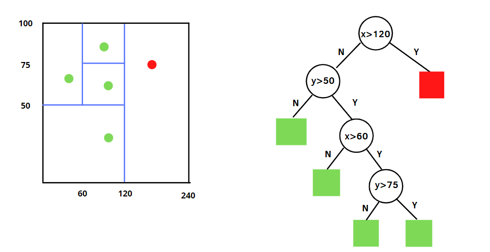

# DATA PREPROCESSING

## Introduction

## Variables tranformations

### discretization

### numeric variable continuous tranformations

### nominal variables tranformations

#### encoding

##### one-hot

##### embedding

In the context of machine learning, an embedding is a low-dimensional, learned continuous vector representation of discrete variables into which you can translate high-dimensional vectors. Generally, embeddings make ML models more efficient and easier to work with, and can be used with other models as well. Embedding is type of categorical variables encoding. It can be also treated as a way for dimentionality reduction.

#### other

## Data Problems

### Numeric and categorical

#### Extreme values

Trzeba pamiętać o jednym ważnym rozróżnieniu.

1.  Wartości nietypowe jako różniące się od typowych obserwacji w zbiorze
2.  Wartości na które jest wrażliwa dana metoda (algorytm) w oparciu o którą budujemy model (nadzorowany lub nienadzorowany). W tym przypadku chyba tylko w przypadku klasycznych modeli ekonometrycznych są dobrze określone miary umożliwiające wykrywanie wartości na które model jest wrażliwy. W pozostałych przypadkach trzeba po prostu przetestować różne sposoby wykrywania outliersów w rozumieniu definicji z punktu 1 i zobaczyć czy dale to wspływ na algorytm.

Rodzaje algorytmów:

Porównanie wyników różnych algorytmów:


##### LOF (local outlier factor)

Jest to algorytm działający w oparciu o lokalną analizę gęstości punktów (idea podobna np. do DBSCAN).

Opis algorytmu (mój intuicyjny):

1.  Ustalam parametr *k* określający *k* najbliższych sąsiadów.

2.  Wyznaczmy punktu znajdujące się w otoczeniu analizowanego punktu. W tym celu szukam dla analizowanego punktu w jego otoczeniu *k* najbliższych sąsiadów. Uwaga: jeżeli szukamy *k* najbliższych sąsiadów możemy finalnie mieć w analizowanym otoczeniu punktu A więcej punktów niż *k* punktów*.* Poniższy rysunek pokazuje jak to jest możliwe. Szukamy tutaj 2 najbliższych sąsiadów dla punktu A. Pierwszy najbliższy punkt to C. Następny to np. punkt B. Zatem mamy już dwóch sąsiadów. Jednak okazuje Punkty D leży w takiej samej odległości od A co punkt B. Zatem też go uwzględniamy. Zatem będziemy mieć w analizie sąsiedztwa punktu A, 3 a nie 2 punkty czyli liczbę różną od k.

    

3.  Obliczamy REACHABILITY DENSITY (RD). Jeżeli odległość punktu od punktu analizowanego jest w promieniu wyznaczonym przez najdalszego sąsiada to RD równa się temu promieniowi. Jeżeli jest poza promieniem to RD jest równe odległości pomiędzy punktami. Popatrzmy na przykład:

    

    Powyżej mamy Xj jako punkt dla którego analizujemy otoczenie. Następnie rozpatrujemy 2 możliwe położenia punktu Xi. W pierwszym jest wewnątrz koła wyznaczonego przez najdalszych sąsiadów. Jego RD jest równe niebieskiej linii, czyli promienia okręgu wyznaczonego przez najdalszych sąsiadów. W drugim przypadku jest poza kołem i jego RD jest równe odległości od Xj (pomarańczowa linia).

4.  Następnie obliczmy LOCAL REACHABILITY DENSITY (LRD):

    

    Nk(A) to jest zbiór punktów z wyznaczonego otoczenia dla punktu A. W powyższym wzorze \|\| \|\| nie oznacza normy tylko liczebność zbioru. Tak więc \|\|Nk(A)\|\| to ilość punktów w wyznaczonym otoczeniu. Miara jest liczona dla każdego puntu (A) przy zadanym k.

    LRD is inverse of the average reachability distance of A from its neighbors. Intuitively according to LRD formula, more the average reachability distance (i.e., neighbors are far from the point), less density of points are present around a particular point. This tells how far a point is from the nearest cluster of points. Low values of LRD implies that the closest cluster is far from the point.

5.  Następnie obliczmy: LOCAL OUTLIER FACTOR (LOF).

    

    Powyższa miara jest liczona dla każdego punktu. Pierwszy człon to suma wartość LRD wyznaczonych dla punktów znajdujących się w wyznaczonym otoczeniu punktu A, podzielona przez ilość tych punktów. Drugi człon to odwrotność LRD dla analizowanego punktu.

    LRD of each point is used to compare with the average LRD of its K neighbors. LOF is the ratio of the average LRD of the K neighbors of A to the LRD of A.

    Intuitively, if the point is not an outlier (inlier), the ratio of average LRD of neighbors is approximately equal to the LRD of a point (because the density of a point and its neighbors are roughly equal). In that case, LOF is nearly equal to 1. On the other hand, if the point is an outlier, the LRD of a point is less than the average LRD of neighbors. Then LOF value will be high.

    Generally, if LOF\> 1, it is considered as an outlier, but that is not always true. Let's say we know that we only have one outlier in the data, then we take the maximum LOF value among all the LOF values, and the point corresponding to the maximum LOF value will be considered as an outlier.

**Przykład obliczeniowy:**

We have points: A(0,0), B(1,0), C(1,1) and D(0,3) and K=2. We will use LOF to detect one outlier among these 4 points.


Following the procedure discussed above:

Najpierw obliczamy dla każdego punktu odległość od k-tego najdalszego sąsiada. Dla nas k = 2 więc szukamy 2 najbardziej oddalonego sąsiada. Użyjemy odległości **Manhattan:**

K-distance(A) --\> since C is the 2ᴺᴰ nearest neighbor of A --\> distance(A, C) =2\
K-distance(B) --\> since A, C are the 2ᴺᴰ nearest neighbor of B --\> distance(B,C) OR distance(B,A) = 1\
K-distance(C) --\> since A is the 2ᴺᴰ nearest neighbor of C --\> distance(C,A) =2\
K-distance(D) --\> since A,C are the 2ᴺᴰ nearest neighbor of D --\> distance(D,A) or distance(D,C) =3

Zatem wszystkie kombinacje odległości to:


Poniżej dla każdego punktu jest lista punktów w wyznaczonym otoczeniu oraz ich liczebność.

K-neighborhood (A) = {B,C} , \|\|N2(A)\|\| =2\
K-neighborhood (B) = {A,C}, \|\|N2(B)\|\| =2\
K-neighborhood (C)= {B,A}, \|\|N2(C)\|\| =2\
K-neighborhood (D) = {A,C}, \|\|N2(D)\|\| =2

K-distance, the distance between each pair of points, and K-neighborhood will be used to calculate LRD.

 Local reachability density (LRD) will be used to calculate the Local Outlier Factor (LOF).


Highest LOF among the four points is LOF(D). Therefore, D is an outlier.

**Pros:**

-   A point will be considered as an outlier if it is at a small distance to the extremely dense cluster. The global approach may not consider that point as an outlier. But the LOF **can effectively identify the local outliers**.

**Cons:**

-   Since LOF is a ratio, it is **tough to interpret**. There is no specific threshold value above which a point is defined as an outlier. The identification of an outlier is dependent on the problem and the user.

##### Angle

Idea jest prosta. Biorę punktu i sprawdzam pod jakim kątem względem niego są inne punktu. Jeżeli większość punktów na podobny kąt względem punktu analizowanego to punkt analizowane jest wartością odstającą (lewy rysunek poniżej). Jeżeli kąty są bardzo zróżnicowane to punkt nie jest wartością odstającą (prawy rysunek poniżej)


Usually in implementation, not just the angle but the distance between the point is also divided so that distance is also taken into account.( Nearby points may also have very less angle but might not be outlier)  So angular distance=


(AB,AC) - dot product of AB

AB, AC - distance between A and B, A and C

So cosine= (AB, AC)/AB\*AC

cosine /distances= (AB, AC)/(AB\^2\*AC\^2)

to calculate angle based outlier factor of A, variance of all possible cosine/distance is taken. **Lower value means more outlier-ness.**

##### knn

Opis algorytmu (mój intuicyjny):

1.  Budujemy model k-nn

2.  Dla każdego punktu obliczamy średnią odległość od jego k najbliższych sąsiadów.

3.  Uśrednione odległości dla każdego punktu wrzucamy na wykres:

    

    Najwyższe wartości możemy traktować jako wartości odstające.

##### One class SVM

Tutaj mamy SVM z przeformułowanym problemem. Zamiast tworzyć hiperpłaszczyznę separującą różne klasy zakładamy że wszystkie elementy należą do jednej klasy, a my tworzymy jak **najmniejszą sferę** która będzie zawierała jak najwięcej elementów. Zatem funkcja celu to:

\$min,r\^2 ,,subject,to, \|\|\Phi(x_i)-c\|\|^2^\leq r2 \$

Czy minimalizujemy kwadrat promienia sfery ($r^2$) i ustalamy c (środek sfery) tak aby kwadrat odległości obserwacji od środka (obserwacje mogę być przetransformowane do wyższych wymiarów (kernel trick) i stąd $\Phi()$ ) był mniejszy niż kwadrat średnicy (wszystkie obserwacje wewnątrz sfery).

Aby nie wszystkie obserwacje znalazły się wewnątrz koła, funkcja celu ma wprowadzone warunki łagodzące (slack variables) umożliwiające występowaniem obserwacji poza sferą. Mamy tutaj parametr który umożliwia sterowanie wpływem slack variables i tym samym możemy określać jak duży procent elementów ma być poza sferą.

##### z-score

Z-socre jest analizą jednowymiarową. Obliczamy go dla i-tej obserwacji ze wzoru :

$zscore_i = \frac{x_i-x\_mean}{standard\_deviation}$

Wyraża ilu odchyleniom standardowym równa się odległość obserwacji od średniej. Wartości o wysokim z-score możemy traktować jako wartości ostające. Wartość progowa to często wartości z przedziału [2,3].

**Pros:**

-   It is a very effective method if you can describe the values in the feature space with a gaussian distribution. (Parametric)

-   The implementation is very easy using pandas and scipy.stats libraries.

**Cons:**

-   It is only convenient to use in a low dimensional feature space, in a small to medium sized dataset.

-   Is not recommended when distributions can not be assumed to be parametric.

##### PCA

PCA jest przykładem zastosowania redukcji wymiarowości do wykrywania outliersów. Ogólna idea jest taka że algorytm redukujący wymiar powinien uchwycić najważniejsze elementy struktury danych. Elementy nieistotne dla tej struktury w wyniku redukcji powinny istotnie zmienić swoje "położenie". Jeżeli możemy przeprowadzić rekonstrukcję (powrót po redukcji do pierwotnej przestrzeni), wtedy łatwo zbudować metrykę porównującą dane przez i po redukcji (dzięki redukcji porównanie w tej samej pierwotnej przestrzeni). Poniżej jest pokazana idea redukcji i rekonstrukcji:


Elementy które mocno zmieniły położenie będę outliersami. Jednak w przypadku PCA ta analiza ma swoje wady. Popatrzmy poniżej:


Punkt 1 po redukcji mocno zmieni swoje położenie i jest dobrym przykładem outliersa. Jednak punkt 2 też powinien być outliersem, jednak przy założeniu że stosujemy PCA nim nie będzie.

##### Autoencoders

To kolejny przykład jak algorytm do redukcji wymiary może być użyteczny do wykrywania outliersów. Autoencoder kompresuje dane i potem stara się zrobić rekonstrukcję. Błąd rekonstrukcji obserwacji określa czy nadaje się na outliersa. Jeżeli obserwacja jest mało widzenia z punktu widzenia struktury danych to informacja na jej temat będzie utracona w czasie kompresji i przy rekonstrukcji będziemy mieć duży błąd.

##### **Elliptic Envelope**

filmik: [Lecture 15.7 --- Anomaly Detection \| Multivariate Gaussian Distribution --- [ Andrew Ng ]](https://www.youtube.com/watch?v=JjB58InuTqM)

Algorytm sprawdza się jeżeli dane mają rozkład normalny. Dopasowujemy rozkład normalny do danych (czyli po prosty estymujemy macierz wariancji/kowariancji i wektor wartości oczekiwanych) , a następnie na jego podstawie rysujemy odpowiednią elipsoidę (musimy ustalić jakieś p-value):

To co jest poza elipsoidą traktuje jako wartość odstającą:


##### COPOD

Algorytm oparty o kopuły. Copuła jest w pewnym sensie podobna co do założeń do **Elliptic Envelope.** Ale tutaj zakładamy że nie znamy wielowymiarowe rozkładu naszych zmiennych. Jednak możemy zbudować ten rozkład właśnie poprzez kopułę. Kiedy będziemy mieć taki rozkład elementy o niskim prawdopodobieństwie traktujemy jako outliersy.

##### Isolation Forest

Szczegółowe omówienie: [link](https://towardsdatascience.com/isolation-forest-from-scratch-e7e5978e6f4c)

Opis algorytmu (mój intuicyjny):

1.  Dokonuje podziału przestrzeni obserwacjami, aż uzyskam odizolowanie każdego punktu tak jak na lewym rysunku poniżej:

    

    Podział mogę oczywiście przedstawić w postaci drzewa jak jak rysunku powyżej po prawej. Dla każdej obserwacji mogę policzyć ile splitów trzeba było przeprowadzić żeby ją w pełni odseparować od reszty. Dla czerwonej obserwacji udało się to zrobić już po pierwszym splicie. Podziały ze względu na cechy wykonuje się losowe.

2.  Punkty 1 i 2 powtarzam n razy, dzięki czemu uzyskuję dużą ilość drzew:

    

    Uwaga: W praktyce przy dużych zbiorach danych aby usprawnić pracę algorytmu przy budowie poszczególnych drzew stosuje się następujące uproszenia:

    1.  Każde kolejne drzewo jest robione na podpróbkach danych

    2.  Dla każdego kolejnego drzewa losuje podzbiór zmiennych na których buduje drzewo.

    3.  Zazwyczaj ogranicza się głębokość drzewa (np. do ceil(log_2(n))), tak więc drzewo nie odizoluje każdego punktu.

3.  Na koniec obliczam dla każdej obserwacji score którego wartość mieści się w przedziale [0,1]:

    $s(x,n) = 2 \frac{- E(h(x))}{c(n)}$ 

    Wartości bliskie 1 są traktowane jako wartości odstające.

**Pros:**

-   There is no need of scaling the values in the feature space.

-   It is an effective method when value distributions can not be assumed.

-   It has few parameters, this makes this method fairly robust and easy to optimize.

-   Scikit-Learn's implementation is easy to use and the documentation is superb.

**Cons:**

-   The Python implementation exists only in the development version of Sklearn.

-   Visualizing results is complicated.

-   If not correctly optimized, training time can be very long and computationally expensive.

-   Kolejna wada objawia się przy niektórych rozkładach danych:


Powyżej oczekiwalibyśmy że wartość scoru będzie wzrastać równomiernie we wszystkich kierunkach w miarę oddalania się od centrum zbioru (punkt (0,0)). Jednak po prawej (im jaśniej tym mniejszy score) utworzył się nam krzyż i niskie wartości mamy też np. na samym dole w środku. Problem wnika z tego drzewo dokonuje tylko poziomych i pionowych podziałów. Sytuacja wygląda jeszcze gorzej przy takim zbiorze danych:


Dlatego istnieje algorytm **Extended Isolation Forest** gdzie dokonuje się podziałów pod różnym kątem:


#### Missing values

#### Untipical distributions (for example copula models, kernel estimators, logaritmic transofmations ect., mixed distributions)

#### Censored/truncated data

#### Aggregated date (decomposition)

#### Meassurement error (for example Kalman filter model)

#### Granularity of data

#### Imbalanced categories

Uwaga. W przypadku klasyfikacji *imbalanced data* i *skewed data* jest najczęściej używane zamiennie.

##### Non synthetic methods

###### Under-sampling

**Pros:**

**Cons:**

-   under-sampling the majority can end up leaving out important instances that provide important differences between the two classes.

###### **Over-sampling:**

**Pros:**

**Cons:**

-   the random oversampling may increase the likelihood of overfitting occurring, since it makes exact copies of the minority class examples. In this way, a symbolic classifier, for instance, might construct rules that are apparently accurate, but actually cove one replicated example." --- Page 83, [Learning from Imbalanced Data Sets](https://www.amazon.co.uk/Learning-Imbalanced-Data-Alberto-Fern%C3%A1ndez/dp/3319980734), 2018

##### Synthetic methods

Metody syntetyczne balansowania próby polegają na tworzeniu nowych obserwacji dla kategorii mniej licznej. W porównaniu do metod niesyntetycznych mamy tutaj większe możliwość do dokładaniu informacji do zbioru (bo tworzymy nowe obserwacje).

###### SMOTE

SMOTE - Synthetic Minority Oversampling Technique.

**Pseudo-algorytm (wersja podstawowa):**

Specifically, a random example from the minority class is first chosen. Then *k* of the nearest neighbors for that example are found (typically *k=5*). A randomly selected neighbor is chosen and a synthetic example is created at a randomly selected point between the two examples in feature space.

Zalecane jest aby SMOTE wykonywać w kombinacji w undersamplingiem.

```{python}

over = SMOTE(sampling_strategy=0.1)
under = RandomUnderSampler(sampling_strategy=0.5)

steps = [('o', over), ('u', under)]
pipeline = Pipeline(steps=steps)

# transform the dataset
X, y = pipeline.fit_resample(X, y)

```

**Pros:**

**Cons:**

1.  **Overgeneralization:** SMOTE's procedure is inherently dangerous since it blindly generalizes the minority area without regard to the majority class. This strategy is particularly problematic in the case of **highly skewed class distributions (**Skewed classes basically refer to a dataset, wherein the number of training example belonging to one class out-numbers heavily the number of training examples beloning to the other. Consider a binary classification, where a cancerous patient is to be detected based on some features**)** since**,** in such cases, the minority class is very sparse with respect to the majority class, thus resulting in a greater chance of class mixture**.**

2.  **Lack of Flexibility**: The number of synthetic samples generated by SMOTE is fixed in advance, thus not allowing for any flexibility in the re-balancing rate.

SMOTE występuje w wariantach z licznymi modyfikacjami. Najczęściej polegają one na tym żeby tworzyć nowe obserwacje w obszarach gdzie są błędy klasyfikacyjne. Przykładem może być SMOTE-Borderline.

**Pseudoalgorym (wersja Borderline):**

-   A popular extension to SMOTE involves selecting those instances of the minority class that are misclassified, such as with a k-nearest neighbor classification model.

#### Imbalanced values

Odpowiednikiem zagadnienia niezbalansowanej próby w zagadnieniu klasyfikacyjnym dla zagadnienia regresyjnego może być to problem inflacji zer (zero-inflation).

Przykład dla modlu Possona z problemem zero-inflation [link](https://stats.idre.ucla.edu/r/dae/zip/#:~:text=Zero%2Dinflated%20poisson%20regression%20is,zeros%20can%20be%20modeled%20independently.) .

#### Small samples problem

### Text

#### TF-IDF

Szczegółowe wprowadzeni teoretyczne z przykładami liczbowymi: [link](https://towardsdatascience.com/a-gentle-introduction-to-calculating-the-tf-idf-values-9e391f8a13e5)

### Visual

#### Wykrywanie krewedzi

##### Hough

pis algoytmu: [link](https://towardsdatascience.com/lines-detection-with-hough-transform-84020b3b1549)

#### Wykrywanie elementów

##### Haar Cascade

[link](https://towardsdatascience.com/face-detection-with-haar-cascade-727f68dafd08)

Corners - w przeciwienstwie do lines sa bardziej unikatowe dlatego lepiej jest je wykrywac.

##### ORB

opis algorytmu: [link](https://ichi.pro/pl/wprowadzenie-do-orb-oriented-fast-i-rotated-brief-72709114183887)

### Sound
