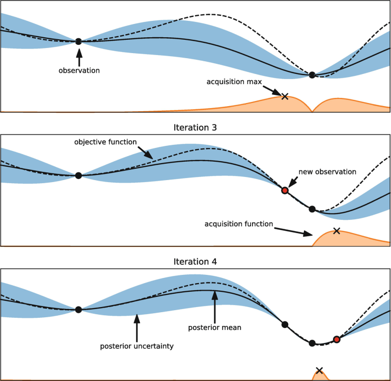
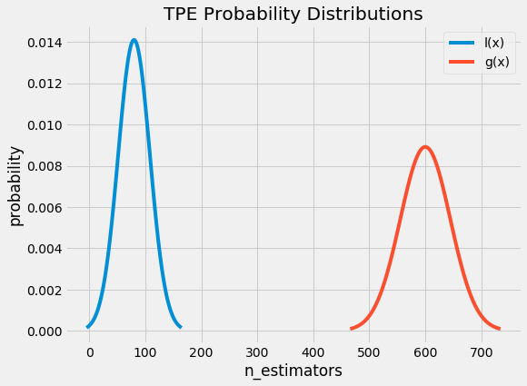

# OTHER MODELS AND PROBLEMS

## Hyperparameters tunning

Przegląd różnych technik: [link](https://medium.com/criteo-engineering/hyper-parameter-optimization-algorithms-2fe447525903)

O bayesowkim algorytmie: [link](https://distill.pub/2020/bayesian-optimization/)

### Bayesian methods

Podejście jest następujące.

Mamy jakąś prawdziwą nieznaną nam funkcję *f* określającą zaleść scoru modelu od wartości hiperparametru (czarna przerywana linia na rysunku). Chcemy ją wyestymować żeby zobaczyć gdzie ma extrema, i w ten sposób zobaczyć jaka kombinacja hiperparametrów jest najbardziej optymalna.

Żeby rozwiązać ten problem losujemy kilka wartości parametrów i przeliczamy model żeby dostać score (czarne kropki). Dodatkowo zakładamy że mamy surrogate-model który stara się na podstawie tych przeliczonych obserwacji estymować przebieg funkcji *f*. Takim modele mogę być estymator parzena. Im mamy więcej obserwacji tym surrogate-model lepiej przybliży nam funkcję *f*. Ale Problem polegam na tym jak efektywnie losować miejsca do następnym przeliczeń aby to było efektywne. Do tego poza naszym surrogate model (który nam tutaj będzie podpowiadał) , potrzeba mieć funkcję estymującą uzysk z danego punktu. Ta funkcja podpowiada nam następny punkt z punktu widzenia dwóch kreteriów:

-   chcemy losować gdzie mamy większe prawdopodobieństwo trafienie na ekstremum

-   chcemy losować tak w miejscach o których nasz surrogate-model mało wie. Są to najczęściej punktu daleko od punktów już wylosowanych. Dzięki takiemu losowaniu możemy mieć duży przyrost informacji ułatwiający przybliżanie przebiegu funkcji *f*.

#### **Tree-structured Parzen Estimator (TPE)**

[link](https://towardsdatascience.com/a-conceptual-explanation-of-bayesian-model-based-hyperparameter-optimization-for-machine-learning-b8172278050f)

Powyższy algorytm można go streścić tak [link](https://docs.openvinotoolkit.org/latest/pot_compression_optimization_tpe_README.html) :

1.  Define a domain of hyperparameter search space,

2.  Create an objective function which takes in hyperparameters and outputs a score (e.g., loss, root mean squared error, cross-entropy) that we want to minimize,

3.  Get couple of observations (score) using randomly selected set of hyperparameters,

4.  Sort the collected observations by score and divide them into two groups based on some quantile. The first group (x1) contains observations that gave the best scores and the second one (x2) - all other observations,

5.  Two densities l(x1) and g(x2) are modeled using Parzen Estimators (also known as kernel density estimators) which are a simple average of kernels centered on existing data points,

6.  Draw sample hyperparameters from l(x1), evaluating them in terms of l(x1)/g(x2), and returning the set that yields the minimum value under l(x1)/g(x1) corresponding to the greatest expected improvement. These hyperparameters are then evaluated on the objective function.

7.  Update the observation list from step 3

8.  Repeat step 4-7 with a fixed number of trials or until time limit is reached

Zakładam że chce minimalizować score. Tutaj mamy podział dla próbki w punktu 4. Oś x to hiperparametr.

Poniżej mamy rozkłady l(x) i g(x). Losujemy punktu z l(x). l(x) jest tworzone Estymatorem Parzena w oparciu o dostępną próbkę.

### **Successive Halving**

1.  losuje *n* kombinacji wartości parametrów.

2.  Dla tych kombinacji zaczynam obliczenia. Wykonuje pierwsze *k* iteracji trenowania n modeli w oparciu o kombinacje wartości hiperparametrów.

3.  Po *k* iteracjach sprawdzam Jaki wyniki mają modele. Usuwam połowe najgorszych modeli.

4.  Wracam do punktu 2.

5.  Powtarzam powyższą pętle do wyczerpania zasobów (zasobem może być ustalony z góry czas na obliczenia), lub gdy zostanie jeden model.

Powyższa metoda ma wady, dlatego powstało jej rozszerzenie w postaci algorytmu *hyperband*.

**Pros:**

-   szybsza nić klasyczna optymalizacja bayesowska

**Cons:**

-   If *n (ilośc kombinacji hiperparamatrów)* is large, then some good configurations which can be slow to converge at the beginning will be killed off early.

-   If *B/n (czas na przeliczenie jednego modeli - ogranicza ilość iteracji))* is large, then bad configurations will be given a lot of resources, even though they could have been stopped before.

### Hyperband

Tutaj równolegle puszczamy kilka symulacji z których każda ma inną wartość n. Wszystkie mają te same budżety. Tym samym robi swego rodzaju grid search dla *n*.

### **Fabolas**

Fabolas, standing for fast Bayesian optimization for large datasets, described in [[8](https://medium.com/criteo-engineering/hyper-parameter-optimization-algorithms-2fe447525903#c1f9)] tries to increase the speed of Bayesian optimization by learning the ML model on a sampled dataset (but evaluating its performance on the full validation dataset). The idea is that a small portion of the data (less than 10 %) is sufficient to check if a hyper-parameter combination is promising or not.

To do it efficiently, it adds another parameter, continuous from 0 to 1, which sets the fraction of the dataset on which to learn the model. It involves a complex acquisition function (which is derived from entropy search, which is an acquisition function based on the predicted information gain around the optimum) and a special covariance kernel.

### **BOHB**

BOHB (Bayesian Optimization and HyperBand) mixes the Hyperband algorithm and Bayesian optimization. It is described in [[3](https://medium.com/criteo-engineering/hyper-parameter-optimization-algorithms-2fe447525903#b598)] and also in this [blog post](https://www.automl.org/blog_bohb/). It uses Hyperband to determine how many configurations to try within a budget but instead of randomly sampling them, it uses a Bayesian optimizer (using a Parzen estimator with no tree structure).

At the beginning of the run, it uses Hyperband capability to sample many configurations with a small budget to explore quickly and efficiently the hyper-parameter search space and get very soon promising configurations, but uses the Bayesian optimizer predictive power to propose good configurations close to the optimum.

It is also parallel (as Hyperband) which overcomes a strong short-coming of Bayesian optimization.

### **Population-based training (PTB)**

The idea is the following: take *k* agents, each of them are given a model to train, randomly sampled from the search space.

After *p* learning iterations, do the *exploit* phase of the algorithm:

-   each of the worker compares itself to the other workers (either all of them, a random subset of them, or only one randomly chosen).

-   If the validation performance of the worker is significantly worse (in a statistical meaning) than the best of the others, the worker copies both the **hyper-parameters and the weights** of the best performing model

-   if the worker has changed its model, do the *explore* phase of the algorithm, i.e. perturb the hyper-parameters before restarting to learn (several strategies exist: for some randomly chosen hyper-parameters, re-sample them randomly from the search space or perturb them all by a multiplicative coefficient between e.g. 0.8 and 1.2)

Loop the algorithm by relearning for *p* iterations.

## Social Network

## Queuing (kolejki)

## Spacial model (modele przestrzenne)

## SIX-Sigma (process quality control, quality control charts)

## Process Analysis (Analiza procesu)

## Reliability and Item Analysis (Analiza rzetelności)

## Experimentla design (Planowanie doświadczeń)

## Sequential analysis

## Logic programming (programowanie logiczne)

## Financial models

### Distance to default

### Copula methods (kopuły)

### Black Scholes

### Vasicek

### Markovitz

### KMV

### Credit Metrics

### Credit Plus

### z-scores

### CAPM

### VaR - Value at risk

### CVA

### Acturial models

## Biological/Medical Models

## Case Studies

### Score cards

Budowanie score cary jest opisane w książce Naeem Siddiqi "Credit Risk Scorecards Developing and Implementing Intelligent Credit Scoring". Przykład przeliczeń jest na str. 115-117.

Uwaga o linowych trendach z WoE: Krzysiek mówi że jeżeli to jest naruszone to rozkład scorów nie będzie zbliżony do rozkładu normalnego.

Na rpubs jest fajny przykład po R [WOE, IV and Scorecards in Credit Risk Modelling](https://rstudio-pubs-static.s3.amazonaws.com/376828_032c59adbc984b0ab892ce0026370352.html)

### PD models

### LGD models

### Churn models

### ICAAP

Mamy szereg DR miesiąc po miesiącu. DR jest liczony w okresie LIP. Czyli dla stycznie mamy styczniowe kredyty i badany ile proc. z nich wpadło w default. I tak dalej. Problem jest tutaj taki że w naszym szeregu DR-ów mamy silną korelację. Defaultu z okien czasowych (długości LIP), zazębiają się dla poszczególnych miesięcy. Czyli w przypadku LIP=3miesiące dla DR styczniowe i lutowego nakładają się okresy luty i marze okien czasowych. To można rozwiązać na 3 sposoby:

-   Zrobić pomiędzy DR-ami takie okresy żeby okna się nie nakładały. Czyli dla LIP = 3miesiące pierwszy DR mamy ze stycznia, a następny dopiero z kwietnia

-   Zastosować specjalne schematy losowanie tak aby zbiory obserwacji dla DR-ów się nie nakładały

-   Ograniczyć autokorelacje przez uśrednianie. Czyli robimy np. średnią z 3 kolejnych miesięcy. Tutaj w ICAAP było podobno tak że nie była to średnia ruchowa, ale były średnie kwartalne i średnia kwartalna była jedną wartością zastępującą 3 miesiące. Czyli z 12 obserwacji rocznie mamy 4 obserwacje.

Kiedy mamy szereg naszych DR-ów przyjmujemy że mają one rozkład Gamma. Na bazie wartości empirycznych szacujemy zmienność szeregu będącą parametrem rozkładu Gamma. Szeregów jest kilka. Po pierwsze jest kilka portfeli, a po drugie są różne koszyki defaultowe. Np. pierwszy koszyk to obserwacje które zdefautowały o max 30 dni. Drugi (30,90), trzeci \>90 itp.

Ponieważ mamy kilka szeregów to możemy zastosować PCA. Wcześniej rozkłady Gamma przekształcamy na rozkłady normalne. Dzięki temu mamy gwarancje że PCA zachowa nam rodzaj rozkładu (PCA to transformacja liniowa zmiennych, a transformacja linowa rozkładu normalnego to rozkład normalny). Bierzemy top x najlepszych wektorów własnych wg. przypisanych im wartości własnych. Następnie wracamy do danych pierwotnych wyliczając tzw wagi czynników. Robimy tutaj dekompozycje na część zależną od tych top wektorów i resztę (czynniki systematyczne i specyficzne). Ta reszt to wartości z rozkładu normalnego standardowego mnożone przez wagę specyficzną wyliczaną przez dopełnianie do jedności kwadratu wag systematycznych. Kiedy sumujemy iloczyny wag i wektorów własnych dostajemy formuła na powrót do zmiennych pierwotnych. Losujemy z rozkładów normalnych naszych wektorów własnych wartości podstawiamy do równania i dostajemy kolejne wartości pierwotne. Wartości pierwotne następnie transformujemy z powrotem do rozkładu Gamma.

Robimy transformacje z powrotem do rozkładu beta. Następnie robimy losowanie z naszych rozkładów. Wylosowane wartości (dodatkowo analogicznie jak dla PD robimy analizę dla LGD (zależnego od Cure Rate i Recovery Rate). W ten sposób losowe wartości PD, LGD podstawiamy pod wzór na stratę dostając jego rozkład. Obcinamy ogon i to jest nasza strata nieoczekiwana.

### AMA

### Stress tests

### Master Scale

### Model summer

Problem: Mam osoby na wakacjach kredytowych i muszę zaprognozować czy po wakacjach (kiedy będą musieli wrócić do składania kredytu) nie będę w defaulcie. Niestety wakacji występują pierwszy raz i nie mam z przeszłości próby żeby wyestymować model.

Algorytm rozwiązania:

-   Wakacje dostają osoby które wcześniej miały dobrą historię kredytową. Są tutaj różne kryteria związane z tym czy sytuacja kredytobiorcy jest dobra. Została zbudowany model klastrujący klientów którym przyznano wakacje. Mimo że jest to grupa z dobrą historią, to przy pomocy takich zmiennych jak dochód, odchylenie od dochodów, maksymalne DPD itp. udał się ich podzielić na dwie kategorie: gorszych i lepszych **(**przy podziale nie brano oczywiście defaultu bo nie wiemy jak się zachowają w przyszłości. Nie mamy tutaj próbki z przeszłości i dlatego też robimy model klastrujący na innych zmiennych które na podstawie naszego doświadczenia wiemy że mogą się przydać do predykcji przeterminowania**)**.

-   Następnie z bazy z przeszłości losujemy próbkę klientów podobnych do tych którzy mieli przyznane wakacje. Stosujemy tutaj takie kryteria jak np. produkt. Losujemy różne próbki z tej populacji i w oparciu o przeszłe dane robimy model predykujący czy będę po pewnym czasie defaultowali.

-   Następnie dla obecnych osób w wakacjami robimy modele z poprzedniego punktu predykcje czy będą defaultowali. Otrzymujemy 2 kategorie : będzie default / nie będzi default.

-   Na koniec w celu uzyskania ostatecznych wyników robimy głosowanie modeli klastrującego i predykcynego. Jeżeli model klastrujący mówi że osoba jest w grupie dobrych klientów, a model predykujący mówi że spłaci, to taki klient ląduje w grupie niskiego ryzyka. Jeżeli predykcje modeli się wykluczają to dajemy średnie ryzyko. Jeżeli model klastrujący mówi że to gorszy klient, a model predykcyjny mówi że klient będzie defaultował to dajemy go to wysokiego ryzyka.
